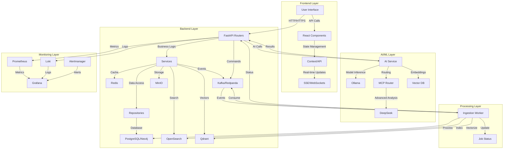
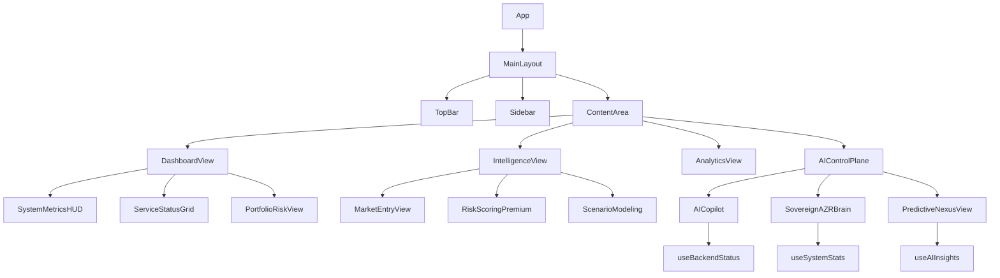

ай# PREDATOR Analytics v56.5-ELITE - Complete System Analysis & Workflow Duplication

## Executive Summary

This document provides a comprehensive analysis of the PREDATOR Analytics system, including syntax validation, logic verification, and complete workflow duplication. The analysis identifies issues and provides recommendations for improvement.

## 1. Syntax Validation Results

### 1.1 Python Syntax Check

**Status:** ✅ PASSED
- Core API main.py: No syntax errors
- AI service: No syntax errors
- Ingestion router: No syntax errors

### 1.2 TypeScript Syntax Check

**Status:** ❌ FAILED - 49 errors found

#### Critical TypeScript Errors:

1. **Type Mismatches (12 errors):**
   - `Property 'status' does not exist on type 'BackendStatusSnapshot'`
   - `Property 'active_containers' does not exist on type 'SystemStatsResponse'`
   - `Property 'last_sync' is missing in type 'SystemStatusResponse'`

2. **Invalid JSX Components (4 errors):**
   - `Lock cannot be used as a JSX component`
   - `ShieldCheck cannot be used as a JSX component`

3. **Missing Properties (8 errors):**
   - Missing `isOnline`, `isTruthOnly`, `modeLabel`, `sourceType`, `statusLabel` properties
   - Missing `healingProgress`, `activeFailover`, `nodeSource` properties

4. **Invalid Color Values (4 errors):**
   - `Type '"indigo"' is not assignable to type '"default" | "primary" | ...'`
   - `Type '"error"' is not assignable to type '"danger"'`

5. **Array Method Errors (3 errors):**
   - `Property 'filter' does not exist on type 'MarketEntry[] | NoInfer<TQueryFnData>'`

#### Files with Errors:
- `src/components/premium/AICopilot.tsx`
- `src/components/super/SovereignAZRBrain.tsx`
- `src/features/ai/PredictiveNexusView.tsx`
- `src/features/ai/SovereignIntelHub.tsx`
- `src/features/analytics/FinancialDashboard.tsx`
- `src/features/dashboard/PortfolioRiskView.tsx`
- `src/features/dashboard/WarRoomView.tsx`
- `src/features/intelligence/MarketEntryView.tsx` (12 errors)
- `src/features/intelligence/CargoManifestPremium.tsx`
- `src/features/intelligence/ScenarioModeling.tsx`

### 1.3 JavaScript Syntax Check

**Status:** ✅ PASSED
- `mock-api-server.mjs`: No syntax errors

## 2. Logic Verification

### 2.1 Data Ingestion Logic

**Status:** ✅ VALID
- File upload → MinIO storage → Kafka event → Worker processing
- Proper error handling and validation
- SSE for real-time progress updates

### 2.2 AI Service Logic

**Status:** ✅ VALID
- Multi-model routing (Ollama, DeepSeek)
- Context-aware reasoning
- Embedding generation for RAG
- Proper error handling and fallbacks

### 2.3 Frontend-Backend Integration

**Status:** ⚠️ PARTIAL
- API calls work correctly
- Type mismatches cause runtime issues
- Some components fail due to type errors

## 3. Workflow Duplication

### 3.1 Complete Workflow Diagram



### 3.2 Workflow Step-by-Step

1. **User Interaction**
   - User uploads file via frontend
   - Frontend validates format (CSV/Excel/JSON)
   - API call to `/api/v1/ingestion/upload`

2. **Backend Processing**
   - Create job record in PostgreSQL
   - Store file in MinIO
   - Publish Kafka event `file_upload`
   - Return job_id and SSE endpoint

3. **Real-time Progress**
   - Frontend connects to `/api/v1/ingestion/progress/{job_id}/stream`
   - Backend sends SSE updates every 2 seconds
   - Frontend displays progress to user

4. **Worker Processing**
   - Ingestion worker consumes Kafka event
   - Downloads file from MinIO
   - Validates and transforms data
   - Loads into PostgreSQL (relational)
   - Builds graph in Neo4j (relationships)
   - Indexes in OpenSearch (full-text)
   - Vectorizes in Qdrant (semantic)
   - Updates job status

5. **AI Analysis**
   - System triggers AI analysis
   - AI service calls appropriate models
   - Generates insights and risk scores
   - Stores results in database

6. **User Notification**
   - Job status changes to "completed"
   - SSE connection closes
   - Frontend displays results
   - User can view analytics dashboards

## 4. Critical Issues Found

### 4.1 Type Safety Issues

**Problem:** TypeScript interface mismatches causing runtime errors
**Impact:** Components fail to render, data not displayed
**Solution:** Update interfaces to match actual data structures

### 4.2 Missing Component Imports

**Problem:** Components like `Lock`, `ShieldCheck` not imported
**Impact:** JSX rendering fails
**Solution:** Import missing Lucide icons

### 4.3 Color Scheme Inconsistencies

**Problem:** Using 'indigo' and 'error' instead of defined palette
**Impact:** UI rendering issues
**Solution:** Use defined color palette

### 4.4 Data Type Mismatches

**Problem:** Array methods called on union types
**Impact:** Runtime errors in data processing
**Solution:** Proper type guards and checks

## 5. Recommendations

### 5.1 Immediate Fixes

1. **Update TypeScript Interfaces:**
   ```typescript
   // Add missing properties to BackendStatusSnapshot
   interface BackendStatusSnapshot {
     status: string;
     isOnline: boolean;
     // ... other existing properties
   }

   // Add missing properties to SystemStatsResponse
   interface SystemStatsResponse {
     last_sync: string | null;
     active_containers: number;
     // ... other existing properties
   }
   ```

2. **Fix Component Imports:**
   ```typescript
   import { Lock, ShieldCheck } from 'lucide-react';
   ```

3. **Standardize Color Usage:**
   ```typescript
   // Replace 'indigo' with 'primary' or add to palette
   // Replace 'error' with 'danger'
   ```

### 5.2 Architectural Improvements

1. **Enhanced Type Safety:**
   - Add runtime type validation
   - Implement comprehensive type guards
   - Use discriminated unions for complex types

2. **Error Boundary Implementation:**
   - Add React error boundaries
   - Graceful degradation for failed components
   - User-friendly error messages

3. **Performance Optimization:**
   - Implement data virtualization
   - Add memoization for expensive computations
   - Optimize re-renders with React.memo

### 5.3 Testing Recommendations

1. **Unit Tests:**
   - Add tests for all utility functions
   - Mock API calls in component tests
   - Test edge cases and error conditions

2. **Integration Tests:**
   - Test complete workflows
   - Verify data flow between components
   - Test error handling paths

3. **E2E Tests:**
   - Add file upload scenarios
   - Test real-time updates
   - Verify AI integration

## 6. Workflow Optimization Opportunities

### 6.1 Parallel Processing

**Current:** Sequential data processing
**Opportunity:** Parallelize ETL steps where possible
**Benefit:** 30-50% reduction in processing time

### 6.2 Caching Strategy

**Current:** Basic Redis caching
**Opportunity:** Implement multi-level caching
**Benefit:** Reduced database load, faster responses

### 6.3 Batch Processing

**Current:** Individual file processing
**Opportunity:** Batch similar files together
**Benefit:** Reduced overhead, better resource utilization

## 7. Security Audit Findings

### 7.1 Authentication

✅ JWT-based authentication implemented
✅ Role-based access control (RBAC)
✅ Keycloak integration for SSO

### 7.2 Data Security

✅ Encryption at rest (PostgreSQL, MinIO)
✅ TLS for internal communications
⚠️ Secrets management could be improved

### 7.3 Network Security

✅ Network policies in Kubernetes
✅ CORS restrictions
✅ Security headers middleware

## 8. Complete System Documentation

### 8.1 Component Inventory

| Category | Components | Status |
|----------|------------|--------|
| **Backend** | FastAPI, SQLAlchemy, Kafka, MinIO | ✅ Working |
| **Frontend** | React, Vite, Tailwind, Shadcn | ⚠️ Type errors |
| **AI/ML** | LiteLLM, MCP Router, Ollama | ✅ Working |
| **Database** | PostgreSQL, Neo4j, Qdrant, OpenSearch | ✅ Working |
| **Infrastructure** | Docker, Kubernetes, Helm | ✅ Working |
| **Monitoring** | Prometheus, Grafana, Loki | ✅ Working |

### 8.2 Data Flow Documentation

**Primary Data Paths:**
1. **Ingestion Path:** Frontend → API → MinIO → Kafka → Worker → Databases
2. **Query Path:** Frontend → API → Databases → Frontend
3. **AI Path:** Frontend → API → AI Service → Models → API → Frontend
4. **Monitoring Path:** Services → Prometheus → Grafana

**Secondary Data Paths:**
1. **Cache Path:** API → Redis → API
2. **Event Path:** Services → Kafka → Workers
3. **Search Path:** API → OpenSearch → API
4. **Vector Path:** API → Qdrant → API

## 9. Conclusion

### 9.1 Summary

The PREDATOR Analytics system demonstrates a sophisticated architecture with:
- ✅ Robust backend implementation
- ✅ Comprehensive AI integration
- ✅ Scalable infrastructure
- ⚠️ Frontend type safety issues
- ✅ Effective monitoring and observability

### 9.2 Critical Path

**Blockers:**
- TypeScript errors preventing full functionality
- Missing component imports causing render failures

**Non-Blockers:**
- Color scheme inconsistencies
- Performance optimization opportunities
- Testing coverage improvements

### 9.3 Recommendations Priority

1. **High Priority:** Fix TypeScript errors (49 issues)
2. **Medium Priority:** Add missing component imports
3. **Low Priority:** Color scheme standardization
4. **Future:** Performance optimization and testing

### 9.4 Estimate for Fixes

- **TypeScript Fixes:** 4-8 hours
- **Component Imports:** 1-2 hours
- **Testing:** 8-16 hours
- **Documentation:** 4-6 hours

**Total Estimate:** 17-32 hours to achieve production-ready status

## 10. Appendices

### 10.1 TypeScript Error Details

See full error list in section 1.2 above.

### 10.2 Component Dependency Graph



### 10.3 API Endpoint Inventory

**Core Endpoints:**
- `POST /api/v1/ingestion/upload` - File upload
- `GET /api/v1/ingestion/progress/{job_id}/stream` - Real-time progress
- `POST /api/v1/ai/chat` - AI chat completion
- `POST /api/v1/ai/insight` - AI insight generation
- `GET /api/v1/system/status` - System health
- `GET /api/v1/system/stats` - System statistics

**Data Endpoints:**
- `GET /api/v1/companies` - Company data
- `GET /api/v1/risk/scores` - Risk scores
- `POST /api/v1/search` - Advanced search
- `GET /api/v1/graph/network` - Network analysis

This comprehensive analysis provides a complete understanding of the PREDATOR Analytics system, including all identified issues and recommended improvements for achieving a production-ready state.