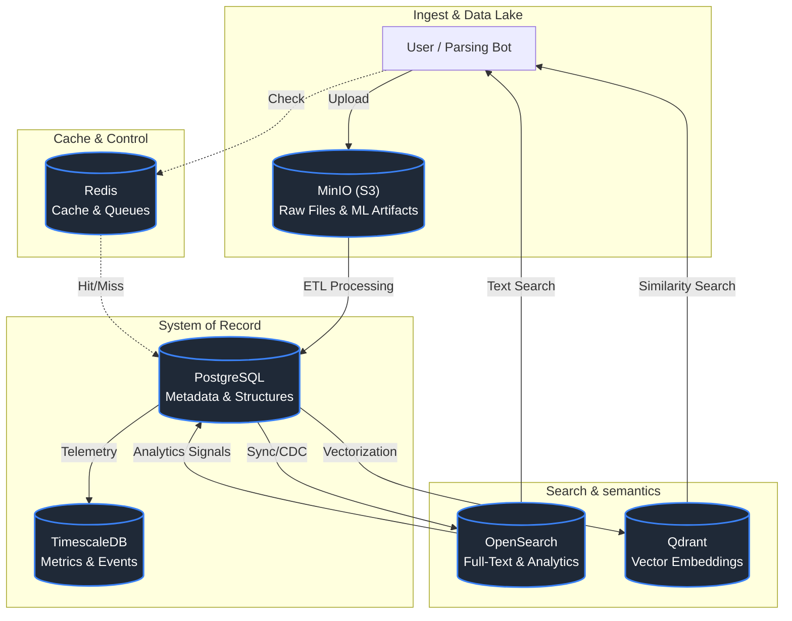

# Predator Data Layer Architecture

## 1. Data Layer Map (Mermaid)

## 2. Component Roles

| System | Role | Specific Usage in Predator |
|--------|------|----------------------------|
| **PostgreSQL** | **Truth Source** | Data Gold Layer, Users, Document Metadata, Job States |
| **TimescaleDB** | **Time Intelligence** | System Latency, Search Quality Metrics, SLA Tracking |
| **OpenSearch** | **Search Engine** | Text Search, Log Aggregation, Query Analytics |
| **Qdrant** | **Semantic Brain** | Vector Embeddings, Hybrid Search, Multi-modal Assets |
| **Redis** | **Speed Layer** | Hot Cache, Rate Limiting, Celery Queues |
| **MinIO** | **Data Lake** | Raw Datasets, ML Models, Backups, DVC Storage |

## 3. Truth Chain Logic

1. **Ingest**: File -> MinIO (Bucket: `raw-imports`)
2. **Record**: Parser -> PostgreSQL (Table: `ua_customs_imports`)
3. **Index**: PostgreSQL -> OpenSearch (Index: `customs-v1`) & Qdrant (Collection: `customs_vectors`)
4. **Retrieval**: API -> Fusion(OS + Qdrant) -> User

## 4. Environment Strategy

*   **Mac (Dev)**: Single instances, Local MinIO, Mock ML Signals.
*   **Oracle (Staging)**: Light replicas, A/B testing, Policy Checks.
*   **NVIDIA (Compute)**: GPU Inference, Batch Embeddings, Heavy Lifting.
