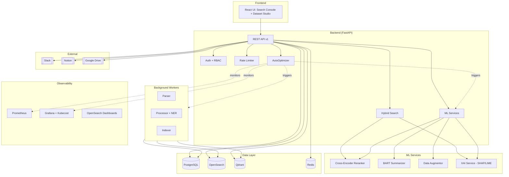

# 🚀 Predator Analytics v21.0 - Autonomous Semantic Search Platform

**Next-Generation AI-Powered Search & Analytics with Self-Optimization**

## 🌟 Унікальні Особливості

### 1. **Автономне Самовдосконалення**
Платформа еволюціонує як жива система:
- ✅ **Самозцілення**: Автоматичне виправлення помилок (latency, errors, accuracy)
- ✅ **Auto Fine-tuning**: Періодичне перетренування моделей на нових даних
- ✅ **Quality Gates**: Автоматичний rollback при погіршенні метрик
- ✅ **Proactive Optimization**: Пошук покращень навіть без проблем
- ✅ **Federated Learning**: Навчання на даних користувачів без їх передачі

**Цикл самовдосконалення:**
```
Monitor (Prometheus/Grafana) 
  → Analyze (anomalies, quality gates)
  → Fix (scale, retrain, optimize)
  → Validate (A/B tests, DVC)
  → Deploy (ArgoCD, zero downtime)
  → Repeat (∞)
```

### 2. **Семантичний Пошук з XAI**
Не просто пошук, а **пояснення** чому результати релевантні:
- Hybrid Search: OpenSearch (keyword) + Qdrant (semantic)
- RRF (Reciprocal Rank Fusion): Оптимальна комбінація результатів
- Cross-Encoder Reranker: Точне ранжування
- **XAI пояснення**: SHAP/LIME + token importance + attention heatmaps

### 3. **Синтетичні Дані та Fine-Tuning**
Dataset Studio для експериментів:
- 4 методи аугментації: synonym, paraphrase, backtranslation, template
- Автогенерація 10K+ прикладів одним кліком
- H2O LLM Studio: No-code fine-tuning
- DVC: Версіонування датасетів і моделей

### 4. **Next-Gen UI**
Інтерфейс, що змушує сказати "вау":
- Giant gradient search bar (120px з неоновими акцентами)
- Фільтри sidebar (дата, категорія, джерело, мова)
- Animated result cards з rank badges
- Document Deep Dive modal з AI summary
- Експорт в Notion/Slack/Google Drive одним кліком
- Hacker Mode (зелена terminal-style тема)

---

## 📊 Технічний Стек

### Backend
- **FastAPI** - API Gateway
- **Celery** - Background workers (Parser, Processor, Indexer)
- **PostgreSQL** - Structured data (staging → gold)
- **OpenSearch** - Full-text search
- **Qdrant** - Vector embeddings
- **Redis** - Cache + Rate limiting
- **MinIO** - Object storage

### ML/AI
- **Sentence Transformers** - Embeddings
- **Cross-Encoder** - Reranking (ms-marco-MiniLM)
- **BART/T5** - Summarization
- **NLPAug** - Data augmentation
- **H2O LLM Studio** - Fine-tuning
- **MLflow** - Experiment tracking
- **SHAP/LIME** - XAI

### Frontend
- **React + TypeScript** - SPA
- **Framer Motion** - Анімації
- **Tailwind CSS** - Styling
- **Lucide Icons** - Icons

### DevOps
- **Docker Compose** - Local dev
- **Kubernetes/K3s** - Production
- **Helm** - Package management
- **ArgoCD** - GitOps
- **Prometheus + Grafana** - Моніторинг
- **OpenSearch Dashboards** - Логи
- **Kubecost** - Cost tracking

---

## 🏗️ Архітектура



---

## 🚀 Quick Start

### 1. Локальна розробка (Docker Compose)

```bash
# Клонувати репо
git clone https://github.com/your-org/predator-analytics.git
cd predator-analytics

# Запустити всі сервіси
make up

# Переглянути логи
make logs

# Перейти до UI
open http://localhost:5173

# API docs
open http://localhost:8000/docs
```

### 2. Deploy на NVIDIA Compute (GPU)

```bash
# Helm з GPU підтримкою
make helm-nvidia

# Перевірити статус
kubectl get pods -n predator-compute

# Forwarding
kubectl port-forward -n predator-compute svc/backend 8000:8000
```

### 3. Deploy на Oracle Cloud (ARM)

```bash
# Helm для ARM
make helm-oracle

# Перевірити
kubectl get pods -n predator-edge
```

---

## 📖 API Endpoints

### Search
```bash
# Hybrid search з XAI
GET /api/v1/search?q=нейронні+мережі&semantic=true&rerank=true&explain=true

# Document summary
GET /api/v1/documents/{id}/summary
```

### ML Services
```bash
# Rerank results
POST /api/v1/ml/rerank
{
  "query": "machine learning",
  "documents": [...],
  "top_k": 10
}

# Data augmentation
POST /api/v1/ml/augment
{
  "text": "Original text",
  "method": "synonym",
  "num_variations": 3
}

# XAI explanation
POST /api/v1/ml/explain
{
  "query": "AI пошук",
  "document_id": "uuid-123",
  "score": 0.92
}

# Generate synthetic dataset
POST /api/v1/ml/datasets/generate
{
  "document_ids": ["uuid-1", "uuid-2"],
  "method": "paraphrase",
  "variations_per_doc": 3
}
```

### AutoOptimizer
```bash
# Статус самовдосконалення
GET /api/v1/optimizer/status

# Поточні метрики
GET /api/v1/optimizer/metrics

# Примусовий цикл
POST /api/v1/optimizer/trigger

# Історія оптимізацій
GET /api/v1/optimizer/history?limit=50

# Quality gates
GET /api/v1/optimizer/quality-gates

# Оновити gate
POST /api/v1/optimizer/quality-gates/ndcg_at_10?threshold=0.80
```

---

## 🎯 Success Metrics

### Performance
- ✅ Search latency P95 < 500ms
- ✅ NDCG@10 ≥ 0.75
- ✅ Indexing throughput > 1000 docs/sec
- ✅ Error rate < 1%

### ML Quality
- ✅ Reranker NDCG improvement: +15-20%
- ✅ Summary quality: ROUGE-L > 0.35
- ✅ Augmentation diversity: > 0.70

### Business
- ✅ User satisfaction (NPS): > 4/5
- ✅ Cost per 1K requests: < $0.50
- ✅ Downtime: < 0.1% (SLA 99.9%)

### Automation
- ✅ Auto-healing response time: < 5 min
- ✅ Model updates frequency: Weekly
- ✅ Quality gate violations: Auto-fixed > 90%

---

## 🔐 Security & Compliance

- **Rate Limiting**: Redis-based, plan quotas (100/day free, 10K/day premium)
- **RBAC**: Role-based access (admin, premium, free)
- **OAuth2**: Slack, Notion, Google Drive integrations
- **Feature Flags**: Gradual rollout, A/B testing
- **Data Encryption**: Secrets in Vault/External Secrets

---

## 📊 Моніторинг

### Dashboards
- **Grafana**: API performance, ML metrics, ETL pipeline
- **OpenSearch Dashboards**: Logs, search analytics
- **Kubecost**: Cost tracking per namespace/service

### Alerts
- Latency > 800ms → Scale pods
- NDCG < 0.75 → Trigger retraining
- Error rate > 2% → Increase workers
- Cost spike → Optimize models

---

## 🧪 Testing

```bash
# Unit tests
make test

# ML services test
make ml-test

# Load testing
cd tests/load
locust -f search_load_test.py --host http://localhost:8000
```

---

## 🔄 Автоматизовані Процеси

### Daily
- Збір метрик (Prometheus)
- Аналіз аномалій (AutoOptimizer)
- Логування search queries для покращення

### Weekly
- Fine-tuning моделей на накопичених даних
- Генерація нових синтетичних датасетів
- A/B тести нових моделей у staging

### Monthly
- Повний retrain на всіх даних
- Cost optimization review (Kubecost)
- Security audit

### On-Trigger
- Quality gate failure → Auto-retrain
- High latency → Scale up
- Low GPU utilization → Launch experiments

---

## 📂 Структура Проекту

```
predator-analytics/
├── frontend/                    # React UI
│   ├── src/
│   │   ├── views/
│   │   │   ├── SearchConsole.tsx  # Main search UI
│   │   │   └── DatasetStudio.tsx  # Dataset generation
│   │   └── components/
│   │       └── DocumentModal.tsx  # Deep dive modal
│   └── package.json
├── ua-sources/                  # Backend
│   ├── app/
│   │   ├── api/v1/             # API endpoints
│   │   │   ├── ml.py           # ML services
│   │   │   └── optimizer.py    # AutoOptimizer
│   │   ├── services/
│   │   │   ├── ml/             # ML services
│   │   │   │   ├── reranker_service.py
│   │   │   │   ├── summarizer_service.py
│   │   │   │   ├── data_augmentor.py
│   │   │   │   └── xai_service.py
│   │   │   ├── search_fusion.py
│   │   │   └── auto_optimizer.py  # Self-improvement
│   │   ├── core/
│   │   │   └── rate_limiter.py
│   │   └── tasks/
│   │       └── etl_workers.py  # Celery tasks
│   └── requirements.txt
├── infra/
│   ├── postgres/migrations/    # DB migrations
│   ├── grafana/dashboards/     # Monitoring
│   └── scripts/
├── helm/
│   └── predator-umbrella/      # Helm chart
│       ├── values-dev-mac.yaml
│       ├── values-compute-nvidia.yaml
│       └── values-edge-oracle.yaml
├── docker-compose.yml
├── Makefile
└── README.md
```

---

## 🤝 Contributing

1. Fork the repo
2. Create feature branch (`git checkout -b feature/amazing`)
3. Commit changes (`git commit -m 'Add amazing feature'`)
4. Push to branch (`git push origin feature/amazing`)
5. Open Pull Request

---

## 📄 License

MIT License - see [LICENSE](LICENSE)

---

## 🎓 Documentation

### Core Specs
- [Technical Spec](TECH_SPEC.md) - Повна специфікація платформи
- [Self-Improvement Loop ♾️](docs/SELF_IMPROVEMENT_SPEC.md) - **Система автономного самовдосконалення**
- [Integration Guide](docs/SELF_IMPROVEMENT_INTEGRATION.md) - Швидкий старт AutoOptimizer
- [Integration Roadmap](INTEGRATION_ROADMAP.md) - План розвитку

### APIs & Tools
- [API Reference](http://localhost:8000/docs) - Swagger docs
- [AutoOptimizer API](http://localhost:8000/docs#/Auto-Optimization) - Self-improvement endpoints
- [MLflow UI](http://localhost:5000) - Experiment tracking
- [Grafana Dashboards](http://localhost:3000) - Metrics & monitoring

### Workflows
- [Deployment Workflows](.agent/workflows/) - GitOps процедури
- [Final Summary](FINAL_SUMMARY.md) - Повний огляд реалізації


---

## 🌐 Контури Розгортання

### MacBook (Dev-Local)
- Docker Compose
- Мінімальні ресурси
- Debug mode

### NVIDIA Server (Lab-GPU)
- K3s/K8s
- GPU support (CUDA)
- H2O LLM Studio, Ollama
- Autoscaling
- Prometheus/Grafana

### Oracle Cloud (Remote Edge)
- ARM-compatible
- Lightweight
- Automated backups

---

## 💡 Ключові Інновації

### 1. Еволюційна Система
Платформа сама себе вдосконалює без втручання DevOps:
- Моніторить якість → Виявляє проблеми → Виправляє автоматично
- Генерує нові датасети → Fine-tune → A/B test → Deploy

### 2. XAI з Першого Дня
Кожен результат пошуку має пояснення:
- Чому документ релевантний?
- Які токени найважливіші?
- Attention heatmap

### 3. No-Code ML
Dataset Studio дозволяє:
- Генерувати 10K прикладів за хвилини
- Fine-tuning через H2O Studio (no code)
- Версіонування через DVC

### 4. Premium UX
UI як у Grok xAI:
- Gradient effects, neon glow
- Smooth animations
- Dark mode з Hacker variant

---

## 🚀 Roadmap

### Q1 2025
- ✅ ML Foundation (reranker, summarizer, XAI)
- ✅ AutoOptimizer (self-healing)
- ✅ Next-Gen UI (SearchConsole, Dataset Studio)
- 🔜 Federated Learning
- 🔜 Multimodal Search (CLIP)

### Q2 2025
- Slack/Notion бот інтеграції
- Voice search (Whisper)
- Advanced analytics dashboards
- Mobile app

### Q3 2025
- H2O AutoML integration
- Custom model marketplace
- Enterprise SSO/SAML
- Multi-tenant support

---

**Built with ❤️ by Predator Analytics Team**

*"Search is not just keywords. It's understanding."*
