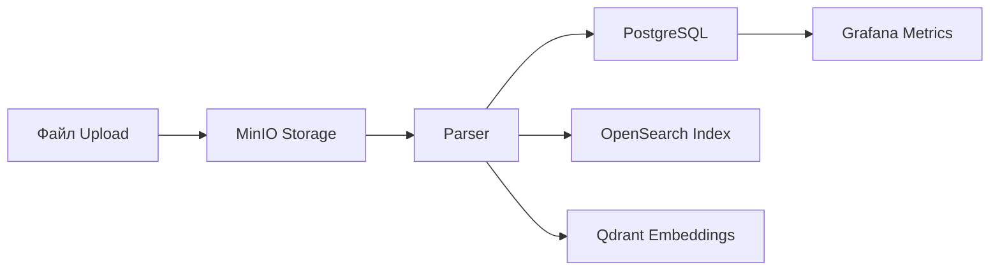

# 📋 PREDATOR ANALYTICS v19.0.0 — EXTENDED FINAL

> **AI-Native · GitOps-Only · Real-Data-Only · Multi-Env (Mac ⇄ NVIDIA ⇄ Oracle) · Multi-IDE (AI Studio ⇄ VS Code)**

**Версія документу:** 19.0.0  
**Дата:** 2 грудня 2025

---

## 0. Головна Мета Системи

Створити єдину AI-аналітичну платформу **Predator Analytics**, яка:

1. **Працює одночасно на трьох середовищах:**
   - **MacBook** — локальна розробка, тест ETL, UI, API
   - **NVIDIA-сервер** — важкі GPU-задачі: NAS/AutoML, ML, LLM, LoRA
   - **Oracle OCI** (free tier) — хмарний remote staging / demo

2. **Повністю керується через GitOps:**
   - Будь-яка зміна коду → GitHub → GitHub Actions CI → ArgoCD → Kubernetes (на всіх середовищах)

3. **Має 0% симуляцій:**
   - Усі дані — реальні Excel/CSV/PDF/Telegram/відкриті реєстри
   - Синтетика генерується лише на основі реальних даних і тільки вручну

4. **Має повний стек AI-Native:**
   - LLM через Ollama (локально + на NVIDIA)
   - API-моделі через Gemini/Mistral/Groq/Fireworks
   - NAS / AutoML / LoRA — GPU-підтримка на NVIDIA

5. **Синхронізує код з:**
   - AI Studio → GitHub
   - VS Code → GitHub
   - GitHub → всі 3 кластери через ArgoCD

---

## 1. Загальна Архітектура (High Level)

```
AI Studio / VS Code
        │
        ▼
 GitHub Repository (predator-analytics)
        │
        ├── GitHub Actions (CI)
        ▼
   ArgoCD (3 інстанси)
        │
        ├── MacBook k8s кластер (dev-local)
        ├── NVIDIA k3s кластер (GPU / ML / NAS)
        └── Oracle k3s кластер (remote cloud)
```

### Компоненти стеку

| Компонент | Технологія | Призначення |
|-----------|------------|-------------|
| Backend | FastAPI | REST API, ETL, LLM integration |
| Frontend | Next.js + React + Tailwind | Веб-інтерфейс |
| Database | PostgreSQL 16 | Основна БД |
| Object Storage | MinIO | S3-сумісне сховище файлів |
| Search Engine | OpenSearch 2.x | Full-text пошук |
| Vector DB | Qdrant | Векторні embeddings |
| LLM Runtime | Ollama | Локальні LLM моделі |
| Cache | Redis | Кешування та черги |
| Monitoring | Prometheus + Grafana + Loki | Метрики та логи |
| GitOps | ArgoCD | Continuous Deployment |
| CI/CD | GitHub Actions | Build & Test |

---

## 2. Три Машини — їхня Роль і Навантаження

### 2.1. MacBook (Dev-Local)

**Призначення:**
- Розробка UI / Backend / ETL
- Локальний запуск повного Predatora через k8s (minikube)
- Тестування реальних даних

**Компоненти:**
- ✅ Backend API (FastAPI)
- ✅ Frontend (Next.js/React)
- ✅ PostgreSQL
- ✅ MinIO
- ✅ OpenSearch
- ✅ Qdrant
- ⚡ Легкий Ollama (необов'язково)
- ✅ Легкий ETL
- ✅ ArgoCD (локальний)

**Обмеження:**
- ❌ Немає важкої GPU-логіки

**Kubernetes:**
```yaml
namespace: predator-mac
nodeSelector: {}  # Без GPU
resources:
  backend:
    memory: "512Mi"
    cpu: "500m"
```

---

### 2.2. NVIDIA-сервер (Lab-GPU)

**Призначення:**
- Heavy ML GPU tasks:
  - NAS (Neural Architecture Search)
  - AutoML
  - LoRA retraining
  - Embeddings generation
  - LLM reasoning
- Важкі ETL / Data-heavy jobs

**Компоненти:**
- ✅ k3s кластер
- ✅ NVIDIA Toolkit + drivers
- ✅ Ollama (full, з великими моделями)
- ✅ FastAPI backend
- ✅ NAS Engine
- ⚡ MLFlow (опційно)
- ⚡ Celery/Kafka Jobs (опційно)
- ✅ ArgoCD
- ✅ Monitoring stack (Prometheus + Grafana + Loki)

**Характеристики:**
```yaml
GPU: NVIDIA GTX 1080 (8GB VRAM)
RAM: 49GB
CPU: 16 cores
Storage: 177GB SSD
OS: Ubuntu 24.04 LTS
k3s: v1.32.5+k3s1
```

**Kubernetes:**
```yaml
namespace: predator-nvidia
nodeSelector:
  gpu: "true"
resources:
  backend:
    memory: "2Gi"
    cpu: "2000m"
  nas-engine:
    nvidia.com/gpu: "1"
```

---

### 2.3. Oracle Cloud (remote cloud)

**Призначення:**
- Remote staging/demo без GPU
- Перевірка роботи AI API (Gemini, Mistral)
- Мінімальний набір компонентів

**Компоненти:**
- ✅ Base FastAPI backend
- ✅ Frontend (Next.js)
- ✅ PostgreSQL (lightweight)
- ✅ OpenSearch (або lightweight wrapper)
- ✅ ArgoCD
- ⚡ Lightweight Ollama (ARM/AMD)

**Вимоги:**
- Multi-arch Docker images (amd64 + arm64)
- Traffic rules для експорту UI

---

## 3. Всі Компоненти Predator Analytics

### 3.1. ETL Layer (реальні дані)

**Підтримувані джерела:**

| Джерело | Технологія | Max Size |
|---------|------------|----------|
| Excel | pandas / polars | до 300MB |
| CSV | pandas / polars | до 800MB |
| PDF | pdfplumber | без обмежень |
| Telegram | Telethon | real-time |
| Websites | Playwright / Scrapy | - |
| Реєстри | API / HTML parsing | - |
| JSON archives | jsonlines | без обмежень |

**ETL-пайплайн (обов'язковий):**



1. Завантаження файлу → MinIO
2. Парсинг → PostgreSQL
3. Індексація → OpenSearch
4. Embeddings → Qdrant
5. Метрики → Grafana

> ⚠️ **ЗАБОРОНА:** Ніяких симуляцій реальних даних!

---

### 3.2. Backend

**Фреймворк:** FastAPI

**Структура:**
```
backend/
├── app/
│   ├── main.py           # FastAPI app
│   ├── api/
│   │   ├── v1/
│   │   │   ├── etl.py    # ETL endpoints
│   │   │   ├── search.py # Search endpoints
│   │   │   ├── llm.py    # LLM endpoints
│   │   │   └── nas.py    # NAS/AutoML endpoints
│   ├── core/
│   │   ├── config.py     # Settings
│   │   └── security.py   # Auth
│   ├── services/
│   │   ├── etl_service.py
│   │   ├── llm_service.py
│   │   ├── search_service.py
│   │   └── nas_service.py
│   └── models/
│       └── schemas.py
├── Dockerfile
└── requirements.txt
```

**Функції:**
- API для UI
- Обробка ETL
- Виклики LLM (Ollama/Remote API)
- Виклики NAS/AutoML
- Робота з БД
- S3 (MinIO) інтеграція
- Logging → Loki/Promtail

---

### 3.3. Frontend (Nexus UI)

**Фреймворк:** Next.js 14 + React + Tailwind CSS

**Структура:**
```
frontend/
├── src/
│   ├── app/
│   │   ├── layout.tsx
│   │   ├── page.tsx
│   │   ├── dashboard/
│   │   ├── etl/
│   │   ├── search/
│   │   └── ml/
│   ├── components/
│   │   ├── ui/
│   │   ├── charts/
│   │   └── forms/
│   └── lib/
│       └── api.ts
├── Dockerfile
└── package.json
```

**Підтримує:**
- Завантаження реальних файлів (Excel/CSV)
- Перегляд таблиць
- Графіки (Plotly / D3.js / Recharts)
- Векторний пошук
- Пошук по OpenSearch
- UI для ML/NAS
- Моніторинг подій (через WebSocket)

---

### 3.4. ML / LLM Layer

**Локальні моделі (Ollama):**

| Модель | Розмір | Призначення | Де працює |
|--------|--------|-------------|-----------|
| llama3.2 | 2GB | Швидкі відповіді | Mac, NVIDIA |
| qwen2.5 | 4.7GB | Аналіз | NVIDIA |
| qwen3 | 5.2GB | Reasoning | NVIDIA |
| nomic-embed-text | 300MB | Embeddings | Всі |
| mxbai-embed-large | 500MB | Quality embeddings | NVIDIA |

**Використання:**
- Embeddings → Qdrant
- Summaries / Insights
- Agent system
- NAS reasoning

**Хмарні API:**
- Gemini 2.0 Flash
- Mistral Small
- Groq Llama
- Fireworks mixtral

---

### 3.5. NAS / AutoML

**Мета:**
- Пошук найкращої моделі для задач:
  - Виявлення аномалій
  - Прогнозування
  - Класифікація ризиків

> ⚠️ Працює **виключно** на NVIDIA GPU

**Компоненти:**
```yaml
nas-engine:
  image: predator/nas-engine:latest
  resources:
    limits:
      nvidia.com/gpu: "1"
  nodeSelector:
    gpu: "true"
```

---

### 3.6. Моніторинг

| Компонент | Порт | Призначення |
|-----------|------|-------------|
| Prometheus | 9090 | Збір метрик |
| Grafana | 3000 | Візуалізація |
| Loki | 3100 | Агрегація логів |
| Tempo | 3200 | Distributed tracing |
| Node Exporter | 9100 | Host metrics |

---

## 4. DevOps / GitOps — Повний Цикл

### 4.1. GitHub Actions (CI)

**Пайплайни:**

```
.github/workflows/
├── ci.yml                 # Lints + Tests
├── build-backend.yml      # Build/push Docker backend
├── build-frontend.yml     # Build/push frontend
├── helm-lint.yml          # Helm chart validation
├── zero-simulation.yml    # No mock data check
└── deploy-trigger.yml     # ArgoCD webhook (optional)
```

**Приклад ci.yml:**
```yaml
name: CI
on: [push, pull_request]
jobs:
  lint:
    runs-on: ubuntu-latest
    steps:
      - uses: actions/checkout@v4
      - name: Lint Backend
        run: |
          cd backend
          pip install ruff
          ruff check .
      - name: Lint Frontend
        run: |
          cd frontend
          npm ci
          npm run lint

  test:
    runs-on: ubuntu-latest
    steps:
      - uses: actions/checkout@v4
      - name: Test Backend
        run: |
          cd backend
          pip install pytest
          pytest

  zero-simulation-check:
    runs-on: ubuntu-latest
    steps:
      - uses: actions/checkout@v4
      - name: Check for mock data
        run: ./scripts/check_zero_simulation.sh
```

---

### 4.2. ArgoCD (CD)

**Структура:**
```
argocd/
├── predator-macbook.yaml
├── predator-nvidia.yaml
└── predator-oracle.yaml
```

**Application Template:**
```yaml
apiVersion: argoproj.io/v1alpha1
kind: Application
metadata:
  name: predator-{env}
  namespace: argocd
spec:
  project: default
  source:
    repoURL: https://github.com/dima1203oleg/predator-analytics.git
    targetRevision: HEAD
    path: environments/{env}
  destination:
    server: https://kubernetes.default.svc
    namespace: predator-{env}
  syncPolicy:
    automated:
      prune: true
      selfHeal: true
    syncOptions:
      - CreateNamespace=true
```

---

### 4.3. Kubernetes Environments

**Структура:**
```
environments/
├── macbook/
│   ├── Chart.yaml
│   ├── values.yaml
│   └── templates/
│       ├── namespace.yaml
│       ├── backend-deployment.yaml
│       ├── frontend-deployment.yaml
│       ├── postgresql.yaml
│       ├── minio.yaml
│       ├── opensearch.yaml
│       ├── qdrant.yaml
│       └── services.yaml
├── nvidia/
│   ├── Chart.yaml
│   ├── values.yaml
│   └── templates/
│       └── ... (+ nas-engine.yaml, ollama.yaml)
└── oracle/
    ├── Chart.yaml
    ├── values.yaml
    └── templates/
```

**Порівняння середовищ:**

| Компонент | Mac | NVIDIA | Oracle |
|-----------|-----|--------|--------|
| GPU | ❌ | ✔ | ❌ |
| NAS | легкий | повний | вимкнено |
| Ollama | легкий | повний | легкий |
| ML jobs | ❌ | ✔ | ❌ |
| Resources | мінімальні | максимальні | середні |

---

## 5. Multi-IDE Development (AI Studio + VS Code)

### 5.1. AI Studio функції:
- Редагування UI/Backend коду
- Push у GitHub
- Автоматичний sync скрипт: `sync_from_ai_studio.sh`

### 5.2. VS Code функції:
- Локальний/dev запуск
- Remote SSH на NVIDIA
- Kubernetes extension
- ArgoCD extension
- GitHub Copilot multi-agent

---

## 6. Дані: 100% Real-Only Policy

### Головне правило:

> **Якщо дані показані у UI — це реальні дані з файлів або анонімізовані копії.**
> **Симуляція заборонена.**

### Заборонені патерни в коді:
```python
# ❌ ЗАБОРОНЕНО
import random
from faker import Faker
mock_data = [...]
fake_users = generate_fake()
```

### Перевіряючі механізми:
1. CI перевіряє, що в коді немає: `random()`, `faker`, `mock data`
2. Frontend не має JSON-файлів з демо-даними
3. Backend тестує ETL на реальному тестовому excel

### Скрипт перевірки:
```bash
#!/bin/bash
# scripts/check_zero_simulation.sh

FORBIDDEN_PATTERNS=(
  "faker"
  "mock_data"
  "fake_users"
  "generate_fake"
  "random.choice.*name"
  "synthetic_data"
)

for pattern in "${FORBIDDEN_PATTERNS[@]}"; do
  if grep -r "$pattern" --include="*.py" --include="*.ts" --include="*.tsx" .; then
    echo "❌ Found forbidden pattern: $pattern"
    exit 1
  fi
done

echo "✅ Zero simulation check passed"
```

---

## 7. Definition of Done (DoD)

Система вважається готовою, якщо:

### ✅ MacBook:
- [ ] Завантаження Excel → MinIO → PostgreSQL → OpenSearch → Qdrant → UI

### ✅ NVIDIA:
- [ ] Все як на Mac + ML/NAS/LLM відпрацьовують GPU pipeline
- [ ] `nvidia-smi` показує GPU в k3s pods

### ✅ Oracle:
- [ ] Remote staging працює без GPU
- [ ] API AI працює (Mistral/Gemini)

### ✅ GitOps:
- [ ] `git push` → GitHub Actions → ArgoCD → всі 3 середовища синхронізуються

### ✅ 0 Симуляцій:
- [ ] Всі графіки / таблиці / інсайти — з реальних даних

---

## 8. Структура Репозиторію

```
predator-analytics/
├── .github/
│   └── workflows/
│       ├── ci.yml
│       ├── build-backend.yml
│       ├── build-frontend.yml
│       ├── helm-lint.yml
│       └── zero-simulation.yml
├── argocd/
│   ├── predator-macbook.yaml
│   ├── predator-nvidia.yaml
│   └── predator-oracle.yaml
├── backend/
│   ├── app/
│   ├── Dockerfile
│   └── requirements.txt
├── frontend/
│   ├── src/
│   ├── Dockerfile
│   └── package.json
├── environments/
│   ├── macbook/
│   ├── nvidia/
│   └── oracle/
├── scripts/
│   ├── bootstrap_mac_minikube.sh
│   ├── bootstrap_nvidia_k3s.sh
│   ├── bootstrap_oracle_k3s.sh
│   ├── check_zero_simulation.sh
│   ├── sync_from_ai_studio.sh
│   └── push_to_ai_studio.sh
├── docs/
│   └── ...
├── TECH_SPEC.md
├── README.md
└── DEPLOY_CHECKLIST.md
```

---

## 9. Secrets Management

**GitHub Secrets:**
```
DOCKERHUB_USERNAME
DOCKERHUB_TOKEN
ARGOCD_TOKEN_MAC
ARGOCD_TOKEN_NVIDIA
ARGOCD_TOKEN_ORACLE
GEMINI_API_KEY
MISTRAL_API_KEY
```

**Kubernetes Secrets (per environment):**
```yaml
apiVersion: v1
kind: Secret
metadata:
  name: predator-secrets
  namespace: predator-{env}
type: Opaque
stringData:
  POSTGRES_PASSWORD: "${POSTGRES_PASSWORD}"
  MINIO_SECRET_KEY: "${MINIO_SECRET_KEY}"
  OLLAMA_API_KEY: "${OLLAMA_API_KEY}"
```

---

## 10. Порти та Endpoints

| Service | Port | Endpoint |
|---------|------|----------|
| Backend API | 8000 | /api/v1/* |
| Frontend | 3000 | / |
| PostgreSQL | 5432 | - |
| MinIO | 9000 | /minio |
| MinIO Console | 9001 | - |
| OpenSearch | 9200 | - |
| Qdrant | 6333 | - |
| Ollama | 11434 | - |
| Prometheus | 9090 | /prometheus |
| Grafana | 3000 | /grafana |
| ArgoCD | 8080 | /argocd |

---

## Changelog

- **v19.0.0** (2025-12-02): Initial full specification
- **v18.x**: Legacy version (pre-GitOps)
