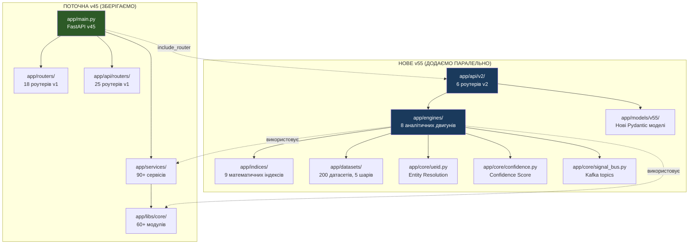
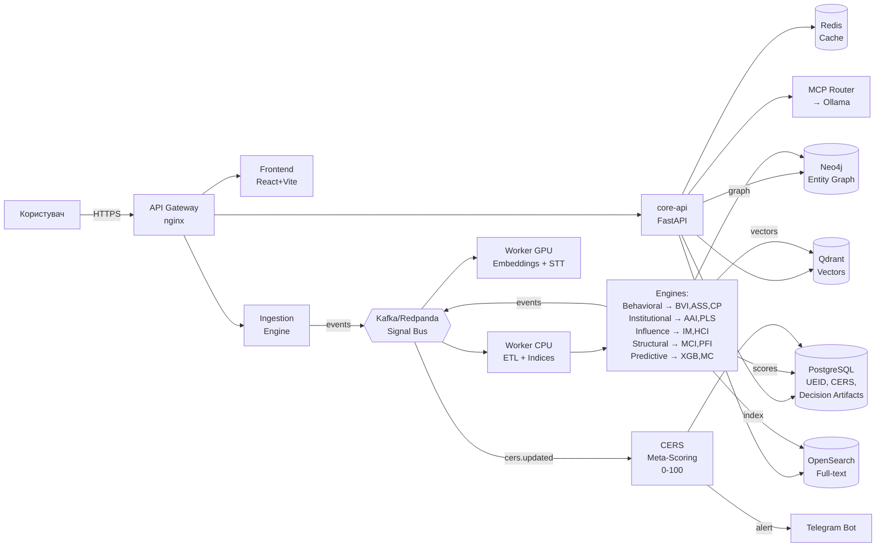
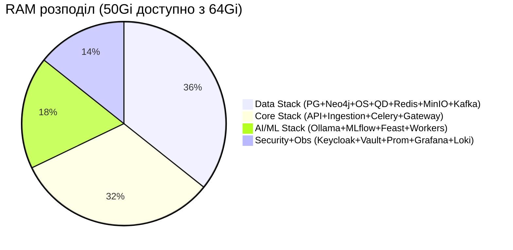
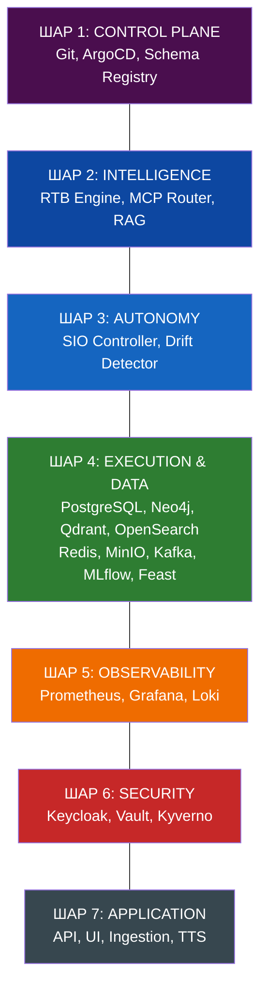
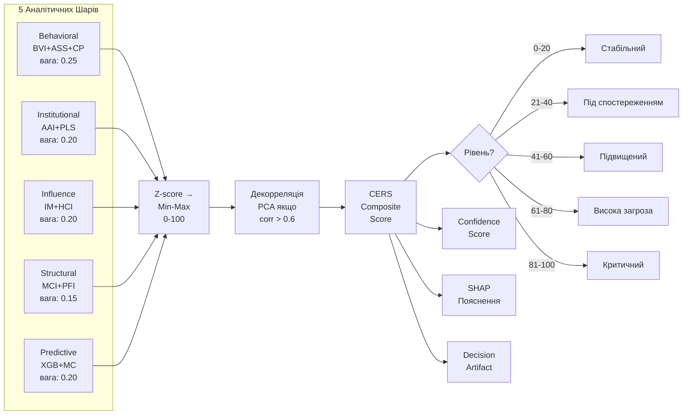
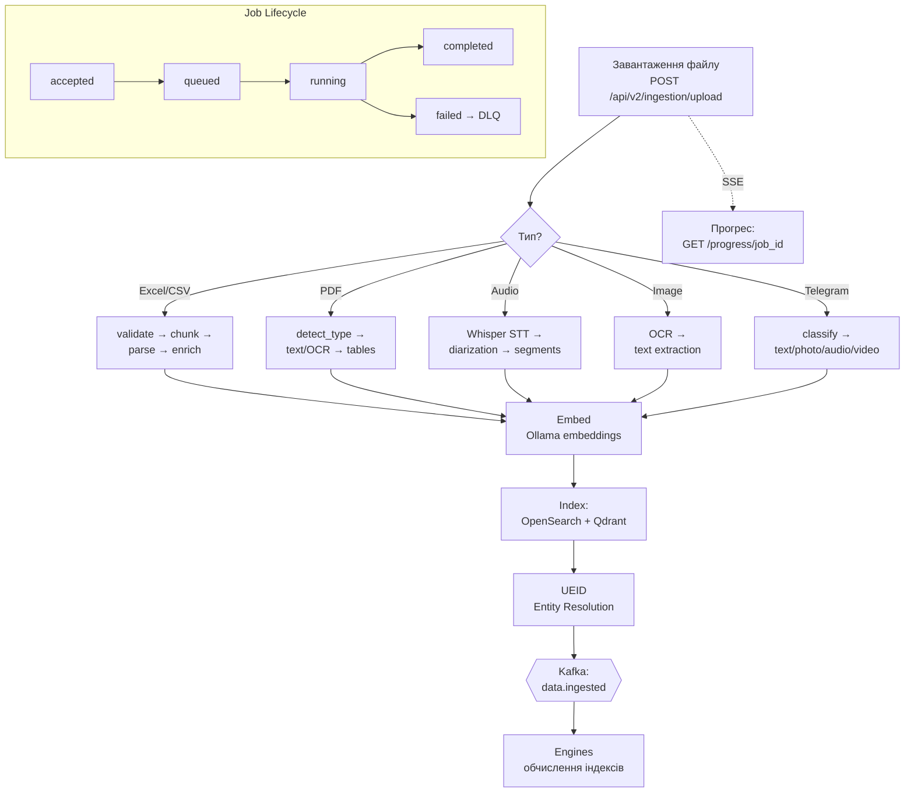
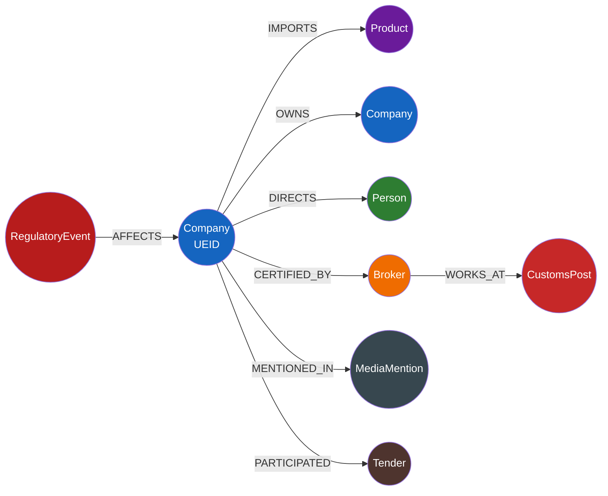
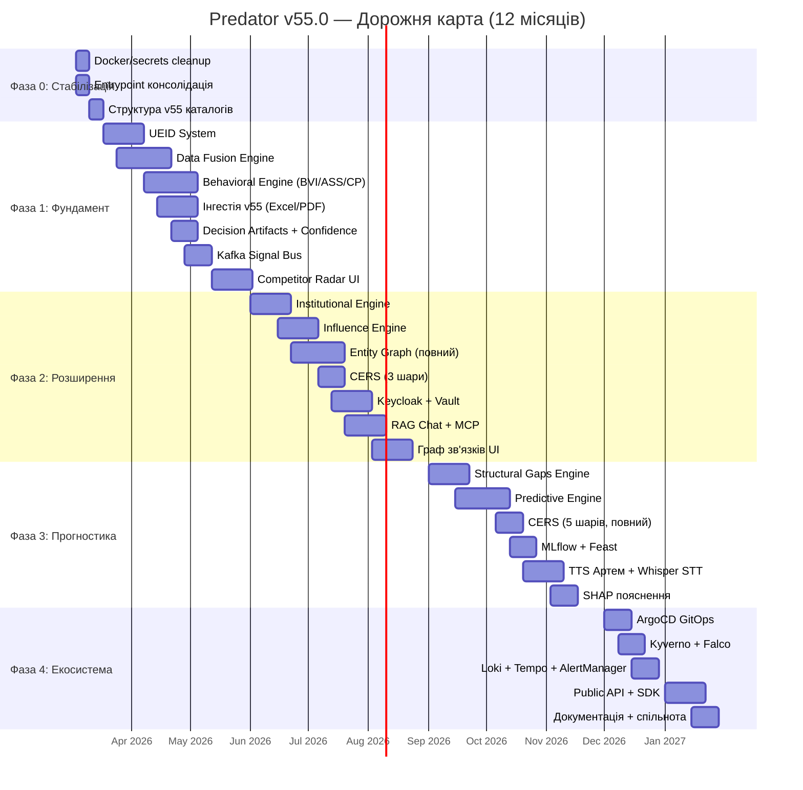
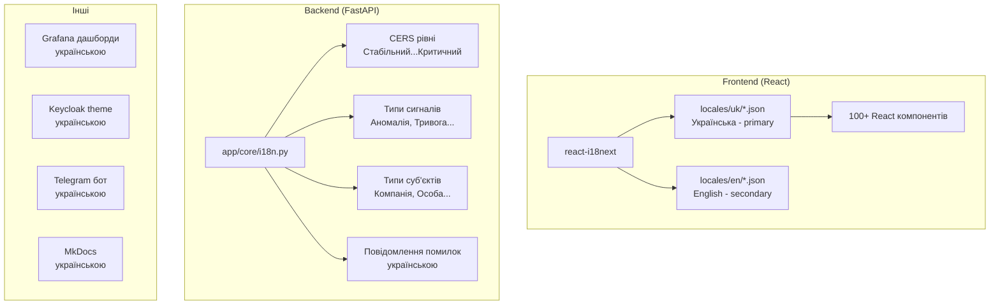
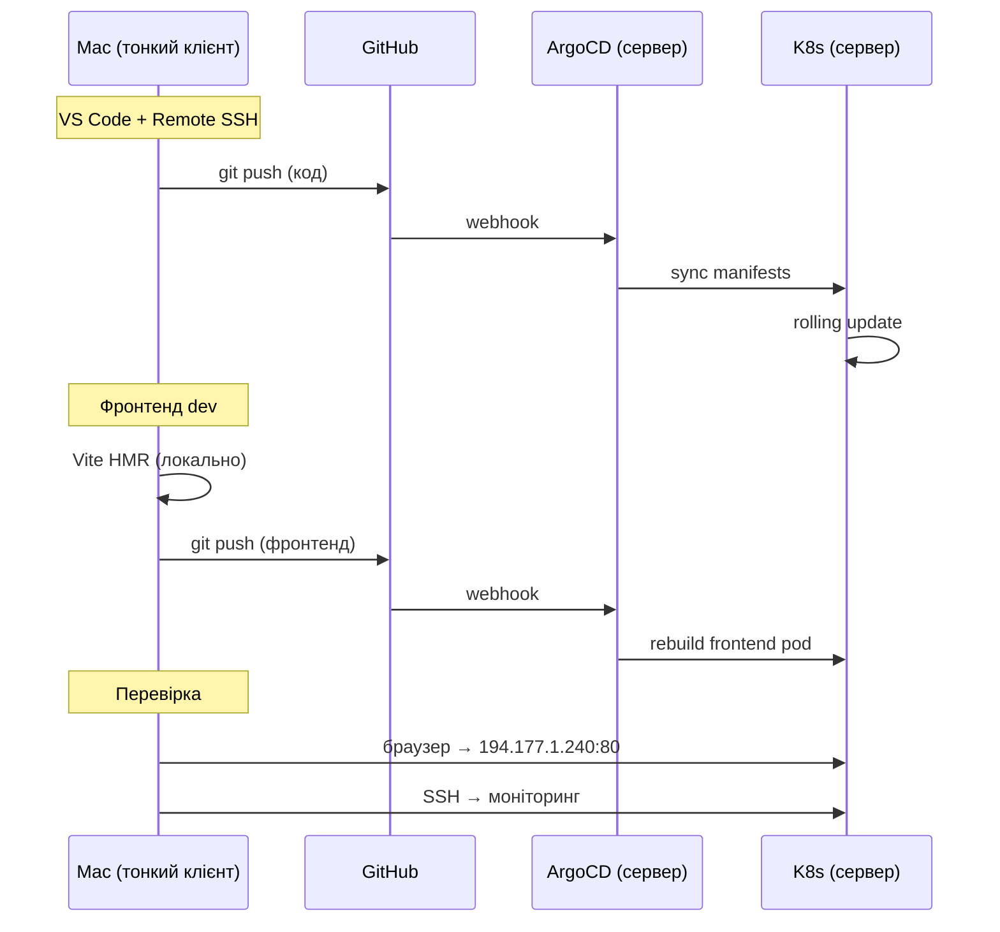

# PREDATOR v55.0 — АРХІТЕКТУРНІ ДІАГРАМИ ВПРОВАДЖЕННЯ

## 1. ТРАНСФОРМАЦІЯ: v45 → v55 (Strangler Fig)

## 2. ПОТІК ДАНИХ v55

## 3. СЕРВЕР 194.177.1.240 — РОЗПОДІЛ РЕСУРСІВ

## 4. 7 ШАРІВ СИСТЕМИ v55

## 5. CERS PIPELINE

## 6. ІНГЕСТІЯ PIPELINE

## 7. ENTITY GRAPH (Neo4j)

## 8. ФАЗИ ВПРОВАДЖЕННЯ — ТАЙМЛАЙН

## 9. УКРАЇНІЗАЦІЯ — АРХІТЕКТУРА i18n

## 10. MAC ↔ СЕРВЕР СИНХРОНІЗАЦІЯ

