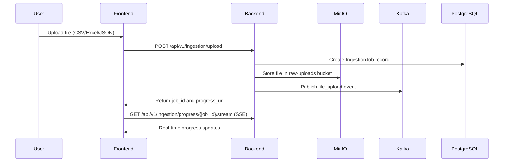
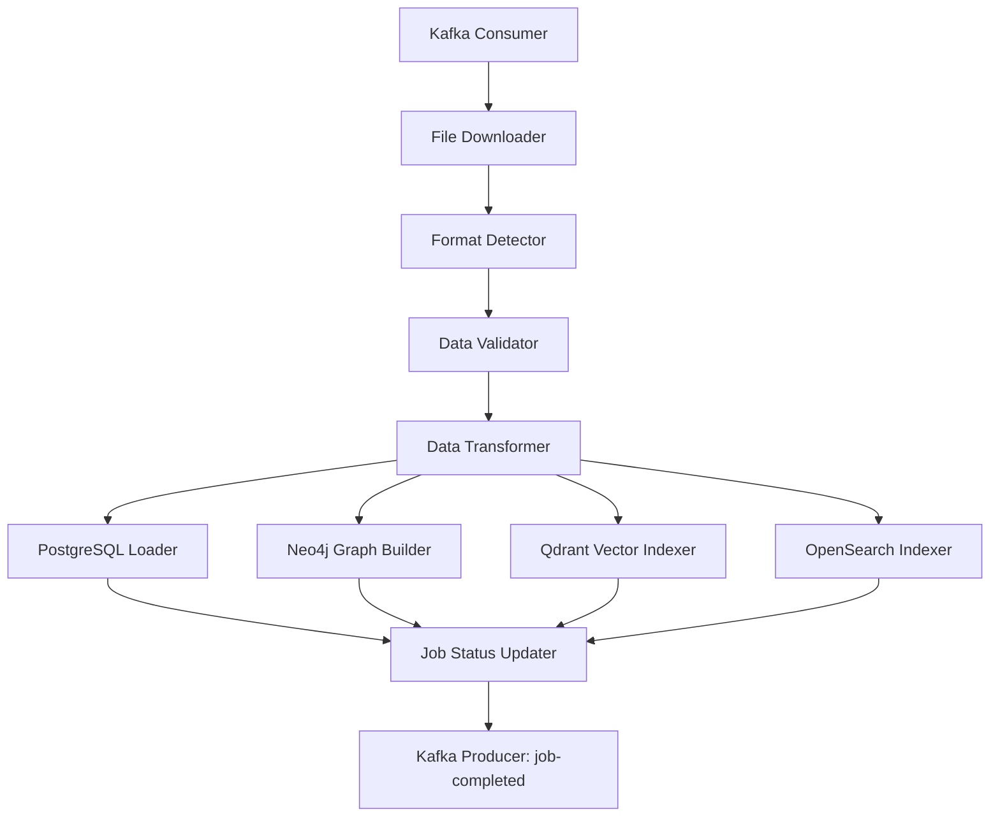
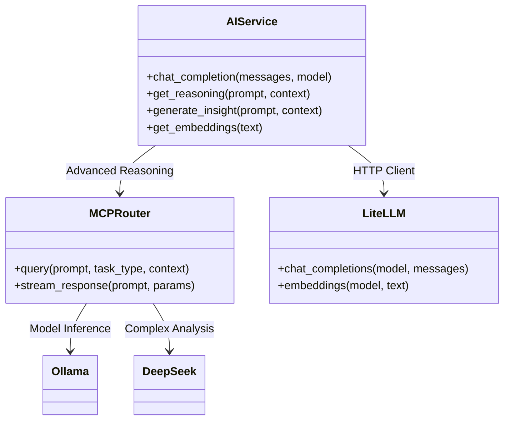
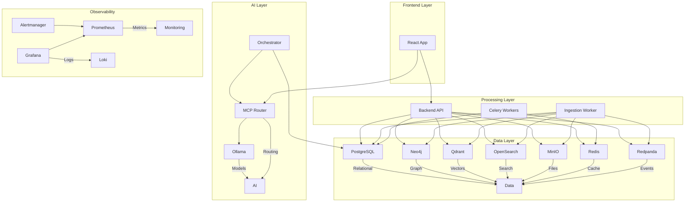

# PREDATOR Analytics v56.5-ELITE - Complete Workflow Analysis

## Executive Summary

PREDATOR Analytics is a sophisticated OSINT (Open Source Intelligence) platform for customs analytics in Ukraine. The system employs a microservices architecture with advanced AI/ML capabilities, real-time data processing, and comprehensive observability. This analysis documents the complete workflow from data ingestion to AI-driven insights.

## 1. System Architecture Overview

### 1.1 High-Level Components

```
┌───────────────────────────────────────────────────────────────────────────────┐
│                                PREDATOR Analytics v56.5-ELITE                 │
├─────────────────┬─────────────────┬─────────────────┬─────────────────┬─────────┤
│   Data Layer    │  Processing     │   AI/ML Layer   │  Frontend Layer │  Ops   │
│                 │    Layer        │                 │                 │ Layer   │
└─────────────────┴─────────────────┴─────────────────┴─────────────────┴─────────┘
```

### 1.2 Technology Stack

**Backend:**
- Python 3.12, FastAPI, SQLAlchemy 2.0 async
- PostgreSQL 16, Neo4j 5, Redis 7, Qdrant 1.8
- Kafka (Redpanda), MinIO, OpenSearch 2.12

**Frontend:**
- React 18, Vite 5, TypeScript
- Tailwind CSS 3, Shadcn UI
- TanStack Query, Recharts, Cytoscape.js

**AI/ML:**
- LiteLLM, Ollama, DeepSeek
- DSPy, LangChain, RAG pipelines
- Custom AI agents and copilots

**Infrastructure:**
- Docker, Kubernetes (k3s), Helm
- Prometheus, Grafana, Loki
- ArgoCD, GitHub Actions CI/CD

## 2. Data Ingestion Workflow

### 2.1 File Upload Process



### 2.2 Key Components

**Ingestion Router (`services/core-api/app/routers/ingestion.py`):**
- Handles file uploads with validation
- Supports CSV, Excel, JSON formats
- Implements Server-Sent Events (SSE) for real-time progress
- Integrates with MinIO for file storage
- Publishes events to Kafka for async processing

**Kafka Integration:**
- Uses Redpanda as Kafka-compatible broker
- Topics: file-uploads, ingestion-commands, processing-results
- Enables decoupled, scalable processing

**MinIO Storage:**
- Bucket structure: `raw-uploads/{tenant_id}/{job_id}/`
- Versioned storage for auditability
- Lifecycle policies for cleanup

## 3. Data Processing Pipeline

### 3.1 Ingestion Worker Architecture



### 3.2 Processing Features

**Data Validation:**
- Schema validation using Pydantic models
- Data quality checks (nulls, duplicates, outliers)
- Business rule validation

**ETL Transformations:**
- Data normalization and cleansing
- Entity resolution and deduplication
- Graph relationship extraction

**Multi-Database Persistence:**
- **PostgreSQL:** Structured relational data
- **Neo4j:** Graph relationships and network analysis
- **Qdrant:** Vector embeddings for semantic search
- **OpenSearch:** Full-text search and analytics

## 4. AI/ML Workflow

### 4.1 AI Service Architecture



### 4.2 AI Capabilities

**Core AI Services (`services/core-api/app/services/ai_service.py`):**
- **Chat Completion:** Basic LLM interactions
- **Reasoning Engine:** Deep analysis with context
- **Insight Generation:** Sovereign Advisor integration
- **Embeddings:** Vector representations for RAG

**MCP Router Integration:**
- Multi-model routing (Ollama, DeepSeek, etc.)
- Task-specific model selection
- Response streaming and optimization

**AI Features in Frontend:**
- **AI Copilot:** Interactive assistance
- **Risk Scoring:** Automated risk assessment
- **Anomaly Detection:** Pattern recognition
- **Predictive Analytics:** Forecasting models

## 5. Frontend Architecture

### 5.1 Component Structure

```
src/
├── components/          # Reusable UI components
├── features/            # Feature modules
│   ├── ai/              # AI control plane
│   ├── analytics/       # Financial dashboards
│   ├── intelligence/    # Intelligence views
│   ├── dashboard/       # System monitoring
│   └── infrastructure/  # Cluster management
├── services/            # API clients
├── context/             # React context providers
├── hooks/               # Custom React hooks
└── pages/               # Page routes
```

### 5.2 Key Frontend Features

**Real-time Data Visualization:**
- Interactive charts with Recharts
- Graph visualization with Cytoscape.js
- Real-time metrics with SSE

**AI Integration:**
- AI Copilot component for interactive assistance
- Automated risk scoring displays
- Predictive analytics dashboards

**System Monitoring:**
- Service health dashboards
- Cluster topology visualization
- Resource utilization charts

## 6. Infrastructure & Deployment

### 6.1 Docker Compose Architecture



### 6.2 Deployment Profiles

- **Local Development:** Frontend + Backend + Key services
- **Server Deployment:** Full stack with observability
- **Production:** Kubernetes with Helm charts

### 6.3 Kubernetes Architecture

**Helm Chart Structure:**
- Main chart with dependencies
- Subcharts for each microservice
- Configurable resource limits
- Horizontal Pod Autoscaler (HPA) support

**Key Kubernetes Features:**
- Network policies for security
- Pod Disruption Budgets (PDB)
- Resource quotas and limits
- Persistent Volume Claims (PVC)

## 7. Workflow Analysis

### 7.1 Data Flow

1. **Ingestion:** Files uploaded → MinIO storage → Kafka events
2. **Processing:** Workers consume events → ETL → Multi-database persistence
3. **API Layer:** FastAPI endpoints → Service methods → Data retrieval
4. **AI Layer:** LLM calls → Insight generation → Response formatting
5. **Frontend:** React components → API calls → Real-time updates

### 7.2 Performance Optimization

**Backend:**
- Async SQLAlchemy for database operations
- Redis caching for frequent queries
- Circuit breakers for external services
- Rate limiting and compression middleware

**Frontend:**
- TanStack Query for data fetching
- Code splitting with Vite
- Memoization and React.memo
- Virtualized lists for large datasets

**Infrastructure:**
- Resource limits and requests
- Horizontal scaling for workers
- Health checks and readiness probes
- Graceful shutdown handling

### 7.3 Security Features

**Authentication:**
- JWT-based authentication
- Keycloak integration for SSO
- Role-based access control (RBAC)

**Data Security:**
- Encryption at rest (PostgreSQL, MinIO)
- TLS for all internal communications
- Secrets management with Vault

**Network Security:**
- Network policies in Kubernetes
- CORS restrictions
- Security headers middleware

## 8. Monitoring and Observability

### 8.1 Monitoring Stack

- **Prometheus:** Metrics collection
- **Grafana:** Dashboards and visualization
- **Loki:** Log aggregation
- **Alertmanager:** Alerting and notifications

### 8.2 Key Metrics

**Backend Metrics:**
- Request latency and throughput
- Database query performance
- Cache hit/miss ratios
- Error rates and response codes

**Frontend Metrics:**
- Page load times
- API call durations
- Error tracking
- User interaction analytics

**Infrastructure Metrics:**
- CPU/Memory utilization
- Network I/O
- Disk usage
- Container health

## 9. Development Workflow

### 9.1 CI/CD Pipeline

1. **Code Quality:** Ruff linting, Mypy type checking
2. **Testing:** Pytest (backend), Vitest (frontend)
3. **Build:** Docker multi-stage builds
4. **Deploy:** Helm charts to Kubernetes
5. **Verify:** E2E tests with Playwright

### 9.2 Development Tools

- **Local Development:** Docker Compose profiles
- **Testing:** Comprehensive test suites
- **Documentation:** Auto-generated OpenAPI docs
- **Debugging:** Structured logging, error tracking

## 10. Conclusion

PREDATOR Analytics v56.5-ELITE represents a sophisticated, enterprise-grade OSINT platform with:

- **Scalable Architecture:** Microservices with async processing
- **Advanced AI:** Multi-model LLM integration
- **Real-time Capabilities:** SSE, WebSockets, Kafka streaming
- **Comprehensive Observability:** Full monitoring stack
- **Robust Security:** End-to-end encryption and access control

The system demonstrates best practices in modern software engineering, combining cutting-edge AI technologies with reliable enterprise patterns for customs analytics in Ukraine.