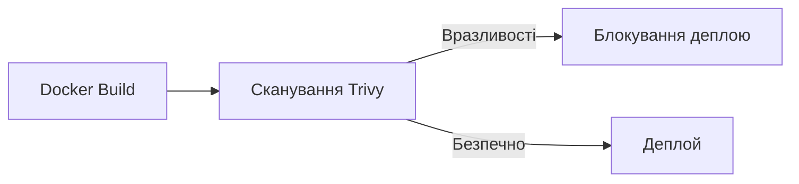

# 🚀 Покращений воркфлов PREDATOR Analytics

## 🔄 CI/CD Pipeline
```mermaid
graph TD
    A[Push до main/dev] --> B[GitHub Actions]
    B --> C{Тести та лінтинг}
    C -->|Успіх| D[Сканування Trivy]
    C -->|Провал| E[Сповіщення у Telegram]
    D -->|Успіх| F[Деплой на NVIDIA Server]
    D -->|Провал| E
    F --> G[Моніторинг (Grafana)]
```

## 🧪 Тестування
```mermaid
graph LR
    A[Локальна розробка] --> B[Юніт-тести (pytest/vitest)]
    B --> C[E2E-тести (Playwright)]
    C --> D[Автономні тести (test_autonomy.sh)]
    D --> E[Результати у SonarQube]
```

## 🛡️ Безпека
