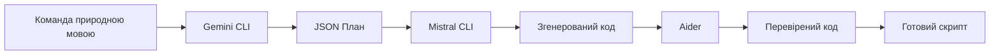

# 🚀 CLI Tools Integration - Predator Analytics v45.0

## Огляд

Інтеграція трьох CLI-інструментів для автоматизації розробки через ланцюжок:
**Gemini → Mistral → Aider**

### Ролі інструментів:
- **Gemini CLI** (Стратег) - Планування та аналіз завдань
- **Mistral CLI** (Генератор) - Швидка генерація коду
- **Aider** (Охоронець) - Перевірка та дебаг коду
- **Ollama + CodeLlama** - Локальна генерація (офлайн)

---

## 📦 Встановлення

### На NVIDIA Сервері:

```bash
# Підключення до сервера
ssh dima@194.177.1.240 -p 6666

# Перехід в проект
cd ~/predator-analytics

# Синхронізація коду з Mac
git pull origin main

# Запуск встановлення CLI інструментів
chmod +x scripts/install_cli_tools.sh
./scripts/install_cli_tools.sh
```

### Вимоги:
- Python 3.8+
- pip3
- curl (для Ollama)
- 10GB вільного місця (для моделей Ollama)

---

## 🔑 API Ключі

### Mistral API:
```bash
export MISTRAL_API_KEY="wAp8islIU7ZK24G7cRDrfttvYBIfMKKc"
```

### Gemini API (опціонально):
```bash
export GEMINI_API_KEY="ваш-ключ-від-google"
```

> **Примітка**: Якщо GEMINI_API_KEY не встановлено, використовується Ollama Llama 3.2

---

## 🎯 Використання

### 1. Базовий Triple CLI Chain

Генерація коду через ланцюжок Gemini → Mistral → Aider:

```bash
# Простий скрипт
python3 scripts/triple_cli.py "Створи скрипт для бекапу Qdrant в MinIO"

# З вказанням output файлу
python3 scripts/triple_cli.py "ETL pipeline для PostgreSQL" -o etl_pipeline.py

# Генерація навчального скрипту
python3 scripts/triple_cli.py "H2O AutoML для класифікації тексту" -o train.py
```

### 2. ML CLI - Навчання Моделей

Спеціалізований CLI для ML завдань:

```bash
# Навчання моделі з H2O AutoML
python3 scripts/ml_cli.py train \
  --task "класифікація емоцій в тексті" \
  --framework h2o

# PyTorch пайплайн
python3 scripts/ml_cli.py train \
  --task "NER для українського тексту" \
  --framework pytorch

# Kubeflow Pipeline
python3 scripts/ml_cli.py train \
  --task "sentiment analysis" \
  --framework kubeflow
```

### 3. ML CLI - Створення Агентів

Генерація AI агентів з LangGraph:

```bash
# Код-ревьювер агент
python3 scripts/ml_cli.py agent \
  --type "код-ревьювер" \
  --tools git opensearch postgres

# Дослідницький агент
python3 scripts/ml_cli.py agent \
  --type "дослідник документів" \
  --tools opensearch qdrant

# Оптимізаційний агент
python3 scripts/ml_cli.py agent \
  --type "оптимізатор SQL запитів" \
  --tools postgres prometheus
```

### 4. ML CLI - Аугментація Даних

Генерація пайплайнів аугментації:

```bash
# Текстова аугментація (nlpaug)
python3 scripts/ml_cli.py augment \
  --data-type text \
  --count 5000

# Аугментація зображень (augly)
python3 scripts/ml_cli.py augment \
  --data-type image \
  --count 2000

# Табличні дані (SMOTE)
python3 scripts/ml_cli.py augment \
  --data-type tabular \
  --count 1000
```

### 5. ML CLI - MLOps Скрипти

Автоматизація MLOps:

```bash
# Моніторинг моделей (drift detection)
python3 scripts/ml_cli.py mlops --type monitoring

# Deployment пайплайн
python3 scripts/ml_cli.py mlops --type deployment

# Rollback механізм
python3 scripts/ml_cli.py mlops --type rollback

# Тестовий framework
python3 scripts/ml_cli.py mlops --type testing
```

---

## 🔗 Ланцюжки CLI

### Як працює Triple CLI Chain:



### Приклад виводу:

```
━━━━━━━━━━━━━━━━━━━━━━━━━━━━━━━━━━━━━━━━━━━━━━
🔗 ЗАПУСК TRIPLE CLI CHAIN
━━━━━━━━━━━━━━━━━━━━━━━━━━━━━━━━━━━━━━━━━━━━━━
📝 Завдання: Створи скрипт для бекапу Qdrant

━━━━━━━━━━━━━━━━━━━━━━━━━━━━━━━━━━━━━━━━━━━━━━
🧠 Крок 1/3: Планування з Gemini (Стратег)
━━━━━━━━━━━━━━━━━━━━━━━━━━━━━━━━━━━━━━━━━━━━━━
✅ План створено:
   📋 Тип: script
   📝 Опис: Backup Qdrant collections to MinIO
   📦 Кроків: 4

━━━━━━━━━━━━━━━━━━━━━━━━━━━━━━━━━━━━━━━━━━━━━━
⚡ Крок 2/3: Генерація коду з Mistral (Генератор)
━━━━━━━━━━━━━━━━━━━━━━━━━━━━━━━━━━━━━━━━━━━━━━
✅ Код згенеровано (1542 символів)

━━━━━━━━━━━━━━━━━━━━━━━━━━━━━━━━━━━━━━━━━━━━━━
🛡️ Крок 3/3: Перевірка з Aider (Охоронець)
━━━━━━━━━━━━━━━━━━━━━━━━━━━━━━━━━━━━━━━━━━━━━━
✅ Код перевірено та виправлено

━━━━━━━━━━━━━━━━━━━━━━━━━━━━━━━━━━━━━━━━━━━━━━
✅ ЛАНЦЮЖОК ЗАВЕРШЕНО
━━━━━━━━━━━━━━━━━━━━━━━━━━━━━━━━━━━━━━━━━━━━━━
📁 Код збережено: /path/to/generated_script.py
🚀 Запустіть: python3 generated_script.py
```

---

## 🤖 Інтеграція з Telegram Bot

### Додавання команд в Trinity Bot:

```python
# apps/telegram-trinity-bot/handlers.py

@dp.message_handler(commands=['generate'])
async def cmd_generate(message: types.Message):
    """Генерація коду через Triple CLI"""
    task = message.get_args()
    if not task:
        await message.answer("Використання: /generate <опис завдання>")
        return

    # Запускаємо Triple CLI
    result = subprocess.run(
        ['python3', 'scripts/triple_cli.py', task],
        capture_output=True,
        text=True
    )

    await message.answer(f"✅ Код згенеровано:\n{result.stdout}")

@dp.message_handler(commands=['train'])
async def cmd_train(message: types.Message):
    """Генерація навчального пайплайну"""
    args = message.get_args().split()
    task = ' '.join(args)

    result = subprocess.run(
        ['python3', 'scripts/ml_cli.py', 'train', '--task', task],
        capture_output=True,
        text=True
    )

    await message.answer(f"✅ Навчальний пайплайн: {result.stdout}")
```

---

## 📊 Інтеграція з Self-Improvement Loop

CLI інструменти можуть генерувати configs для SIO:

```python
# apps/self-improve-orchestrator/services/cli_integration.py

from scripts.triple_cli import TripleCLIChain

class SIOCLIIntegration:
    def __init__(self):
        self.cli = TripleCLIChain()

    async def generate_optimization_script(self, signal: dict):
        """Генерує скрипт оптимізації на базі сигналу"""
        task = f"Створи скрипт оптимізації для: {signal['description']}"
        script = self.cli.run_chain(task)

        # Виконуємо згенерований скрипт
        exec(script)
```

---

## 🎓 Use Cases для Навчання Моделей

### 1. Швидкий прототайп ML моделі

```bash
python3 scripts/ml_cli.py train \
  --task "класифікація спаму в email" \
  --framework sklearn
```

Результат: готовий sklearn pipeline з:
- Preprocessing (TfidfVectorizer)
- GridSearchCV tuning
- MLflow tracking
- FastAPI wrapper для inference

### 2. Створення навчаючого агента

```bash
python3 scripts/ml_cli.py agent \
  --type "навчальний асистент" \
  --tools opensearch postgres mlflow
```

Результат: LangGraph агент що:
- Читає документацію з OpenSearch
- Генерує навчальні матеріали
- Tracking прогресу в PostgreSQL
- Інтеграція з MLflow для експериментів

### 3. Автоматизація аугментації для покращення моделі

```bash
# Генерація більше навчальних даних
python3 scripts/ml_cli.py augment --data-type text --count 10000

# Запуск згенерованого скрипту
python3 generated_ml_scripts/augment_text.py

# Перенавчання з новими даними
python3 scripts/ml_cli.py train --task "класифікація з аугментованими даними"
```

---

## 🔧 Розширення та Кастомізація

### Додавання нових фреймворків

Відредагуйте `scripts/ml_cli.py`:

```python
prompts = {
    "h2o": "...",
    "pytorch": "...",
    "your_framework": """Створи пайплайн для вашого фреймворку..."""
}
```

### Додавання нових типів агентів

```python
agent_types = {
    "код-ревьювер": "...",
    "ваш-агент": """Опис вашого агента..."""
}
```

---

## 📈 KPI та Метрики

### Цільові метрики (з TECH_SPEC.md):

| Метрика | Ціль | Поточне |
|---------|------|---------|
| Час ланцюжка | <15с | ? |
| Bug Detection | 85% | ? |
| Код Reliability | >90% | ? |
| Automation Rate | 80% задач | ? |

### Моніторинг через Prometheus:

```python
# Додайте метрики в scripts/triple_cli.py
from prometheus_client import Counter, Histogram

cli_requests = Counter('cli_requests_total', 'Total CLI requests')
cli_latency = Histogram('cli_latency_seconds', 'CLI chain latency')
```

---

## 🐛 Troubleshooting

### Проблема: Mistral API помилка

```bash
# Перевірте API ключ
echo $MISTRAL_API_KEY

# Тестування
python3 -c "from mistralai import Mistral; print(Mistral(api_key='YOUR_KEY').models.list())"
```

### Проблема: Ollama не запускається

```bash
# Перезапуск Ollama
pkill ollama
ollama serve &

# Перевірка моделей
ollama list
```

### Проблема: Aider не працює

```bash
# Оновлення Aider
pip3 install --upgrade aider-chat

# Перевірка версії
aider --version
```

---

## 📚 Додаткові Ресурси

- [Gemini API Documentation](https://ai.google.dev/docs)
- [Mistral AI Docs](https://docs.mistral.ai/)
- [Aider GitHub](https://github.com/paul-gauthier/aider)
- [Ollama Models](https://ollama.ai/library)

---

## ✅ Чекліст Інтеграції

- [ ] CLI інструменти встановлено на сервері
- [ ] API ключі налаштовано
- [ ] Triple CLI chain протестовано
- [ ] ML CLI працює (train, agent, augment, mlops)
- [ ] Інтеграція з Telegram bot
- [ ] Інтеграція з Self-Improvement Loop
- [ ] Документація оновлена
- [ ] Моніторинг метрик налаштовано

---

**Status**: 🚧 В розробці
**Version**: v45.0
**Last Updated**: 2025-12-20
