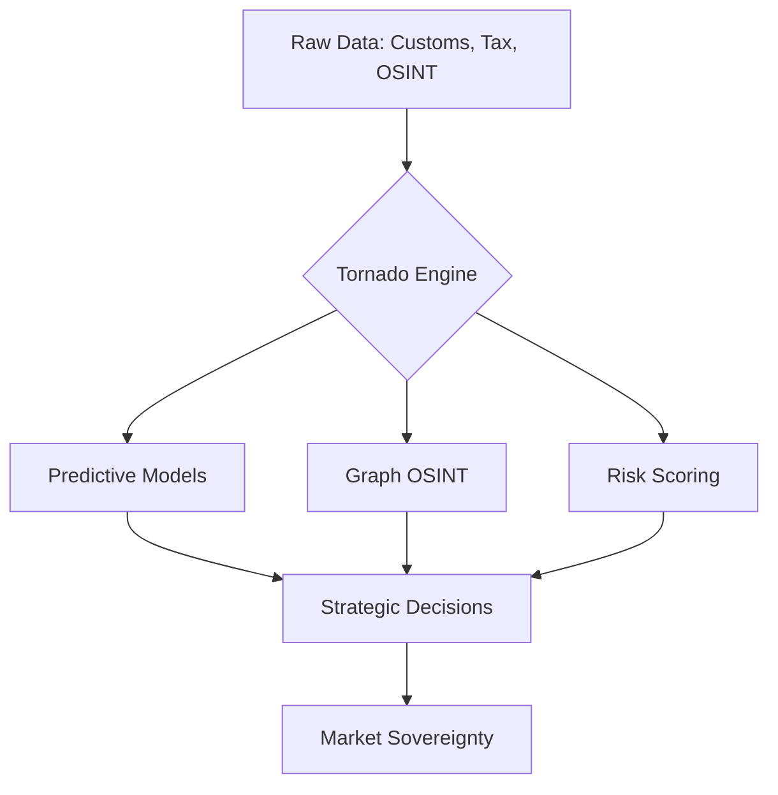

# EXECUTIVE SALES DECK: PREDATOR Analytics v56.5-ELITE
## Sovereign Intelligence for Enterprise Resilience

> [!NOTE]
> Це конфіденційний документ стратегічного планування. Призначений для C-level менеджменту (CEO, CFO, CTO) та керівників департаментів безпеки.

---

## 1. Проблема: "The Information Fog"
Сучасний бізнес тоне в даних, але залишається сліпим до стратегічних загроз.
* **Реактивність**: Рішення приймаються на основі вчорашніх звітів.
* **Приховані ризики**: Контрагенти з підставними власниками.
* **Втрачена вигода**: Неможливість передбачити ринкові тренди.

## 2. Рішення: PREDATOR "Tornado Insights"
Ми пропонуємо **Autonomous Strategic Intelligence** — систему, яка не просто збирає дані, а генерує готові рішення.

---

## 3. Ключові Модулі (Enterprise Grade)

### A. Graph Intelligence & OSINT
Розкриття корпоративних масок. Виявлення реальних UBO (Кінцевих бенефіціарів) через аналіз 50+ джерел.
* **Multi-hop Analysis**: Зв'язки через 3-4 рівні посередників.
* **Shadow Mapping**: Карта впливу конкурентів.

### B. Risk Engine v56.5
Найпотужніший в Україні двигун оцінки ризиків.
* **WORM Compliance**: Кожне рішення логується без можливості видалення (аудит-трейл).
* **Zero-Trust Validation**: Автоматична перевірка кожної транзакції.

---

## 4. Економічний Ефект (ROI)

| Показник | Очікуваний ефект | Метод досягнення |
| :--- | :--- | :--- |
| **Чистий прибуток** | +12% .. +25% | Оптимізація закупівель та прогноз попиту. |
| **Операційні ризики** | -80% | Раннє виявлення токсичних контрагентів. |
| **Швидкість прийняття рішень** | x10 | Автоматизація збору та обробки OSINT. |

---

## 5. Архітектура "Sovereign Headless"
Ми гарантуємо **Цифровий Суверенітет**:
* **Local Compute**: Ваші дані ніколи не залишають ваш периметр (iMac Compute Node).
* **Hybrid AI**: Використання найкращих моделей (Gemini Pro) для аналізу при збереженні приватності через LiteLLM.
* **VRAM Guard**: Оптимізація ресурсів для роботи 24/7.

---

## 6. План впровадження (Roadmap)

1. **Phase 1: Ingestion (Week 1-2)**
   * Підключення кастомних джерел даних.
   * Налаштування Kafka-пайплайнів.
2. **Phase 2: Discovery (Week 3-4)**
   * Побудова Knowledge Graph вашого ринку.
   * Тренування предиктивних моделей на ваших даних.
3. **Phase 3: Operations (Week 5+)**
   * Запуск Sovereign Command Center.
   * Розгортання автономних агентів.

---

**PREDATOR Analytics: Know Everything. Control Everything.**
