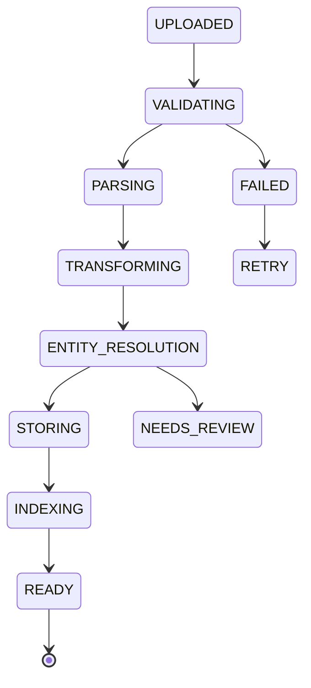

# ТЕХНІЧНЕ ЗАВДАННЯ (РОЗШИРЕНА ФІНАЛЬНА ВЕРСІЯ)

WEB-ІНТЕРФЕЙС + KNOWLEDGE PIPELINE ДЛЯ ФАЙЛУ Березень_2024.xlsx

(Контракт для Google Antigravity / Gravity Control)

---

## 0. СТАТУС ДОКУМЕНТА
- **Тип:** Contract Technical Specification
- **Рівень:** Production / Acceptance
- **Допускається:** копіювання без змін
- **Забороняється:** спрощення, обхід, заміна компонентів

---

## 1. СИСТЕМНА АКСІОМА (НЕ ОБГОВОРЮЄТЬСЯ)

Excel не “імпортується”.
Excel перетворюється на знання.

Система зобов’язана провести файл шляхом:

Excel
→ Source Validation
→ Immutable Storage (MinIO)
→ Parsing
→ Data Quality
→ Transformation
→ Entity Resolution
→ PostgreSQL (facts)
→ Graph DB (relations)
→ OpenSearch (search)
→ Qdrant (semantics)
→ UI Query
→ Explainable Result

---

## 2. ОБОВʼЯЗКОВИЙ СТЕК (ФІКСОВАНО)

```yaml
storage:
  raw: MinIO
  facts: PostgreSQL
  relations: Neo4j (або ArangoDB)
  search: OpenSearch
  vectors: Qdrant
  state: Redis

backend:
  api: FastAPI
  jobs: Celery / Argo
  parsing: pandas + custom parsers

frontend:
  framework: React 18
  ui: Ant Design
  graph: D3.js
  state: React Query / Zustand

observability:
  metrics: Prometheus
  dashboards: Grafana

security:
  auth: Keycloak / JWT
  secrets: Vault / env
```

❌ Видалення Redis або Graph DB = автоматичний FAIL

---

## 3. FSM PIPELINE (STATE MACHINE — КРИТИЧНО)

### 3.1 Фіксований автомат станів



### 3.2 Redis — єдине джерело правди

```json
redis:pipeline:{source_id} = {
  "state": "PARSING",
  "overall_progress": 42,
  "stage_progress": {
    "VALIDATING": 100,
    "PARSING": 42
  },
  "eta": "4m 12s",
  "errors": []
}
```

❌ UI НЕ має права читати статус з PostgreSQL
✅ UI читає ТІЛЬКИ Redis

---

## 4. DATA QUALITY ENGINE (РОЗШИРЕНО)

### 4.1 Обовʼязкові правила

```yaml
data_quality:
  mandatory_fields:
    - declaration_number
    - declaration_date
    - company_name
    - product_description
    - hs_code
    - value

  rules:
    - hs_code.length in [6,8,10]
    - value > 0
    - declaration_date ∈ March 2024
    - duplicate(declaration_number, product) → warning
```

### 4.2 Результат DQ
- зберігається в PostgreSQL (dq_results)
- показується в UI
- впливає на confidence_score

---

## 5. ENTITY RESOLUTION (РОЗШИРЕНО)

### 5.1 Алгоритм

```yaml
entity_resolution:
  methods:
    - exact_match
    - normalized_match
    - fuzzy_match
  confidence_threshold: 0.85
```

### 5.2 Поведінка
- confidence >= 0.85 → auto-merge
- confidence < 0.85 → NEEDS_REVIEW (UI)

---

## 6. GRAPH DB — КОНТРАКТ СХЕМИ

### 6.1 Вузли

```yaml
nodes:
  - Company
  - Declaration
  - Product
  - HSCode
  - Country
  - Source
```

### 6.2 Звʼязки

```yaml
relations:
  - (Company)-[:FILED]->(Declaration)
  - (Declaration)-[:CONTAINS]->(Product)
  - (Product)-[:HAS_HS]->(HSCode)
  - (Declaration)-[:FROM_COUNTRY]->(Country)
  - (Declaration)-[:ORIGIN]->(Source)
```

❌ Заборонено дублювати факти в Graph DB

---

## 7. OPENSEARCH (ІНДЕКСИ + МАПІНГ)

```yaml
indices:
  declarations_index:
    fields:
      - declaration_number
      - company_name
      - date
      - countries
  products_index:
    fields:
      - description
      - hs_code
      - value
```

---

## 8. QDRANT — ВЕКТОРНА МОДЕЛЬ (УТОЧНЕНО)

### 8.1 Що векторизується

```yaml
vectors:
  - product_description
  - declaration_summary
```

### 8.2 Вимоги
- модель embeddings має бути явно вказана
- розмірність зберігається в metadata
- reference_id = product_id / declaration_id

---

## 9. EXPLAINABILITY (ЖОРСТКА ВИМОГА)

Кожен результат запиту ПОВИНЕН містити пояснення:

```json
{
  "why_returned": [
    "HS-код співпадає",
    "Компанія однакова",
    "Період: березень 2024"
  ],
  "databases_used": [
    "PostgreSQL",
    "Neo4j",
    "OpenSearch"
  ]
}
```

❌ “Просто результат без пояснення” = FAIL

---

## 10. UI — ОБОВʼЯЗКОВІ ЕКРАНИ

### 10.1 Dashboard
- всі джерела
- статуси
- % pipeline

### 10.2 Source Detail
- FSM timeline
- Redis-прогрес
- помилки

### 10.3 Knowledge Graph
- фільтр по компанії
- live nodes / edges count

### 10.4 Search & Query
- текстовий запит
- таблиця результатів
- блок “Чому?”

---

## 11. VERSIONING & REPROCESSING

```yaml
versioning:
  source_version: immutable
  parser_version: semver
  transform_version: semver
```

UI має кнопку: Reprocess with new rules

---

## 12. БЕЗПЕКА ТА АУДИТ
- всі дії логуються
- source_id присутній у всіх таблицях
- audit trail для змін

---

## 13. ACCEPTANCE — ФІНАЛЬНИЙ КОНТРАКТ

Робота ПРИЙНЯТА, якщо:
- файл Березень_2024.xlsx:
  - пропарсений
  - проіндексований
  - векторизований
  - присутній у всіх БД
- UI показує реальний FSM + %
- Graph DB має реальні звʼязки
- контрольний запит:
  - повертає дані
  - має explainability
- всі acceptance-тести пройдені

---

## 14. ФІНАЛЬНИЙ ПРИНЦИП (ЗАКРИВАЄ ВСЕ ТЗ)

Дані без звʼязків — це шум.
Звʼязки без пояснень — це магія.
Магія без контролю — це брак.
