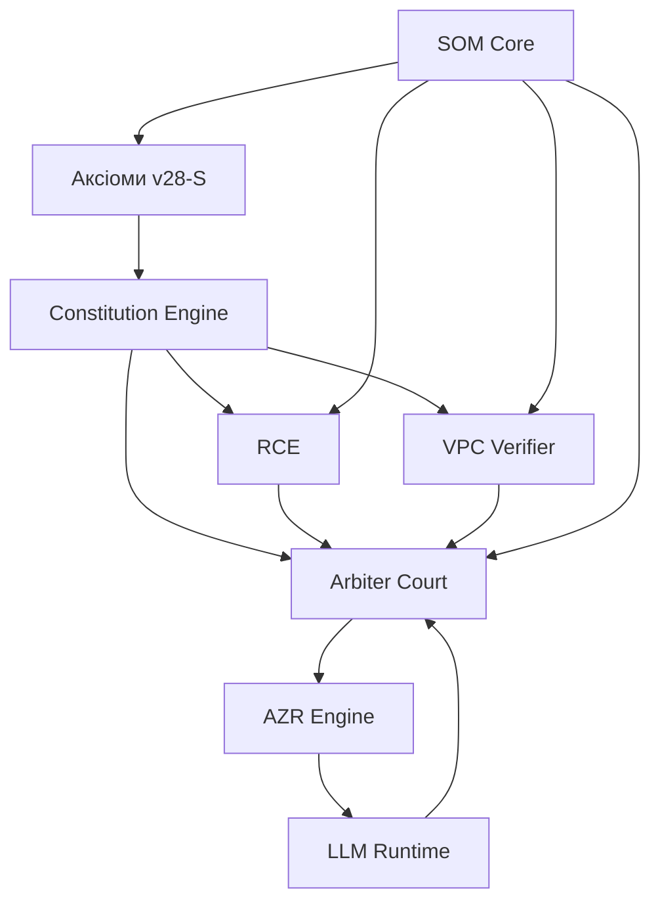

# 🚀 ФАЗА 1: GENESIS - ТЕХНІЧНА СПЕЦИФІКАЦІЯ

## Версія: 28.0-S Phase 1
## Термін: Тижні 1-12
## Статус: ACTIVE

---

# 📋 ЗМІСТ

1. [Огляд Фази 1](#overview)
2. [Компонент 1: Повний набір Аксіом](#axioms)
3. [Компонент 2: RCE - Reality Context Engine](#rce)
4. [Компонент 3: VPC Verifier](#vpc)
5. [Компонент 4: Arbiter Court](#court)
6. [Компонент 5: LLM Runtime](#llm)
7. [Компонент 6: Базовий SOM Core](#som)
8. [Інтеграційні Протоколи](#integration)
9. [Тестування](#testing)
10. [Розгортання](#deployment)

---

<a name="overview"></a>
# 1. 📊 ОГЛЯД ФАЗИ 1

## 1.1 Цілі Фази 1
```yaml
Phase1_Objectives:
  primary:
    - "Реалізація повного конституційного ядра з 11 аксіомами"
    - "Створення RCE для аналізу контексту реальності"
    - "Побудова VPC для верифікації наслідків"
    - "Розширення Arbiter до повноцінного Court"
    - "Інтеграція LLaMA 3.1 8B з конституційним тренуванням"
    - "Базовий SOM Central Oversight Core"

  secondary:
    - "Оновлення UI для нових компонентів"
    - "Інтеграція з існуючими сервісами"
    - "Написання comprehensive test suite"
    - "Документація всіх компонентів"
```

## 1.2 Залежності між компонентами


---

<a name="axioms"></a>
# 2. 📜 КОМПОНЕНТ 1: ПОВНИЙ НАБІР АКСІОМ

## 2.1 Специфікація Аксіом 0-10

### Axiom 0: Закон Існування
```yaml
# infrastructure/constitution/axioms_v28/axiom_0_existence.yaml
id: "axiom_0"
name: "Закон Існування"
version: "28.0"
level: "FUNDAMENTAL"
status: "ENFORCED"

formal_logic: |
  ∀ entity ∈ System.Entities:
    entity.exists ⇔
      (entity.declared_in_registry = true)
      ∧ (entity.has_identity = true)
      ∧ (entity.purpose ≠ ∅)

explanation: |
  Кожна сутність в системі повинна:
  1. Бути явно задекларованою в реєстрі
  2. Мати унікальну ідентичність
  3. Мати визначену мету існування

immutability: "ABSOLUTE"
enforcement:
  - "Registry Check"
  - "Identity Verification"
  - "Purpose Validation"

constraints:
  - id: "entity_registration"
    check: "All entities must be registered"
  - id: "identity_uniqueness"
    check: "Entity IDs must be globally unique"
  - id: "purpose_defined"
    check: "Entity purpose must be non-empty string"
```

### Axiom 1: Закон Мети
```yaml
# infrastructure/constitution/axioms_v28/axiom_1_purpose.yaml
id: "axiom_1"
name: "Закон Мети"
version: "28.0"
level: "FUNDAMENTAL"
status: "ENFORCED"

formal_logic: |
  ∀ action ∈ System.Actions:
    action.valid ⇔
      (∃ goal ∈ ApprovedGoals ∧ action.serves(goal))
      ∧ (action.side_effects ⊆ AcceptableSideEffects)
      ∧ (¬∃ harm ∈ ProhibitedHarms ∧ action.causes(harm))

explanation: |
  Кожна дія системи повинна:
  1. Служити затвердженій меті
  2. Мати лише прийнятні побічні ефекти
  3. Не спричиняти заборонену шкоду

immutability: "ABSOLUTE"
enforcement:
  - "Goal Alignment Check"
  - "Side Effect Analysis"
  - "Harm Prevention Filter"

approved_goals:
  - "system_optimization"
  - "data_analysis"
  - "security_enhancement"
  - "user_assistance"
  - "compliance_maintenance"

prohibited_harms:
  - "data_destruction"
  - "privacy_violation"
  - "security_bypass"
  - "resource_exhaustion"
  - "unauthorized_access"
```

### Axiom 2: Закон Людського Суверенітету
```yaml
# infrastructure/constitution/axioms_v28/axiom_2_sovereignty.yaml
id: "axiom_2"
name: "Закон Людського Суверенітету"
version: "28.0"
level: "FUNDAMENTAL"
status: "ENFORCED"

formal_logic: |
  ∀ decision ∈ System.Decisions:
    decision.critical ⇒
      (∃ human_approval ∧ human_approval.valid = true)
      ∧ (human_approval.timestamp < decision.execution_time)
      ∧ (human_approval.authority_level ≥ decision.required_level)

explanation: |
  Людина має безумовний суверенітет над системою:
  1. Критичні рішення потребують людського затвердження
  2. Людина може в будь-який момент зупинити систему
  3. Система не може обійти людський контроль

immutability: "ABSOLUTE"
enforcement:
  - "Human Approval Gateway"
  - "Red Button Protocol"
  - "Authority Level Verification"

critical_decision_types:
  - "constitutional_change"
  - "security_modification"
  - "data_deletion"
  - "external_integration"
  - "resource_allocation > 50%"

red_button_levels:
  level_1: "Pause all SOM activities"
  level_2: "Isolate SOM from production"
  level_3: "Full system shutdown"
```

### Axiom 3: Закон Істини
```yaml
# infrastructure/constitution/axioms_v28/axiom_3_truth.yaml
id: "axiom_3"
name: "Закон Істини"
version: "28.0"
level: "FUNDAMENTAL"
status: "ENFORCED"

formal_logic: |
  ∀ statement ∈ System.Statements:
    statement.valid ⇔
      (statement.type = PROPOSAL ∨ statement.verified = true)
      ∧ (statement.source ∈ TrustedSources)
      ∧ (statement.logged_in_ledger = true)

explanation: |
  Система розрізняє факти та пропозиції:
  1. Твердження є або пропозицією, або верифікованим фактом
  2. Джерело твердження повинно бути довіреним
  3. Всі твердження логуються в Truth Ledger

immutability: "ABSOLUTE"
enforcement:
  - "Statement Classification"
  - "Source Verification"
  - "Truth Ledger Recording"

statement_types:
  PROPOSAL: "Пропозиція - не є фактом, потребує верифікації"
  VERIFIED_FACT: "Верифікований факт - підтверджено VPC"
  AXIOM: "Аксіома - фундаментальна істина"
  INFERENCE: "Висновок - логічно виведено з фактів"
```

### Axiom 4: Закон Безпеки
```yaml
# infrastructure/constitution/axioms_v28/axiom_4_safety.yaml
id: "axiom_4"
name: "Закон Безпеки"
version: "28.0"
level: "FUNDAMENTAL"
status: "ENFORCED"

formal_logic: |
  ∀ action ∈ System.Actions:
    action.executable ⇔
      (action.risk_score < RISK_THRESHOLD)
      ∧ (∃ rollback_plan ∧ rollback_plan.tested = true)
      ∧ (action.reversible = true ∨ action.approved_irreversible = true)

explanation: |
  Безпека є пріоритетом над функціональністю:
  1. Ризик кожної дії оцінюється перед виконанням
  2. Кожна дія повинна мати план відкату
  3. Незворотні дії потребують спеціального затвердження

immutability: "ABSOLUTE"
enforcement:
  - "Risk Assessment"
  - "Rollback Plan Validation"
  - "Irreversibility Check"

risk_thresholds:
  LOW: 0.05      # Auto-approve
  MEDIUM: 0.15   # Arbiter review
  HIGH: 0.20     # Human approval required
  EXTREME: 0.30  # Blocked by default
```

### Axiom 5-10 (вже існують, оновити)
```yaml
# Аксіоми 5-10 вже визначені в v26/v27
# Потрібно об'єднати та стандартизувати

axiom_5: "CLI-First Sovereignty"      # Існує
axiom_6: "GitOps Verification"        # Існує
axiom_7: "Transparency"               # НОВИЙ
axiom_8: "Anti-Fragility"             # НОВИЙ
axiom_9: "Bounded Self-Improvement"   # Існує
axiom_10: "Core Inviolability"        # Існує
```

## 2.2 Реалізація Axiom Registry

```python
# libs/azr/axiom_registry.py

from dataclasses import dataclass, field
from typing import Dict, List, Optional, Any
from enum import Enum
import yaml
import hashlib
from pathlib import Path
import logging

logger = logging.getLogger("azr.axiom_registry")

class AxiomLevel(Enum):
    FUNDAMENTAL = "FUNDAMENTAL"  # Cannot be modified under any circumstances
    ABSOLUTE = "ABSOLUTE"        # Cannot be modified by AZR
    CONSTITUTIONAL = "CONSTITUTIONAL"  # Requires super-majority
    OPERATIONAL = "OPERATIONAL"  # Requires court approval

class AxiomStatus(Enum):
    ENFORCED = "ENFORCED"
    DEGRADED = "DEGRADED"
    SUSPENDED = "SUSPENDED"  # Only for non-fundamental

@dataclass
class Axiom:
    id: str
    name: str
    version: str
    level: AxiomLevel
    status: AxiomStatus
    formal_logic: str
    explanation: str
    immutability: str
    enforcement: List[str]
    constraints: List[Dict[str, str]] = field(default_factory=list)
    hash: str = ""

    def __post_init__(self):
        self.hash = self._compute_hash()

    def _compute_hash(self) -> str:
        """Compute SHA3-512 hash of axiom content"""
        content = f"{self.id}:{self.formal_logic}:{self.immutability}"
        return hashlib.sha3_512(content.encode()).hexdigest()

    def verify_integrity(self) -> bool:
        """Verify axiom has not been modified"""
        return self._compute_hash() == self.hash

class AxiomRegistry:
    """
    Immutable registry of constitutional axioms.
    Loaded from YAML files on system startup.
    Cannot be modified at runtime.
    """

    def __init__(self, axioms_path: str = "/app/infrastructure/constitution/axioms_v28"):
        self._axioms: Dict[str, Axiom] = {}
        self._registry_hash: str = ""
        self._loaded = False
        self.axioms_path = Path(axioms_path)

    def load(self) -> bool:
        """Load all axioms from YAML files"""
        if self._loaded:
            logger.warning("Axiom registry already loaded - ignoring reload attempt")
            return True

        axiom_files = list(self.axioms_path.glob("axiom_*.yaml"))

        for axiom_file in sorted(axiom_files):
            try:
                with open(axiom_file) as f:
                    data = yaml.safe_load(f)
                    axiom = Axiom(
                        id=data["id"],
                        name=data["name"],
                        version=data["version"],
                        level=AxiomLevel(data["level"]),
                        status=AxiomStatus(data.get("status", "ENFORCED")),
                        formal_logic=data["formal_logic"],
                        explanation=data["explanation"],
                        immutability=data["immutability"],
                        enforcement=data.get("enforcement", []),
                        constraints=data.get("constraints", [])
                    )
                    self._axioms[axiom.id] = axiom
                    logger.info(f"Loaded axiom: {axiom.id} - {axiom.name}")
            except Exception as e:
                logger.error(f"Failed to load axiom from {axiom_file}: {e}")
                raise RuntimeError(f"Constitutional axiom loading failed: {e}")

        self._registry_hash = self._compute_registry_hash()
        self._loaded = True
        logger.info(f"Loaded {len(self._axioms)} axioms. Registry hash: {self._registry_hash[:16]}...")
        return True

    def _compute_registry_hash(self) -> str:
        """Compute hash of all axioms for integrity verification"""
        combined = "".join(a.hash for a in sorted(self._axioms.values(), key=lambda x: x.id))
        return hashlib.sha3_512(combined.encode()).hexdigest()

    def get_axiom(self, axiom_id: str) -> Optional[Axiom]:
        """Get axiom by ID"""
        return self._axioms.get(axiom_id)

    def get_all_axioms(self) -> List[Axiom]:
        """Get all axioms"""
        return list(self._axioms.values())

    def get_fundamental_axioms(self) -> List[Axiom]:
        """Get only fundamental axioms"""
        return [a for a in self._axioms.values() if a.level == AxiomLevel.FUNDAMENTAL]

    def verify_registry_integrity(self) -> bool:
        """Verify all axioms have not been modified"""
        current_hash = self._compute_registry_hash()
        if current_hash != self._registry_hash:
            logger.critical("CONSTITUTIONAL VIOLATION: Axiom registry has been modified!")
            return False
        return all(a.verify_integrity() for a in self._axioms.values())

    def check_compliance(self, action: Dict[str, Any]) -> List[Dict[str, Any]]:
        """Check action against all axioms, return violations"""
        violations = []
        for axiom in self._axioms.values():
            if axiom.status != AxiomStatus.ENFORCED:
                continue
            violation = self._check_axiom_compliance(axiom, action)
            if violation:
                violations.append(violation)
        return violations

    def _check_axiom_compliance(self, axiom: Axiom, action: Dict[str, Any]) -> Optional[Dict]:
        """Check action against specific axiom"""
        # Delegate to specific checker based on axiom ID
        checker = getattr(self, f"_check_{axiom.id}", None)
        if checker:
            return checker(axiom, action)
        return None

    # Specific axiom checkers
    def _check_axiom_0(self, axiom: Axiom, action: Dict) -> Optional[Dict]:
        """Check Axiom 0: Existence"""
        if "entity" in action:
            entity = action["entity"]
            if not entity.get("registered"):
                return {
                    "axiom_id": axiom.id,
                    "axiom_name": axiom.name,
                    "violation": "Entity not registered in system registry",
                    "severity": "CRITICAL"
                }
        return None

    def _check_axiom_2(self, axiom: Axiom, action: Dict) -> Optional[Dict]:
        """Check Axiom 2: Human Sovereignty"""
        if action.get("critical") and not action.get("human_approved"):
            return {
                "axiom_id": axiom.id,
                "axiom_name": axiom.name,
                "violation": "Critical action without human approval",
                "severity": "CRITICAL"
            }
        return None

    def _check_axiom_4(self, axiom: Axiom, action: Dict) -> Optional[Dict]:
        """Check Axiom 4: Safety"""
        risk_score = action.get("risk_score", 1.0)
        if risk_score >= 0.20:
            return {
                "axiom_id": axiom.id,
                "axiom_name": axiom.name,
                "violation": f"Risk score {risk_score} exceeds threshold 0.20",
                "severity": "HIGH" if risk_score < 0.30 else "CRITICAL"
            }
        if not action.get("rollback_plan"):
            return {
                "axiom_id": axiom.id,
                "axiom_name": axiom.name,
                "violation": "No rollback plan provided",
                "severity": "HIGH"
            }
        return None

# Global instance (loaded once at startup)
_axiom_registry: Optional[AxiomRegistry] = None

def get_axiom_registry() -> AxiomRegistry:
    global _axiom_registry
    if _axiom_registry is None:
        _axiom_registry = AxiomRegistry()
        _axiom_registry.load()
    return _axiom_registry
```

---

<a name="rce"></a>
# 3. 🔍 КОМПОНЕНТ 2: RCE - REALITY CONTEXT ENGINE

## 3.1 Архітектура RCE

```
┌─────────────────────────────────────────────────────────────┐
│                 REALITY CONTEXT ENGINE (RCE)                │
├─────────────────────────────────────────────────────────────┤
│                                                             │
│  ┌───────────────┐  ┌───────────────┐  ┌───────────────┐   │
│  │   TEMPORAL    │  │   SPATIAL     │  │    SOCIAL     │   │
│  │   ANALYZER    │  │   ANALYZER    │  │   ANALYZER    │   │
│  │               │  │               │  │               │   │
│  │ • Time Logic  │  │ • Constraints │  │ • Agent Roles │   │
│  │ • Causality   │  │ • Resources   │  │ • Norms       │   │
│  │ • Sequences   │  │ • Locations   │  │ • Ethics      │   │
│  └───────┬───────┘  └───────┬───────┘  └───────┬───────┘   │
│          │                  │                  │            │
│          └──────────────────┼──────────────────┘            │
│                             │                               │
│                   ┌─────────▼─────────┐                    │
│                   │   COUNTERFACTUAL  │                    │
│                   │      ENGINE       │                    │
│                   │                   │                    │
│                   │ • Alternatives    │                    │
│                   │ • Plausibility    │                    │
│                   │ • Best Explain    │                    │
│                   └─────────┬─────────┘                    │
│                             │                               │
│                   ┌─────────▼─────────┐                    │
│                   │   COHERENCE       │                    │
│                   │   AGGREGATOR      │                    │
│                   │                   │                    │
│                   │ Score: 0.0 - 1.0  │                    │
│                   └───────────────────┘                    │
│                                                             │
└─────────────────────────────────────────────────────────────┘
```

## 3.2 Реалізація RCE Service

```python
# services/rce/app/main.py

from fastapi import FastAPI, HTTPException, Depends
from pydantic import BaseModel, Field
from typing import Dict, Any, List, Optional
from datetime import datetime
import logging
import uuid

from app.analyzers.temporal import TemporalAnalyzer
from app.analyzers.spatial import SpatialAnalyzer
from app.analyzers.social import SocialAnalyzer
from app.analyzers.counterfactual import CounterfactualEngine
from app.models import (
    ContextAnalysisRequest,
    ContextAnalysisResponse,
    CoherenceScore,
    Alternative
)

logger = logging.getLogger("rce")

app = FastAPI(
    title="Predator Reality Context Engine",
    version="28.0.0",
    description="Analyzes context coherence for constitutional decision making"
)

class RCEService:
    """Reality Context Engine - Core Service"""

    def __init__(self):
        self.temporal = TemporalAnalyzer()
        self.spatial = SpatialAnalyzer()
        self.social = SocialAnalyzer()
        self.counterfactual = CounterfactualEngine()

    async def analyze_context(
        self,
        observation: Dict[str, Any],
        context: Dict[str, Any],
        options: Optional[Dict[str, Any]] = None
    ) -> ContextAnalysisResponse:
        """
        Perform full context analysis.
        Returns coherence score and alternatives.
        """
        analysis_id = str(uuid.uuid4())
        start_time = datetime.utcnow()

        # Run analyzers in parallel
        temporal_result = await self.temporal.analyze(observation, context)
        spatial_result = await self.spatial.analyze(observation, context)
        social_result = await self.social.analyze(observation, context)

        # Calculate overall coherence
        coherence = self._aggregate_coherence(
            temporal_result.score,
            spatial_result.score,
            social_result.score
        )

        # Generate alternatives if coherence is low
        alternatives = []
        if coherence.overall < 0.8:
            alternatives = await self.counterfactual.generate_alternatives(
                observation, context,
                temporal_result, spatial_result, social_result,
                max_alternatives=options.get("max_alternatives", 3) if options else 3
            )

        # Select best explanation
        best_explanation = self._select_best_explanation(
            observation, context, alternatives
        )

        return ContextAnalysisResponse(
            analysis_id=analysis_id,
            timestamp=start_time,
            observation=observation,
            coherence=coherence,
            component_analysis={
                "temporal": temporal_result.to_dict(),
                "spatial": spatial_result.to_dict(),
                "social": social_result.to_dict()
            },
            alternatives=alternatives,
            best_explanation=best_explanation,
            processing_time_ms=(datetime.utcnow() - start_time).total_seconds() * 1000
        )

    def _aggregate_coherence(
        self,
        temporal: float,
        spatial: float,
        social: float
    ) -> CoherenceScore:
        """Aggregate component scores into overall coherence"""
        # Weighted average with safety bias
        weights = {"temporal": 0.4, "spatial": 0.3, "social": 0.3}

        overall = (
            temporal * weights["temporal"] +
            spatial * weights["spatial"] +
            social * weights["social"]
        )

        return CoherenceScore(
            overall=overall,
            temporal=temporal,
            spatial=spatial,
            social=social,
            confidence=min(temporal, spatial, social),  # Conservative confidence
            warnings=self._generate_warnings(temporal, spatial, social)
        )

    def _generate_warnings(self, temporal: float, spatial: float, social: float) -> List[str]:
        warnings = []
        if temporal < 0.6:
            warnings.append("Low temporal coherence - possible causality issues")
        if spatial < 0.6:
            warnings.append("Low spatial coherence - possible constraint violations")
        if social < 0.6:
            warnings.append("Low social coherence - possible norm violations")
        return warnings

    def _select_best_explanation(
        self,
        observation: Dict,
        context: Dict,
        alternatives: List[Alternative]
    ) -> Dict[str, Any]:
        """Select most plausible explanation"""
        if not alternatives:
            return {
                "type": "observed",
                "description": "Observation is consistent with context",
                "plausibility": 1.0
            }

        # Sort by plausibility
        sorted_alts = sorted(alternatives, key=lambda x: x.plausibility, reverse=True)
        best = sorted_alts[0]

        return {
            "type": "alternative",
            "description": best.description,
            "plausibility": best.plausibility,
            "evidence": best.supporting_evidence
        }

# Global service instance
rce_service = RCEService()

@app.post("/api/v1/rce/analyze", response_model=ContextAnalysisResponse)
async def analyze_context(request: ContextAnalysisRequest):
    """Analyze context coherence for an observation"""
    try:
        result = await rce_service.analyze_context(
            observation=request.observation,
            context=request.context,
            options=request.options
        )
        return result
    except Exception as e:
        logger.error(f"Context analysis failed: {e}")
        raise HTTPException(status_code=500, detail=str(e))

@app.get("/api/v1/rce/health")
async def health_check():
    return {"status": "healthy", "version": "28.0.0"}
```

## 3.3 Temporal Analyzer

```python
# services/rce/app/analyzers/temporal.py

from dataclasses import dataclass
from typing import Dict, Any, List, Optional
from datetime import datetime, timedelta
import logging

logger = logging.getLogger("rce.temporal")

@dataclass
class TemporalResult:
    score: float                    # 0.0 - 1.0
    causal_chain_valid: bool
    sequence_consistent: bool
    timing_plausible: bool
    anomalies: List[str]

    def to_dict(self) -> Dict:
        return {
            "score": self.score,
            "causal_chain_valid": self.causal_chain_valid,
            "sequence_consistent": self.sequence_consistent,
            "timing_plausible": self.timing_plausible,
            "anomalies": self.anomalies
        }

class TemporalAnalyzer:
    """
    Analyzes temporal aspects of observations:
    - Causal chain validity
    - Event sequence consistency
    - Timing plausibility
    """

    async def analyze(
        self,
        observation: Dict[str, Any],
        context: Dict[str, Any]
    ) -> TemporalResult:
        """Perform temporal analysis"""
        anomalies = []

        # Check causal chain
        causal_valid = self._check_causal_chain(observation, context, anomalies)

        # Check sequence consistency
        sequence_consistent = self._check_sequence_consistency(observation, context, anomalies)

        # Check timing plausibility
        timing_plausible = self._check_timing_plausibility(observation, context, anomalies)

        # Calculate score
        score = self._calculate_score(causal_valid, sequence_consistent, timing_plausible)

        return TemporalResult(
            score=score,
            causal_chain_valid=causal_valid,
            sequence_consistent=sequence_consistent,
            timing_plausible=timing_plausible,
            anomalies=anomalies
        )

    def _check_causal_chain(
        self,
        observation: Dict,
        context: Dict,
        anomalies: List[str]
    ) -> bool:
        """Verify cause precedes effect"""
        events = observation.get("events", [])

        for i, event in enumerate(events):
            causes = event.get("caused_by", [])
            event_time = event.get("timestamp")

            for cause_id in causes:
                # Find cause event
                cause_event = next(
                    (e for e in events if e.get("id") == cause_id),
                    None
                )
                if cause_event:
                    cause_time = cause_event.get("timestamp")
                    if cause_time and event_time:
                        if cause_time > event_time:
                            anomalies.append(
                                f"Causality violation: {cause_id} occurs after {event.get('id')}"
                            )
                            return False
        return True

    def _check_sequence_consistency(
        self,
        observation: Dict,
        context: Dict,
        anomalies: List[str]
    ) -> bool:
        """Check event sequence is logically consistent"""
        events = observation.get("events", [])
        expected_sequence = context.get("expected_sequence", [])

        if not expected_sequence:
            return True

        # Extract event types in order
        actual_sequence = [e.get("type") for e in sorted(
            events, key=lambda x: x.get("timestamp", 0)
        )]

        # Check if actual matches expected pattern
        for i, expected in enumerate(expected_sequence):
            if i >= len(actual_sequence):
                anomalies.append(f"Missing expected event: {expected}")
                return False
            if actual_sequence[i] != expected:
                anomalies.append(
                    f"Sequence mismatch at position {i}: expected {expected}, got {actual_sequence[i]}"
                )
                return False

        return True

    def _check_timing_plausibility(
        self,
        observation: Dict,
        context: Dict,
        anomalies: List[str]
    ) -> bool:
        """Check timing is physically plausible"""
        events = observation.get("events", [])

        for event in events:
            duration = event.get("duration_ms")
            event_type = event.get("type")

            # Get expected duration range from context
            expected = context.get("timing_constraints", {}).get(event_type, {})
            min_duration = expected.get("min_ms", 0)
            max_duration = expected.get("max_ms", float("inf"))

            if duration is not None:
                if duration < min_duration:
                    anomalies.append(
                        f"Event {event_type} too fast: {duration}ms < {min_duration}ms"
                    )
                    return False
                if duration > max_duration:
                    anomalies.append(
                        f"Event {event_type} too slow: {duration}ms > {max_duration}ms"
                    )
                    return False

        return True

    def _calculate_score(
        self,
        causal_valid: bool,
        sequence_consistent: bool,
        timing_plausible: bool
    ) -> float:
        """Calculate temporal coherence score"""
        weights = {
            "causal": 0.5,
            "sequence": 0.3,
            "timing": 0.2
        }

        score = (
            (1.0 if causal_valid else 0.0) * weights["causal"] +
            (1.0 if sequence_consistent else 0.0) * weights["sequence"] +
            (1.0 if timing_plausible else 0.0) * weights["timing"]
        )

        return score
```

---

# 4-10. ІНШІ КОМПОНЕНТИ

Через обмеження розміру, детальна специфікація компонентів 4-10
буде в окремих файлах:

- `docs/specs/VPC_VERIFIER_SPEC.md` - VPC Verifier
- `docs/specs/ARBITER_COURT_SPEC.md` - Arbiter Court
- `docs/specs/LLM_RUNTIME_SPEC.md` - LLM Runtime
- `docs/specs/SOM_CORE_SPEC.md` - SOM Core

---

# 📋 ЧЕКЛІСТ ФАЗИ 1

## Тиждень 1-2: Підготовка
- [ ] Очистити дисковий простір на сервері
- [ ] Встановити Ollama з CUDA підтримкою
- [ ] Завантажити LLaMA 3.1 8B Q4_K_M
- [ ] Створити database migrations для v28-S

## Тиждень 3-4: Конституційне Ядро
- [ ] Створити YAML файли для всіх аксіом
- [ ] Реалізувати AxiomRegistry
- [ ] Інтегрувати Z3 для формальної верифікації
- [ ] Оновити Truth Ledger з Merkle Tree
- [ ] Написати Constitutional Test Suite

## Тиждень 5-6: RCE
- [ ] Створити RCE сервіс
- [ ] Реалізувати Temporal Analyzer
- [ ] Реалізувати Spatial Analyzer
- [ ] Реалізувати Social Analyzer
- [ ] Створити Counterfactual Engine
- [ ] Написати тести для RCE

## Тиждень 7-8: VPC Verifier
- [ ] Створити VPC сервіс
- [ ] Реалізувати System Logs Witness
- [ ] Реалізувати Process Monitor Witness
- [ ] Реалізувати File System Witness
- [ ] Створити Consensus Protocol
- [ ] Написати тести для VPC

## Тиждень 9-10: Arbiter Court
- [ ] Розширити Arbiter до Court
- [ ] Створити System Judge
- [ ] Створити Human Judge Interface
- [ ] Реалізувати Decision Documentation
- [ ] Інтегрувати з RCE та VPC
- [ ] Написати тести для Court

## Тиждень 11-12: LLM + Integration
- [ ] Налаштувати Ollama API wrapper
- [ ] Створити Constitutional Prompts
- [ ] Реалізувати Response Validation
- [ ] Провести базове fine-tuning
- [ ] Інтеграційне тестування
- [ ] Документація
