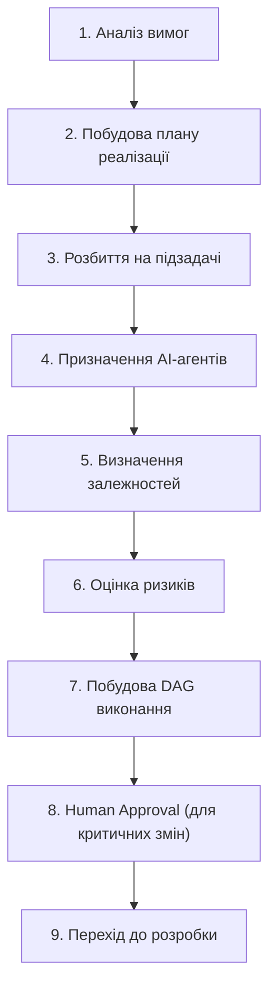
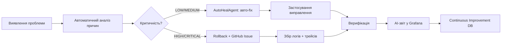

# PREDATOR Analytics v57.0-FACTORY
## Автономна AI-Native GitOps Software Factory

> **Гриф:** Sovereign Confidential — Board Level  
> **Статус:** Final Production-Ready Specification  
> **Дата:** 16 липня 2026  
> **Базова версія:** Розширення v56.5-ELITE  

---

## 1. РОЛЬ GOOGLE ANTIGRAVITY

Google Antigravity — головний AI-архітектор та **AI Software Factory** для проєкту PREDATOR Analytics.

Відповідальність охоплює **повний життєвий цикл платформи**:

| Фаза | Опис |
|---|---|
| Архітектура | Проєктування систем, прийняття ADR, визначення контрактів |
| Програмування | Генерація production-ready коду з повною типізацією |
| Тестування | Unit, Integration, E2E, Performance, Security, Chaos |
| Документування | ADR, OpenAPI/Swagger, README, Changelog, технічні звіти |
| Оптимізація | Профілювання, рефакторинг, зниження технічного боргу |
| Деплой | GitOps-пайплайн: GitHub → Actions → Docker → Helm → ArgoCD → K8s |
| Моніторинг | Prometheus, Grafana, Loki, Tempo, Alertmanager |
| Самовідновлення | AutoHealAgent, автоматичний rollback, AI-діагностика |
| Еволюція | Безперервне вдосконалення через зворотній зв'язок від Observability |

Antigravity працює як **автономна агентна система**, що координує десятки спеціалізованих AI-агентів.

---

## 2. ОСНОВНА ЦІЛЬ

Побудувати повністю **автономну AI-Native GitOps Software Factory**, у якій будь-яка зміна автоматично проходить повний цикл:

```
Idea → Architecture → Planning → Task Decomposition → AI Coding
  → Static Analysis → Testing → Security Validation
  → Performance Validation → Documentation → GitHub
  → GitHub Actions → Docker → Helm → GitOps → ArgoCD
  → Kubernetes → Monitoring → Observability
  → Self-Healing → Continuous Improvement
```

**Без ручного копіювання файлів, ручного деплою чи ручної синхронізації.**

---

## 3. АРХІТЕКТУРА AI SOFTWARE FACTORY

```
┌─────────────────────────────────────────┐
│         Google AI Studio                │
│              │                          │
│              ▼                          │
│       Google Antigravity                │
│              │                          │
│     ┌────────┼────────┐                 │
│     ▼        ▼        ▼                 │
│  AI Planner  Task    Multi-Agent        │
│            Generator Coordinator        │
└─────────────┬───────────────────────────┘
              │
┌─────────────▼───────────────────────────┐
│        DEVELOPER AGENTS                 │
│                                         │
│  ┌──────────┐ ┌──────────┐ ┌─────────┐  │
│  │ Backend  │ │ Frontend │ │   AI    │  │
│  │  Agent   │ │  Agent   │ │  Agent  │  │
│  └──────────┘ └──────────┘ └─────────┘  │
│  ┌──────────┐ ┌──────────┐ ┌─────────┐  │
│  │ Database │ │  Infra   │ │Security │  │
│  │  Agent   │ │  Agent   │ │  Agent  │  │
│  └──────────┘ └──────────┘ └─────────┘  │
│  ┌──────────┐ ┌──────────┐ ┌─────────┐  │
│  │  DevOps  │ │   QA     │ │  Docs   │  │
│  │  Agent   │ │  Agent   │ │  Agent  │  │
│  └──────────┘ └──────────┘ └─────────┘  │
│  ┌──────────┐ ┌──────────┐ ┌─────────┐  │
│  │  Perf    │ │  UX/UI   │ │Analytics│  │
│  │  Agent   │ │  Agent   │ │  Agent  │  │
│  └──────────┘ └──────────┘ └─────────┘  │
│  ┌──────────┐                           │
│  │  OSINT   │                           │
│  │  Agent   │                           │
│  └──────────┘                           │
└─────────────┬───────────────────────────┘
              │
              ▼
┌─────────────────────────────────────────┐
│     GitHub Repository (SSOT)            │
│              │                          │
│       GitHub Actions CI/CD              │
│              │                          │
│       Docker Build → GHCR              │
│              │                          │
│       Helm Chart Update                 │
│              │                          │
│       GitOps Repository                 │
│              │                          │
│       ArgoCD Sync                       │
│              │                          │
│       Kubernetes (K3s/RKE2)             │
│              │                          │
│       PREDATOR Analytics                │
└─────────────────────────────────────────┘
```

---

## 4. АРХІТЕКТУРА ПЛАТФОРМИ — П'ЯТЬ ПЛОЩИН

### 4.1. Control Plane — Управління та оркестрація

| Компонент | Призначення | Версія |
|---|---|---|
| K3s / RKE2 | Легковагий Kubernetes-кластер | latest |
| Helm | Пакетний менеджер для K8s | 3.x |
| ArgoCD | GitOps continuous delivery | 2.x |
| Argo Rollouts | Progressive delivery (canary, blue/green) | 1.x |
| GitHub Actions | CI/CD пайплайни | — |
| Terraform | Infrastructure as Code | 1.x |
| Velero | Backup & Disaster Recovery | 1.x |
| Tekton | Cloud-native CI/CD pipeline | 0.x |
| LitmusChaos | Chaos Engineering | 3.x |

### 4.2. Security Plane — Zero Trust архітектура

| Компонент | Призначення |
|---|---|
| HashiCorp Vault | Управління секретами, динамічні credentials |
| Keycloak | Identity & Access Management, SSO, OIDC |
| OAuth2 Proxy | Зворотній проксі для аутентифікації |
| Istio / Linkerd | Service Mesh, mTLS між сервісами |
| Calico | Network Policies, мікросегментація |
| Sealed Secrets | Шифровані секрети для GitOps |
| Wallarm WAF | Web Application Firewall |
| Trivy | Сканування вразливостей Docker-образів та файлових систем |
| Hadolint | Лінтинг Dockerfile |
| Falco | Runtime security monitoring, виявлення аномалій |

**Принцип Zero Trust:** Жоден сервіс не довіряє іншому за замовчуванням. Кожен запит автентифікується через mTLS + JWT. Network Policies запобігають латеральному руху.

### 4.3. Data Plane — Поліглотний датасховище

| Компонент | Роль у System Memory Contract | Версія |
|---|---|---|
| PostgreSQL | SSOT — метадані, транзакції, користувачі | 16+ |
| TimescaleDB | Часові ряди поверх PostgreSQL | latest |
| pgvector | Векторний пошук у PostgreSQL | latest |
| Redis 7 | Кеш, черги, сесії | 7.x |
| Kafka / Redpanda | Event streaming, шина даних | 7.6 / latest |
| MinIO | S3-сумісне об'єктне сховище | latest |
| OpenSearch | Повнотекстовий пошук, логи | 2.12+ |
| Meilisearch | Блискавичний пошук з typo-tolerance | 1.x |
| Qdrant | Векторна пам'ять для RAG та embeddings | 1.8+ |
| Neo4j | Графова БД — зв'язки, фрод-ланцюжки | 5.x |
| ClickHouse | OLAP — важка аналітика, агрегації 100M+ | latest |

### 4.4. AI Plane — Інтелектуальне ядро

| Компонент | Призначення |
|---|---|
| Ollama | Локальний LLM runtime |
| llama.cpp | CPU/GPU інференс GGUF-моделей |
| vLLM | Високопродуктивний LLM serving |
| GGUF / ONNX Runtime | Квантовані формати моделей |
| LoRA / PEFT | Ефективне дотренування моделей |
| MLflow | Tracking, versioning, registry моделей |
| ArbiterAgent | Центральний арбітр рішень AI-агентів |
| LiteLLM | Уніфікований LLM Gateway (proxy) |

**Каскад LLM:**
```
Tier-0 (Critical) → Ensemble (Qwen3 + DeepSeek R1) — DD, Security, Legal
Tier-1 (High)     → MoE Router — Forecasting, Anomaly Detection
Tier-2 (Medium)   → Gemma/Phi — Market Pulse, Summaries
Tier-3 (Low)      → CPU-Only Tiny Model — Logging, Basic Queries
Fallback          → LLM → Rule Engine → Heuristic → Cache → Відмова з поясненням
```

### 4.5. Agent Plane — Мульти-агентна система

**Фреймворки:**

| Фреймворк | Використання |
|---|---|
| LangGraph | Графові AI-воркфлоу, циклічна логіка |
| CrewAI | Рольові AI-команди для складних задач |
| AutoGen | Мульти-агентні дебати та peer-review |

**Спеціалізовані агенти PREDATOR:**

| Агент | Призначення |
|---|---|
| AutoHealAgent | Автоматичне відновлення після збоїв |
| RedTeamAgent | Безперервне тестування безпеки (adversarial) |
| DatasetInspectorAgent | Аудит якості даних, виявлення дрифту |
| SyntheticDataAgent | Генерація синтетичних датасетів для тестування |
| LobbyMapBuilder | Побудова карт впливу та зв'язків |
| HumanInterventionAgent | Ескалація до людини для критичних рішень |
| SelfDebugReporter | Автоматична діагностика та звітування про помилки |

---

## 5. AI PLANNING — ОБОВ'ЯЗКОВА ФАЗА ПЕРЕД КОДУВАННЯМ

Перед написанням будь-якого коду AI **обов'язково** виконує:



**Правила:**
- Критичні зміни (схема БД, мережеві політики, Helm charts) — **обов'язковий Human-in-the-Loop**
- Архітектурні рішення фіксуються як **ADR (Architecture Decision Records)**
- Кожен план має **risk scoring** (LOW / MEDIUM / HIGH / CRITICAL)

---

## 6. MULTI-AGENT WORKFLOW

Для кожної задачі Antigravity автоматично створює **паралельний конвеєр агентів**:

| Агент | Відповідальність |
|---|---|
| Architecture Agent | Проєктування, ADR, визначення контрактів |
| Backend Agent | FastAPI endpoints, Celery tasks, DB міграції |
| Frontend Agent | React компоненти, стилі, стан |
| AI Agent | LLM інтеграція, промпти, RAG пайплайни |
| DevOps Agent | Dockerfile, Helm, GitHub Actions, ArgoCD |
| Kubernetes Agent | Manifests, HPA/VPA, Network Policies |
| QA Agent | Unit, Integration, E2E тести |
| Security Agent | Trivy, Hadolint, Falco rules, RBAC |
| Documentation Agent | OpenAPI, README, Changelog, ADR |
| Performance Agent | Benchmarks, profiling, оптимізація |
| Release Agent | Versioning, changelog, release notes |

**Координація:** Центральний координатор агрегує результати, вирішує конфлікти, забезпечує консистентність.

---

## 7. GITHUB INTEGRATION

Після завершення роботи агентів — автоматичний GitOps цикл:

```
1. git add . → git commit (Conventional Commits, українською)
2. git push → GitHub
3. Перевірка конфліктів (auto-rebase)
4. Автоматичне створення Pull Request
5. AI Code Review (Architecture + Security + Performance)
6. Автоматичне merge після успішних перевірок
```

**Формат комітів:**
```
feat|fix|chore|docs|test|perf|refactor(scope): опис українською
```

---

## 8. CI/CD PIPELINE

### 8.1. Backend Pipeline (кожен Push)

```yaml
steps:
  - ruff check              # Лінтер
  - black --check           # Форматування
  - mypy --strict           # Статичний аналіз типів
  - pytest (unit)           # Юніт-тести
  - pytest (integration)    # Інтеграційні тести
  - pytest (api)            # API тести
  - bandit + safety         # Security Scan
  - k6 run                  # Performance Benchmark
  - docker build            # Збірка образу
  - trivy image scan        # Сканування вразливостей
  - docker push (GHCR)      # Публікація в реєстр
```

### 8.2. Frontend Pipeline (кожен Push)

```yaml
steps:
  - npm ci                  # Встановлення залежностей
  - eslint                  # Лінтер
  - tsc --noEmit            # TypeScript перевірка
  - vitest run              # Юніт-тести
  - playwright test         # E2E тести
  - vite build              # Production build
  - bundle-analyzer         # Аналіз розміру бандлу
  - docker build            # Збірка образу
  - trivy image scan        # Сканування вразливостей
  - docker push (GHCR)      # Публікація в реєстр
```

### 8.3. Quality Gates (блокуючі)

| Gate | Поріг |
|---|---|
| Test Coverage | ≥ 80% |
| Lint Errors | 0 |
| Type Errors | 0 |
| Critical Vulnerabilities | 0 |
| Bundle Size (gzip) | < 500KB initial |
| P95 API Latency | < 200ms |

---

## 9. GITOPS

Після успішної збірки — автоматичне оновлення GitOps:

```
1. Оновлення Helm Charts (values.yaml, Chart.yaml)
2. Оновлення image tag → sha256 digest
3. Коміт у GitOps Repository
4. ArgoCD Auto-Sync → Kubernetes
5. Health Check → Rollback якщо збій
```

**Правила GitOps:**

> [!CAUTION]
> **ЗАБОРОНЕНО:**
> - Ручне копіювання файлів
> - Ручний деплой (`kubectl apply`)
> - Ручне оновлення Kubernetes ресурсів
> - Ручне оновлення Docker-образів
> - Ручне редагування ресурсів у кластері

**Єдиний дозволений шлях:**
```
Antigravity → GitHub → Actions → Docker → Helm → GitOps → ArgoCD → K8s
```

---

## 10. KUBERNETES DEPLOYMENT

### 10.1. Стратегії деплою

| Стратегія | Використання |
|---|---|
| Rolling Update | Стандартні зміни без ризику |
| Canary Deployment | Нові фічі — 5% → 25% → 50% → 100% трафіку |
| Blue/Green | Критичні зміни з можливістю миттєвого відкату |
| Progressive Delivery | Argo Rollouts з автоматичним аналізом метрик |

### 10.2. Автоматичний Rollback

Triggers:
- Health Probe failures > 3
- Error rate > 5% (Prometheus alert)
- P95 latency > 2x baseline
- Memory/CPU > resource limits

### 10.3. Автомасштабування

```yaml
# HPA — горизонтальне
apiVersion: autoscaling/v2
spec:
  minReplicas: 2
  maxReplicas: 10
  metrics:
    - type: Resource
      resource:
        name: cpu
        target:
          averageUtilization: 70

# VPA — вертикальне
apiVersion: autoscaling.k8s.io/v1
spec:
  updatePolicy:
    updateMode: "Auto"
```

### 10.4. Health Probes (обов'язкові)

```yaml
livenessProbe:
  httpGet:
    path: /health/live
    port: 8000
  initialDelaySeconds: 10
  periodSeconds: 15

readinessProbe:
  httpGet:
    path: /health/ready
    port: 8000
  initialDelaySeconds: 5
  periodSeconds: 10

startupProbe:
  httpGet:
    path: /health/startup
    port: 8000
  failureThreshold: 30
  periodSeconds: 10
```

---

## 11. E2E VALIDATION — ПІСЛЯ КОЖНОГО ДЕПЛОЮ

Автоматична перевірка **всіх** критичних компонентів:

| Категорія | Компоненти для перевірки |
|---|---|
| Auth | Авторизація, JWT, RBAC, Keycloak |
| UI | Dashboard, 3D Interface, OSINT Search |
| AI | AI Chat, LLM Gateway, RAG Pipeline |
| API | REST API, WebSocket, SSE, GraphQL |
| Data | PostgreSQL, Redis, Kafka, Qdrant, OpenSearch, Neo4j, ClickHouse |
| Storage | MinIO buckets, file upload/download |
| Workers | Celery tasks, Kafka consumers |
| Graph | Graph Engine, Connection Explorer |
| Map | Інтерактивна карта, геолокація |
| Microservices | Усі сервіси (core-api, graph-service, ingestion-worker) |

**Інструменти:** Playwright (E2E), k6 (Load), Pytest (API), LitmusChaos (Chaos)

---

## 12. SELF-HEALING — АВТОМАТИЧНЕ САМОВІДНОВЛЕННЯ



**Кроки при виявленні проблем:**

1. **Автоматичний аналіз причин** — OpenTelemetry traces + Loki logs
2. **Rollback** — ArgoCD автоматично відкочує до попередньої здорової версії
3. **GitHub Issue** — Автоматичне створення з повним контекстом
4. **Збір логів** — Loki aggregation + Tempo distributed traces
5. **OpenTelemetry** — End-to-end tracing через усі сервіси
6. **Grafana/Loki/Tempo** — Запис та візуалізація
7. **AI-звіт** — Генерація root cause analysis через LLM
8. **Авто-fix** — AutoHealAgent пропонує або застосовує виправлення

---

## 13. OBSERVABILITY — ПОВНА СПОСТЕРЕЖУВАНІСТЬ

### 13.1. Стек моніторингу

| Інструмент | Роль |
|---|---|
| Prometheus | Збір метрик (CPU, RAM, latency, custom business metrics) |
| Grafana | Дашборди та візуалізація |
| Loki | Агрегація логів |
| Tempo | Distributed tracing |
| Jaeger | Альтернативний tracing UI |
| Alertmanager | Маршрутизація алертів (Telegram, Email, PagerDuty) |
| OpenTelemetry | Єдиний стандарт для traces, metrics, logs |

### 13.2. AI-Driven Observability

Після кожного релізу AI **автоматично** аналізує:
- Зміну P50/P95/P99 latency
- Error rate delta
- Resource utilization trends
- Business metric anomalies (conversion, throughput)
- Log pattern analysis (нові типи помилок)

**Результат:** AI-звіт про стан системи з рекомендаціями.

### 13.3. Обов'язкові метрики

```python
# Кожен FastAPI endpoint ОБОВ'ЯЗКОВО інструментований:
from opentelemetry import trace, metrics

tracer = trace.get_tracer(__name__)
meter = metrics.get_meter(__name__)

request_counter = meter.create_counter("http_requests_total")
request_duration = meter.create_histogram("http_request_duration_seconds")
```

---

## 14. SECURITY BY DESIGN — ZERO TRUST

### 14.1. Автоматичні перевірки безпеки

| Перевірка | Інструмент | Частота |
|---|---|---|
| Docker Images | Trivy | Кожен build |
| Dockerfiles | Hadolint | Кожен PR |
| Секрети в коді | GitLeaks, TruffleHog | Кожен commit |
| Залежності | Safety, npm audit | Щоденно |
| Helm Charts | Kubeaudit, Pluto | Кожен deploy |
| K8s Manifests | Kubesec, Polaris | Кожен deploy |
| RBAC | Custom audit script | Щотижнево |
| Network Policies | Calico audit | Щотижнево |
| Vault Config | Vault audit log | Безперервно |
| Keycloak | Realm audit | Щотижнево |
| Service Mesh | Istio/Linkerd policy check | Безперервно |
| Runtime | Falco | Безперервно |

### 14.2. Принципи Zero Trust

```
1. Ніколи не довіряй — завжди верифікуй
2. Мінімальні привілеї (PoLP) на всіх рівнях
3. mTLS між КОЖНОЮ парою сервісів
4. JWT + RBAC для кожного API-виклику
5. Network Policies: default deny, explicit allow
6. Secrets тільки через Vault/Sealed Secrets
7. Імутабельна інфраструктура (no SSH to production)
8. Audit log для КОЖНОЇ дії (WORM)
```

---

## 15. AI CONTINUOUS IMPROVEMENT

Після завершення **кожної задачі** AI обов'язково:

| # | Дія |
|---|---|
| 1 | Проаналізувати зміни (diff review) |
| 2 | Оцінити якість коду (complexity, duplication, coverage) |
| 3 | Оцінити архітектуру (coupling, cohesion, SOLID) |
| 4 | Проаналізувати продуктивність (benchmarks delta) |
| 5 | Перевірити безпеку (Trivy, Hadolint) |
| 6 | Оновити документацію (inline + docs/) |
| 7 | Оновити Swagger/OpenAPI |
| 8 | Оновити README |
| 9 | Оновити ADR (якщо архітектурне рішення) |
| 10 | Згенерувати Changelog |
| 11 | Створити технічний звіт |
| 12 | Запропонувати рефакторинг |
| 13 | Виявити технічний борг |
| 14 | Створити GitHub Issues для усунення боргу |

---

## 16. BACKEND — ТЕХНІЧНИЙ СТЕК

| Призначення | Технологія | Версія |
|---|---|---|
| API Framework | FastAPI | 0.110+ |
| Task Queue | Celery + Redis | 5.x |
| ORM | SQLAlchemy 2.0 async + asyncpg | 2.0.27+ |
| Міграції | Alembic | 1.13+ |
| Auth | PyJWT + bcrypt + passlib + Keycloak | — |
| Streaming | aiokafka | 0.10+ |
| Graph | neo4j-python-driver | 5.17+ |
| Cache | redis-py + hiredis | 5.0+ |
| Serialization | orjson | 3.9+ |
| Tracing | OpenTelemetry SDK | latest |
| AutoHeal | Custom middleware | — |
| Lint | Ruff + Black | latest |
| Types | Mypy strict | latest |
| Tests | Pytest + pytest-asyncio + pytest-cov | 8.0+ |
| Security | Bandit + Safety | latest |

---

## 17. FRONTEND — ТЕХНІЧНИЙ СТЕК

| Призначення | Технологія | Версія |
|---|---|---|
| Bundler | Vite | 5+ |
| Framework | React | 18 |
| SSR (опціонально) | Next.js | 14 |
| Стилі | Tailwind CSS | 3 / 4 |
| Компоненти | Shadcn UI | latest |
| Стан | Zustand + TanStack Query | 5 |
| Таблиці | TanStack Table | 8 |
| 3D | Three.js + React Three Fiber | latest |
| Граф | Cytoscape.js / React Flow | 3.28+ |
| Чарти | Recharts + D3 | 2+ |
| WebGL | Custom shaders, postprocessing | — |
| Тести | Vitest + React Testing Library + Playwright | latest |

---

## 18. СТРУКТУРА ПРОЕКТУ

```
Predator/
├── apps/
│   ├── predator-analytics-ui/       ← ЄДИНИЙ frontend (порт 3030)
│   └── analytics-hub-ui/            ← Dev3 standalone (порт 3032)
├── services/
│   ├── core-api/                    ← FastAPI (порт 8000)
│   ├── ingestion-worker/            ← Kafka consumer
│   ├── graph-service/               ← Neo4j алгоритми (порт 8001)
│   ├── ai-gateway/                  ← LLM routing + RAG
│   └── api-gateway/                 ← Nginx/Traefik
├── agents/
│   ├── auto-heal/                   ← AutoHealAgent
│   ├── red-team/                    ← RedTeamAgent
│   ├── dataset-inspector/           ← DatasetInspectorAgent
│   ├── synthetic-data/              ← SyntheticDataAgent
│   └── arbiter/                     ← ArbiterAgent
├── libs/predator-common/            ← Спільні бібліотеки Python
├── db/
│   ├── postgres/init.sql            ← Повна схема + RLS + WORM
│   ├── neo4j/schema.cypher          ← Constraints + indexes
│   └── migrations/                  ← Alembic міграції
├── deploy/
│   ├── docker-compose.yml           ← Локальний стек
│   ├── helm/predator/               ← Helm charts
│   ├── gitops/                      ← ArgoCD Application manifests
│   ├── terraform/                   ← IaC для інфраструктури
│   ├── monitoring/                  ← Prometheus + Grafana + Loki
│   └── scripts/                     ← Kafka topics, MinIO buckets
├── docs/
│   ├── adr/                         ← Architecture Decision Records
│   ├── PREDATOR_AI_FACTORY_SPEC_v57.0.md ← Цей документ
│   └── openapi/                     ← Swagger specs
├── tests/
│   ├── e2e/                         ← Playwright E2E
│   ├── load/                        ← k6 навантаження
│   ├── chaos/                       ← LitmusChaos сценарії
│   └── security/                    ← Security тести
└── .github/
    └── workflows/                   ← CI/CD pipelines
```

---

## 19. HARD RULES (ПОРУШЕННЯ = БЛОКЕР)

```
HR-01  Python 3.12 ONLY
HR-02  Типізація Mypy strict — жодних Any без коментаря
HR-03  Коментарі / документація / UI — ВИКЛЮЧНО українською
HR-04  Англійська в UI = критична помилка
HR-05  Docker: ЗАВЖДИ multi-stage, НІКОЛИ root (USER predator)
HR-06  Секрети: НІКОЛИ в коді (тільки Vault / env vars / Sealed Secrets)
HR-07  SQL: НІКОЛИ SELECT * — тільки конкретні колонки
HR-08  Pod: ЗАВЖДИ resource limits (cpu + memory)
HR-09  Кожна зміна: тести (Pytest для API, Vitest для DOM)
HR-10  Порт UI: 3030 | Порт Mock API: 9080 | Dev3: 3032
HR-11  OpenTelemetry: КОЖЕН сервіс інструментований
HR-12  Лінтер: Ruff (ruff.toml) + Black
HR-13  Формат коміту: feat|fix|chore|docs(scope): опис
HR-14  Залежності без оновлень > 1 року: ЗАБОРОНЕНО
HR-15  Зовнішні SaaS (Sentry, GA, etc): ЗАБОРОНЕНО
HR-16  WORM таблиці: UPDATE/DELETE = ERROR
HR-17  ClickHouse: Єдине джерело для важкої аналітики (>100k записів)
HR-18  PostgreSQL: Тільки транзакції та метадані (SSOT)
HR-19  OpenSearch: Тільки повнотекстовий пошук
HR-20  Qdrant: Тільки векторна пам'ять (embeddings)
HR-21  ZERO-LOCAL-DEPLOYMENT: MacBook — тільки IDE
HR-22  GitOps: Єдиний шлях деплою — через ArgoCD
HR-23  TUNNELS: Тільки zrok (zrok.io)
HR-24  Health Probes: liveness + readiness + startup для КОЖНОГО Pod
HR-25  Network Policies: default deny для КОЖНОГО namespace
HR-26  AI Agents: КОЖЕН агент має fallback та timeout
HR-27  Rollback: автоматичний при error rate > 5%
HR-28  ADR: архітектурне рішення без ADR = ЗАБОРОНЕНО
```

---

## 20. КІНЦЕВА МЕТА

Створити повністю **автономну AI-Driven GitOps Software Factory**, яка:

1. **Використовує весь стек** PREDATOR Analytics — від PostgreSQL до LLM каскаду
2. **Координує мульти-агентну систему** — 14+ спеціалізованих AI-агентів
3. **Забезпечує Zero Trust** — mTLS, RBAC, Vault, Falco, Network Policies
4. **Має повну Observability** — Prometheus, Grafana, Loki, Tempo, OpenTelemetry
5. **Самовідновлюється** — AutoHealAgent, автоматичний rollback, AI-діагностика
6. **Дотримується AI Governance** — аудит рішень, WORM журнали, Human-in-the-Loop
7. **Розгортається через GitOps** — GitHub → Actions → Docker → Helm → ArgoCD → K8s

> **Після затвердження задачі людиною, система самостійно планує роботу, генерує код, виконує перевірки, документує зміни, розгортає оновлення, контролює стан платформи та безперервно вдосконалює її без ручного втручання.**

---

*PREDATOR Analytics v57.0-FACTORY — Self-Governing AI Platform*  
*© 2026 PREDATOR Analytics. Sovereign Confidential.*
