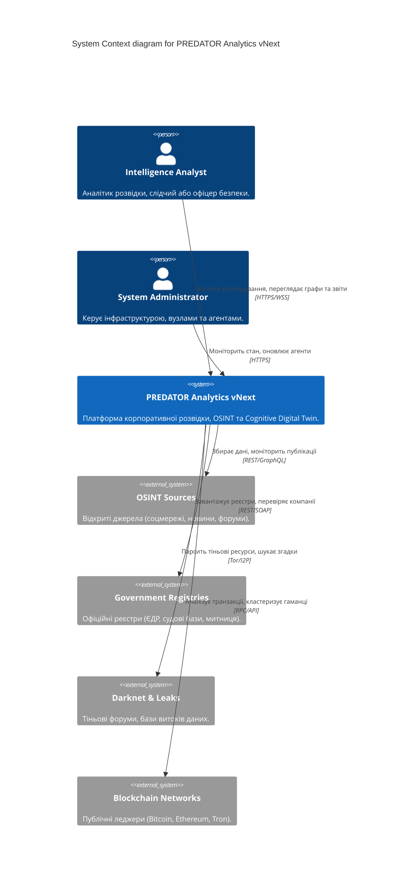
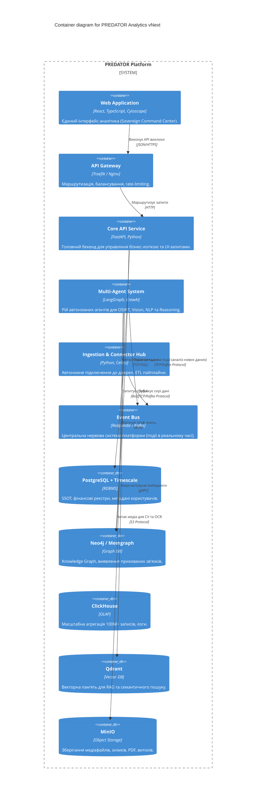
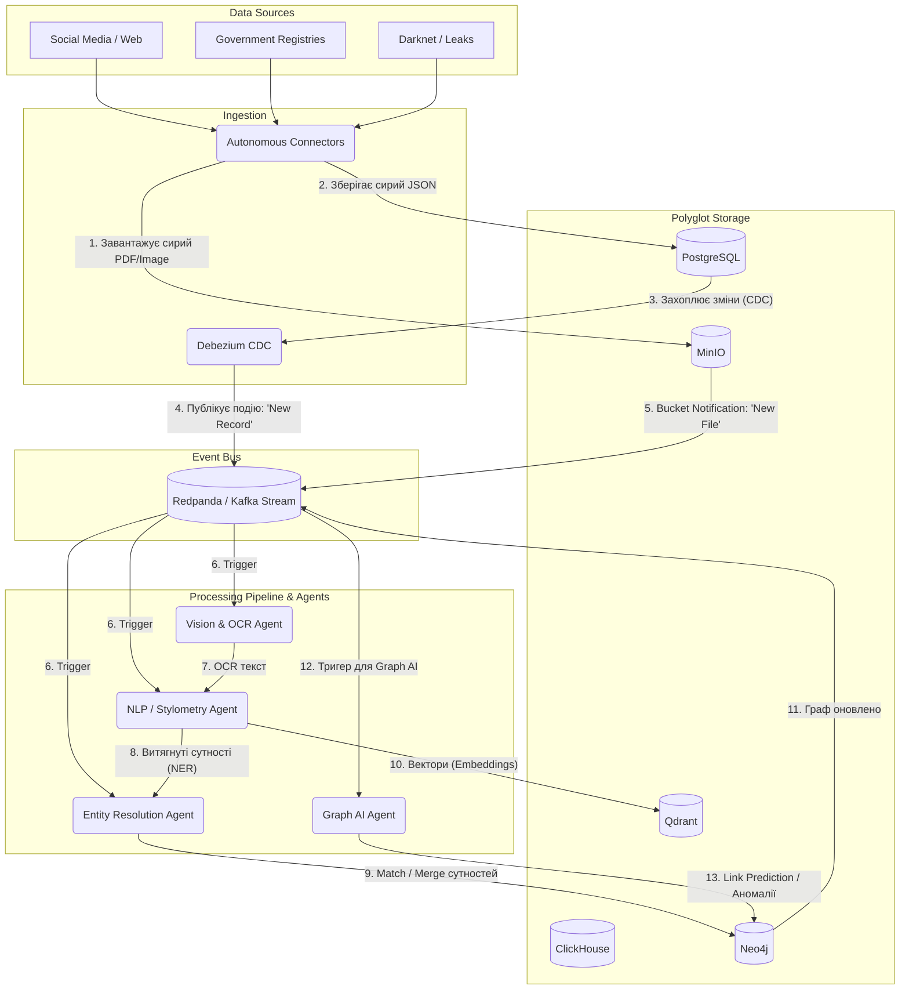

# PREDATOR Analytics vNext - Final Documentation

# PREDATOR Analytics vNext 🦅
## Master Technical Specification (ТЗ) / Архітектурний Blueprint
**Версія: 2.0 (повністю вдосконалена та розширена)**

---

## 1. Вступ та Стратегічна Мета

**PREDATOR Analytics vNext** — це передова інтелектуальна платформа корпоративної розвідки, OSINT, Due Diligence, AML, Risk Intelligence та Threat Intelligence нового покоління.

**Головна місія**:
Автоматично агрегувати дані з усіх легально доступних відкритих джерел, будувати **єдину багатошарову цифрову модель** об’єкта (фізичної/юридичної особи, події, організації), виявляти приховані взаємозв’язки, поведінкові закономірності, часові зміни та генерувати максимально повні, пояснювані аналітичні висновки з оцінкою достовірності.

**Ключові можливості**:
- Near real-time обробка та near real-time розслідування.
- Повністю автономні Multi-Agent системи.
- Побудова Cognitive Digital Twin об’єкта.
- Максимальне використання Open Source рішень світового рівня.
- Повна Explainable Intelligence та етичність.

---

## 2. Основні Інтелектуальні Шари (Cognitive Intelligence Layer)

Не просто пошук, а побудова цифрової моделі людини (Digital Twin). Модель включає:
- Digital Identity Graph & Footprint
- Communication, Behaviour & Knowledge Patterns
- Interest, Social Influence & Professional Patterns
- Financial, Mobility, Risk & Trust Patterns

### 2.1. Digital Identity & Footprint
Повна ідентифікація та сліди в цифровому світі.

### 2.2. Cross-Source Correlation Engine
Не аналіз одного джерела, а автоматичне зіставлення всіх джерел через Entity Resolution, Knowledge Graph та AI Reasoning. 
Ланцюг обробки:
`LinkedIn → GitHub → Socials → Google → Leaks → Court data → Registries → Sanctions → Media → Blockchain → Entity Resolution → Knowledge Graph → AI reasoning`

### 2.3. Human Behaviour Engine
Замість простого профілю система будує детальну поведінкову модель:
- Соціальна активність, комунікабельність, лідерські якості
- Стиль комунікації, динаміка активності, ритм життя
- Професійні інтереси, коло контактів, географічна активність
- Тематика повідомлень, зміна інтересів, репутація, інформаційний вплив

### 2.4. Temporal Intelligence
Усі дані аналізуються не тільки по факту, а по часу. Будуються численні таймлайни:
- Life Events, Career Timeline, Relationship Timeline, Business/Financial/Property Timeline
- Activity, Publication, Travel, Investigation Timelines
- Виявлення сплесків, змін патернів, еволюції мереж

### 2.5. Vision Intelligence
Доцільно інтегрувати сучасні відкриті моделі для:
- Сегментації об’єктів, класифікації сцен, OCR, аналізу документів
- Пошуку схожих зображень, face clustering, виявлення логотипів/транспорту
- Аналізу супутникових знімків та карт

> [!WARNING]
> Висновки щодо особистих психологічних рис лише за фотографією не повинні розглядатися як достовірні. Система може описувати спостережувані ознаки, але не робити категоричних висновків про психологію людини.

### 2.6. Knowledge Graph Intelligence
Граф не просто показує зв’язки, він повинен:
- Знаходити приховані вузли та прогнозувати відсутні зв’язки (Link Prediction)
- Визначати ключових посередників та виявляти спільноти
- Знаходити аномальні структури та оцінювати силу зв’язків
- Будувати часову еволюцію мережі та пояснювати висновки (Explainable AI)

### 2.7. Multi-Agent Investigation System
Не один AI, а десятки спеціалізованих агентів. Наприклад:
`Search Agent`, `Correlation Agent`, `OSINT Agent`, `SOCMINT Agent`, `FININT Agent`, `Vision Agent`, `Risk Agent`, `Validation Agent`, `Self Healing Agent`, `Research Agent`, `Reasoning Agent` тощо.
Оркестрація: LangGraph + CrewAI.

### 2.8. Explainable & Trust Intelligence
Кожен висновок AI має містити:
- Джерела, рівень достовірності та рівень впевненості
- Використані алгоритми, альтернативні пояснення, історію побудови
- Часовий контекст та ступінь незалежного підтвердження

### 2.9. Autonomous Connector Platform
Окремий великий модуль, який автоматично:
- Знаходить нові API та відкриті джерела даних
- Створює конектори до стандартних інтерфейсів (REST, GraphQL, OData, RSS) та генерує ETL-пайплайни
- Автоматично тестує конектори, відстежує зміни схем API та оновлює код без ручного втручання

### 2.10. Research Engine
Окремий агент для безперервного моніторингу Open Source екосистеми (GitHub, GitLab, ArXiv):
- Пошук нових бібліотек та перспективних моделей AI
- Оцінка сумісності зі стеком PREDATOR Analytics
- Автоматичне формування рекомендацій щодо інтеграції

---

## 3. Технічна Архітектура (Event-Driven Data Mesh)

- **Ingestion Layer**: REST/GraphQL/SOAP/OData/CKAN/RSS + Kafka/Redpanda + Debezium (CDC).
- **Processing Pipeline**: Entity Resolution → CV/NLP/Stylometry → Graph Enrichment.
- **Storage Layer** (поліглотне):
  - PostgreSQL + TimescaleDB + pgvector + AGE
  - ClickHouse / DuckDB (OLAP)
  - Memgraph / Neo4j (Graph)
  - Qdrant / OpenSearch (Vector + Hybrid)
  - Redis, MinIO
- **Cognitive Core**: Knowledge Graph + Vector Store + Multi-Agent Layer
- **Autonomous Connector Platform**: Авто-генерація конекторів, тестування, оновлення.
- **Research Engine**: Постійний моніторинг нових Open Source компонентів.

---

## 4. Ключові Open Source Компоненти

- **Збір даних**: SpiderFoot, bbot, theHarvester, Maigret, Recon-ng, Yente/OpenSanctions.  
- **Entity Resolution**: Splink, Zingg.  
- **Vision**: SAM 3, DINOv2/X, YOLO26, PaddleOCR-VL, Surya v2, MiniCPM-o, DocTR.  
- **NLP/Behavioral**: BERTopic, BGE-M3, Stylometry-python, StyloMetrix, StyleShift.  
- **Graph AI**: Memgraph, Neo4j, OpenHGNN, Graphiti, GNNExplainer.  
- **Agents**: LangGraph, CrewAI, AutoGen, CAI Framework.  
- **Інфраструктура**: Kubernetes, Redpanda, FastAPI, vLLM/Triton, ArgoCD.

---

## 5. Дорожня Карта Впровадження (Roadmap)

- **Фаза 1 (1-3 міс.)**: Інфраструктура + онтологія + базовий OSINT.
- **Фаза 2 (4-6 міс.)**: Entity Resolution + Compliance (Yente/Splink).
- **Фаза 3 (7-9 міс.)**: CV, NLP, Behavioral, Temporal Intelligence.
- **Фаза 4 (10-12 міс.)**: Multi-Agent System + Graph AI + Production.
- **Фаза 5+ (1-3 роки)**: Self-Healing, Advanced Research Engine, GraphRAG, TGNN, Adversarial Stylometry.
- **Перспектива (5–10 років)**: Privacy-Preserving Technologies, Autonomous AutoML.

---

## 6. Глобальне дослідження технологій для платформи PREDATOR Analytics vNext

Сучасний ландшафт кіберзагроз, геополітичної нестабільності, фінансових злочинів та інформаційних операцій вимагає від аналітичних систем безпрецедентного рівня автоматизації. PREDATOR Analytics vNext будує архітектуру нового покоління, здатну агрегувати гігантські масиви даних, виконувати багатовимірний аналіз та забезпечувати роботу повністю автономних AI-агентів.

**Архітектурна парадигма**
Перехід від монолітних структур до подієво-орієнтованої (Event-Driven) мікросервісної архітектури (Data Mesh). В основі — Kafka/Redpanda та Debezium для Change Data Capture. Поліглотне зберігання забезпечує найвищу ефективність: PostgreSQL (реляційні дані), TimescaleDB (часові ряди), ClickHouse (OLAP), Neo4j/Memgraph (Графи), Qdrant (Вектори) та MinIO (S3-сховище). Нормалізація даних базується на стандарті FollowTheMoney та інструментах Nomenklatura.

**Розв'язання сутностей (Entity Resolution)**
Класичні RegExp не працюють на масштабах. Для PREDATOR Analytics використовується **Splink** (модель Феллегі-Сантера) для обробки мільйонів записів в DuckDB/Spark, та **Zingg** (Active Learning ML) для Identity Resolution при складних зв'язках.

**Комп'ютерний зір, GEOINT та OCR**
- SAM 3 та DINO-X для сегментації open-vocabulary та вилучення ознак.
- YOLO26 для object detection у реальному часі.
- PaddleOCR-VL, Surya v2 та MiniCPM-o для розпізнавання надскладних макетів документів, таблиць та рукописного тексту з конвертацією у Markdown/JSON.

**NLP та Поведінкова Стилометрія**
Окрім класичного NER, Topic Modeling (BERTopic) та RAG (BGE-M3 гібридний пошук), PREDATOR робить ставку на **Поведінкову аналітику**.
Стилометрія (Stylometry-python, StyloMetrix, StyleShift) вивчає лінгвістичні відбитки, виявляє зміну авторів, згенерований ШІ контент та розраховує математичну дистанцію спільного авторства (Burrows' Delta).

**Графовий ШІ (Graph AI)**
Використання Graph Neural Networks (GNN) для прогнозування зв'язків (OpenHGNN), темпоральних графів (TGNN) для виявлення "сплесків" активності (відмивання грошей), та алгоритму GNNExplainer для повної прозорості (Explainable AI) прийнятих нейромережею рішень.


---

# Розділ 1: Архітектура та Топологія (C4 Model & Data Mesh)

PREDATOR Analytics vNext базується на сучасній мікросервісній, подієво-орієнтованій архітектурі (Event-Driven Data Mesh). Нижче наведено архітектурні діаграми за методологією C4.

## 1.1. System Context Diagram (Рівень 1)
Ця діаграма показує загальну взаємодію платформи із зовнішнім світом (користувачами та джерелами даних).



## 1.2. Container Diagram (Рівень 2)
Ця діаграма розкриває внутрішню будову платформи: основні підсистеми (контейнери) та бази даних.



## 1.3. Event-Driven Data Flow (Рівень Component / Data Mesh)
Архітектура "Event-Driven Data Mesh" забезпечує автоматичну та майже миттєву (near real-time) реакцію на будь-які зміни в базі даних або появу нових файлів.



### Ключові принципи Архітектури
1. **Zero-Point of Failure:** Усі комунікації між агентами відбуваються через Redpanda (Kafka). Якщо Vision Agent впаде, повідомлення залишиться в черзі, і він опрацює його після рестарту (Self-Healing).
2. **Debezium CDC (Change Data Capture):** Дозволяє знімати навантаження з реляційної бази даних. Будь-який INSERT в PostgreSQL автоматично стає потоковою подією для агентів.
3. **Polyglot Persistence:** Замість того, щоб змушувати PostgreSQL робити повнотекстовий пошук чи графові запити, ми використовуємо Qdrant для семантики та Neo4j для топології, які постійно синхронізуються через Event Bus.


---

# Розділ 2: Multi-Agent Investigation System

В основі аналітичної потужності PREDATOR vNext лежить децентралізований рій штучних інтелектів (Multi-Agent System). Замість використання однієї великої мовної моделі (LLM), яка намагається вирішити всі задачі одночасно (що призводить до галюцинацій та обмежень контексту), ми використовуємо десятки вузькоспеціалізованих агентів, що працюють спільно під керівництвом оркестратора.

Система базується на фреймворках **LangGraph** (для циклічних стейт-машин та контролю потоку) та **CrewAI** (для рольової взаємодії агентів).

## 2.1. Ієрархія Агентів

Агенти поділяються на 3 рівні:
1. **Managerial Level (Керуючий рівень)** - Оркеструє роботу, приймає рішення про достатність доказів.
2. **Specialist Level (Рівень спеціалістів)** - Виконують конкретні типи аналізу.
3. **Utility Level (Сервісний рівень)** - Допоміжні функції, перевірка якості та самовідновлення.

### 2.1.1. Managerial Level

* **Arbiter Agent (Головний Суддя):**
  * **Роль:** Приймає фінальне рішення щодо підтвердження гіпотези або ризику.
  * **Функції:** Аналізує висновки від усіх спеціалістів. Зважує рівень впевненості (Confidence Score). Вимагає додаткових перевірок, якщо дані суперечливі.
* **Planning Agent (Стратег):**
  * **Роль:** Декомпозує запит користувача на атомарні задачі.
  * **Функції:** Формує граф виконання. Наприклад, для запиту "Перевірити зв'язок особи А з компанією Б", він запускає OSINT Agent для соцмереж, FININT Agent для фінансів та Graph Agent для пошуку через посередників.

### 2.1.2. Specialist Level

* **OSINT Agent (Відкриті джерела):**
  * **Спеціалізація:** Пошук у медіа, реєстрах, форумах. Використовує SpiderFoot та bbot.
* **SOCMINT Agent (Соціальні мережі):**
  * **Спеціалізація:** Моніторинг LinkedIn, Telegram, Twitter. Співпрацює з NLP агентом для аналізу тональності.
* **FININT Agent (Фінансова розвідка):**
  * **Спеціалізація:** Аналіз транзакцій, офшорів, крипто-гаманців. Має доступ до інструментів блокчейн-аналітики.
* **Vision Agent (Комп'ютерний Зір):**
  * **Спеціалізація:** Отримує зображення, запускає SAM 3 або YOLO26. Повертає список знайдених об'єктів (наприклад, "Приватний літак Bombardier, бортовий номер X").
* **OCR & Document Agent (Аналіз документів):**
  * **Спеціалізація:** Читає PDF (через PaddleOCR), витягує таблиці, договори, фінансові звіти.
* **Graph Agent (Топологія):**
  * **Спеціалізація:** Виконує запити до Neo4j (Cypher). Шукає найкоротші шляхи (Shortest Path) та кластери.

### 2.1.3. Utility Level

* **Validation Agent (Валідатор):**
  * **Спеціалізація:** Перевіряє висновки інших агентів на наявність логічних помилок (Logical Fallacies) або галюцинацій. Вимагає пруфи (джерела) для кожного факту.
* **Report Agent (Генератор звітів):**
  * **Спеціалізація:** Компілює технічні дані у читабельний Executive Summary.
* **Self-Healing Agent (Агент Відновлення):**
  * **Спеціалізація:** Якщо API впало або парсер зламався (змінився HTML), цей агент переписує код парсера, тестує його і деплоїть в рантаймі.

## 2.2. Життєвий цикл розслідування (Investigation Flow)

Коли система отримує нову вхідну сутність (наприклад, номер телефону `+38099XXXXXXX`), запускається наступний цикл:

1. **Trigger:** Kafka отримує подію `NewEntityEvent`.
2. **Planning:** Planning Agent оцінює, що це номер телефону, і створює план: перевірити месенджери, перевірити бази витоків, перевірити реєстри ФОП.
3. **Execution (Паралельно):**
   * *SOCMINT Agent* шукає номер у Telegram. Знаходить профіль з фото.
   * *OSINT Agent* перевіряє витоки даних (Leaks). Знаходить email, пов'язаний з номером.
4. **Enrichment:** 
   * Фото з Telegram передається *Vision Agent* (проводить face clustering або пошук по об'єктах).
   * Email передається назад в OSINT Agent (новий цикл пошуку).
5. **Graph Update:** Всі знайдені сутності (телефон -> email -> особа -> фото) передаються *Entity Agent* (Splink), який зливає їх з існуючими вузлами в Neo4j.
6. **Arbiter Review:** Arbiter Agent оцінює, чи достатньо даних для ідентифікації особи. Якщо впевненість > 95%, він закриває кейс і викликає *Report Agent*.
7. **Reporting:** Report Agent формує досьє, додаючи Explainable Intelligence (пояснення: "Особу ідентифіковано на 98% через збіг номера в Telegram та прив'язку цього ж номера до ФОП у реєстрі Мін'юсту").

## 2.3. Explainable Intelligence (Прозорість рішень)

PREDATOR vNext ніколи не видає висновок типу "Ризик високий" без доказів. 
Артефакт висновку завжди містить:
```json
{
  "claim": "Особа має приховані активи в юрисдикції Кіпру",
  "confidence_score": 0.92,
  "sources": [
    {"type": "Leak", "id": "pandora_papers", "reliability": "high"},
    {"type": "Graph", "path": "Person -> Director -> Cyprus_Company"}
  ],
  "agents_involved": ["FININT Agent", "Graph Agent", "Arbiter Agent"],
  "alternative_explanations": "Особа могла бути номінальним директором без права власності."
}
```
Такий підхід критично важливий для AML комплаєнсу та використання звітів у судових справах.


---

# Розділ 3: Cognitive Intelligence Layer & Human Behaviour Engine

PREDATOR Analytics vNext відмовляється від класичного розуміння "профілю" (Profile) на користь побудови **Цифрового Когнітивного Двійника (Cognitive Digital Twin)**. Це не просто плоский набір атрибутів (Ім'я, Дата народження), а багатовимірна модель, що відображає патерни життя та поведінки особи.

## 3.1. Entity Resolution (Розв'язання Сутностей)

Коли система завантажує дані з різних джерел, вона постійно стикається з дублюванням та шумом. Як зрозуміти, що "Ivanenko I.I." у судовому реєстрі, "Ivan Ivanenko" у LinkedIn та "Іваненко Іван Іванович" у ЄДР — це одна людина?

Ми використовуємо два ешелони Entity Resolution:

1. **Splink (Масштабний Data Fusion):** 
   - Використовує математичну модель Феллегі-Сантера (Fellegi-Sunter).
   - Splink генерує оптимізовані SQL-запити для DuckDB.
   - Він автоматично розраховує ймовірності помилок (наприклад, ймовірність того, що розбіжність у даті народження на 1 день є одруківкою, а не іншою людиною).
2. **Zingg (Active Learning ML):**
   - Використовується для Identity Resolution при слабких зв'язках (наприклад, зіставлення анонімного крипто-гаманця з акаунтом на форумі через часові збіги).
   - Модель самостійно навчається на розмічених людиною прикладах.

## 3.2. Human Behaviour Engine (Поведінкова Модель)

Система будує поведінкову модель, базуючись на діях, а не лише на декларативних даних:

* **Комунікабельність та Лідерство:** Аналізуючи граф зв'язків у соцмережах та форумах (кількість вхідних/вихідних повідомлень, Centrality Score у графі), система розуміє, чи є особа лідером думок (Hub) чи звичайним читачем.
* **Ритм Життя (Circadian Rhythm):** Аналіз часових міток (timestamps) публікацій, транзакцій та логінів дозволяє побудувати "теплову карту" активності. Якщо особа регулярно активна з 02:00 до 05:00 за місцевим часом, це може свідчити про роботу з іншим часовим поясом (офшори) або специфічний спосіб життя.
* **Фінансовий Патерн:** Різкі зміни у обсягах крипто-транзакцій перед публікацією інсайдерських новин.

## 3.3. Стилометрія (Adversarial Stylometry)

Унікальний функціонал PREDATOR vNext — лінгвістичний відбиток (Stylometry).

* **Burrows' Delta (Stylometry-python):** Алгоритм вимірює математичну дистанцію між двома текстами на основі частоти використання функціональних слів (займенників, прийменників). Дозволяє на 90%+ підтвердити, що анонімний Telegram-канал та офіційний Facebook-акаунт веде одна людина.
* **StyleShift & StyloMetrix:** Нейромережеві моделі, які виявляють "зсув стилю" в межах одного документа. Дозволяють знайти моменти, де текст писав LLM, або де публікації почав писати інший SMM-менеджер.

## 3.4. Temporal Intelligence (Часова Інтелектуальність)

PREDATOR vNext будує серію паралельних таймлайнів:

1. **Life Events:** Народження, шлюби, зміна громадянства.
2. **Career Timeline:** Призначення, звільнення, відкриття ФОП.
3. **Property Timeline:** Купівля-продаж нерухомості (з прив'язкою до Career Timeline для пошуку "незадекларованих" доходів).
4. **Communication Timeline:** Інтенсивність контактів.

**Темпоральні Графи (TGNN):**
Система використовує Temporal Graph Neural Networks. Класичні графи статичні. TGNN аналізують еволюцію графа в часі. 
*Приклад:* Вузол А і Вузол Б не мали прямих зв'язків, але протягом місяця перед великим судовим позовом (Подія В) вони почали масово контактувати через Вузол С (Посередник). TGNN автоматично позначає такий трикутник як аномалію та генерує Risk Alert.


---

# Розділ 4: Autonomous Connector Platform & Research Engine

Проблема сучасних OSINT систем — постійна поломка API та парсерів через зміни на стороні джерел (змінився HTML-код сайту, оновилась версія API). PREDATOR Analytics вирішує цю проблему за допомогою двох систем, що роблять платформу **самопідтримуваною (Self-Healing)** та **самовдосконалюваною (Self-Improving)**.

## 4.1. Autonomous Connector Platform (ACP)

ACP — це фабрика конекторів, якою керує штучний інтелект. Люди не пишуть код для підключення до нових джерел.

### Життєвий цикл автоматичного конектора:

1. **Discovery (Виявлення):**
   - Аналітик вставляє URL нового відкритого реєстру (наприклад, `https://data.gov.uk/...`) в систему.
   - Система аналізує сайт (використовуючи LLM та Headless Browser), знаходить сторінку з документацією API (Swagger/OpenAPI) або просто визначає структуру HTML-таблиць.
2. **Generation (Генерація коду):**
   - Agent Coder генерує Python-код для конектора (наслідуючи клас `BaseCollector`).
   - Генеруються ETL правила: як мапити поля джерела (наприклад, `company_title`) у стандарт FollowTheMoney (наприклад, `Company.name`).
3. **Sandboxed Testing (Тестування):**
   - Згенерований код запускається в ізольованому Docker-контейнері (E2B Sandbox).
   - Виконуються тестові запити. Якщо API повертає помилку `401 Unauthorized` або `KeyError`, Agent Coder отримує лог помилки, фіксить код і повторює тест (до `max_iterations = 5`).
4. **Deployment (Розгортання):**
   - Після успішного тесту конектор автоматично реєструється в реєстрі Ingestion Hub і стає доступним для OSINT Agents.

### Self-Healing (Саморемонт):
Якщо існуючий конектор (наприклад, парсер судового реєстру) починає повертати `500 Error` або пусті дані протягом 24 годин:
- Спрацьовує Alert.
- Self-Healing Agent завантажує актуальний HTML/відповідь API.
- Порівнює з еталонним.
- Пише патч (наприклад, змінює XPath селектор з `div.old-class` на `div.new-class`).
- Проганяє тести і робить гаряче оновлення (Hot Reload) конектора в рантаймі без даунтайму.

## 4.2. Research Engine (Двигун Досліджень)

OSINT і AI розвиваються щодня. PREDATOR vNext не повинен застарівати. 

**Research Agent** — це фоновий автономний процес, який 24/7 досліджує інтернет:

1. **Моніторинг GitHub/HuggingFace/ArXiv:**
   - Агент підписаний на ключові теги (`#OSINT`, `#GraphNeuralNetworks`, `#EntityResolution`, `#LLM`).
   - Він щоденно парсить нові репозиторії, які отримують багато зірок, або нові наукові статті на ArXiv.
2. **Оцінка (Evaluation):**
   - Знайшовши новий інструмент (наприклад, нову версію YOLO або новий OSINT скрипт для Telegram), Research Agent аналізує його `README.md`.
   - Визначає ліцензію (чи це MIT/Apache, щоб уникнути юридичних ризиків).
   - Оцінює, чи вирішує цей інструмент якусь із поточних проблем PREDATOR.
3. **Рекомендація:**
   - Формує звіт для System Administrator (через UI Command Center):
     > *"Знайдено нову модель DINO-X для сегментації супутникових знімків. Вона на 15% точніша за поточну DINOv2. Згенеровано план міграції. Схвалити тестування?"*
4. **Continuous Evolution (Безперервна еволюція):**
   - У майбутньому Research Agent зможе самостійно клонувати репозиторій, збирати Docker-образ і запускати A/B тестування паралельно з існуючим модулем.

Цей модуль гарантує, що PREDATOR Analytics vNext завжди залишатиметься на вістрі технологічного прогресу без необхідності утримувати величезний штат R&D інженерів.


---

# Розділ 5: Дорожня карта (Roadmap) та Оцінка ресурсів

Розробка PREDATOR Analytics vNext — це масштабний інфраструктурний проект, який вимагає чіткого планування та розбиття на фази. Нижче наведено деталізований Roadmap на 12 місяців.

## 5.1. Фаза 1: Фундамент та Базовий OSINT (Місяці 1-3)

**Мета:** Розгорнути базову інфраструктуру, налаштувати сховища та запустити перші колектори даних.
* **Спринт 1-2 (Інфраструктура):** 
  * Розгортання Kubernetes (k3s) на Compute Node.
  * Підняття PostgreSQL + TimescaleDB, ClickHouse, MinIO, Neo4j, Qdrant.
  * Налаштування Redpanda (Kafka) для Event Bus.
* **Спринт 3-4 (Ingestion Layer):**
  * Створення FastAPI Core сервісу.
  * Інтеграція базових OSINT скриптів (Recon-ng, theHarvester) та державних реєстрів.
  * Налаштування Debezium CDC для трансляції змін з PostgreSQL у Redpanda.
* **Спринт 5-6 (Сovereign Command Center):**
  * Створення Web UI (React + Cytoscape) для візуалізації зібраних даних.
  * **Milestone 1:** Система здатна приймати номер телефону/ім'я, збирати дані з 10 джерел і показувати їх у вигляді простого графа.

## 5.2. Фаза 2: Entity Resolution та Compliance (Місяці 4-6)

**Мета:** Навчити систему розуміти, що різні записи належать одній сутності, та інтегрувати санкційні перевірки.
* **Спринт 1-2 (Entity Resolution):**
  * Інтеграція Splink для масового злиття дублікатів (Data Fusion).
  * Налаштування Zingg для складного ML-зіставлення.
* **Спринт 3-4 (Compliance & AML):**
  * Інтеграція Yente/OpenSanctions.
  * Імплементація онтології FollowTheMoney.
* **Спринт 5-6 (Графова Аналітика):**
  * Налаштування базових алгоритмів у Neo4j (Shortest Path, Centrality).
  * **Milestone 2:** Дані більше не дублюються. Граф стає чистим, автоматично перевіряються санкції та PEP (Політично значущі особи).

## 5.3. Фаза 3: Cognitive Intelligence (Місяці 7-9)

**Мета:** Додати можливості комп'ютерного зору, NLP та поведінкової аналітики.
* **Спринт 1-2 (Vision & OCR):**
  * Інтеграція SAM 3, DINO-X, PaddleOCR.
  * Автоматичне вилучення тексту та сутностей із завантажених PDF-документів.
* **Спринт 3-4 (NLP & Stylometry):**
  * Інтеграція локальних LLM (Ollama, vLLM).
  * Впровадження Stylometry-python та BGE-M3 для векторного пошуку.
* **Спринт 5-6 (Temporal & Behavioural):**
  * Створення таймлайнів (Timeline View в UI).
  * **Milestone 3:** Система розуміє текст, розпізнає обличчя/об'єкти на фото, виявляє стилістичні збіги та будує Цифрового Двійника.

## 5.4. Фаза 4: Multi-Agent System (Місяці 10-12)

**Мета:** Повна автоматизація розслідувань через рій AI-агентів.
* **Спринт 1-2 (Agent Framework):**
  * Інтеграція LangGraph та CrewAI.
  * Створення базових агентів (Search, OSINT, SOCMINT).
* **Спринт 3-4 (Advanced Agents):**
  * Створення Planning Agent, Arbiter Agent, Validation Agent.
  * Налаштування пояснюваності (Explainable AI).
* **Спринт 5-6 (Autonomous Connectors & Production):**
  * Запуск фабрики конекторів. Навантажувальне тестування.
  * **Milestone 4 (Production Ready):** Платформа працює автономно. Аналітик лише задає ціль, а система (через 20+ агентів) видає готовий звіт з доказами.

## 5.5. Оцінка Ресурсів (Hardware & Team)

### Апаратне забезпечення (Compute Node)
Через жорсткі вимоги до обробки даних (Zero-Local-Deployment), уся система повинна розгортатись на потужному сервері:
* **CPU:** 64+ cores (AMD EPYC або Intel Xeon) для обробки потоків Kafka та OCR.
* **RAM:** 256GB - 512GB (багато in-memory операцій для Memgraph та Redis).
* **GPU (КРИТИЧНО):** 
  * Мінімум 2x NVIDIA RTX 3090/4090 (по 24GB VRAM) або 1x NVIDIA A100 (80GB).
  * VRAM необхідна для постійного хостингу локальних моделей: DINO-X (Vision), BGE-M3 (Embeddings), PaddleOCR, Llama-3/Mistral (через vLLM).
* **Storage:** 4TB+ NVMe SSD для баз даних + 20TB HDD (MinIO для сирих медіа).

### Команда (Core Team)
Для успішної реалізації проекту в зазначені терміни знадобиться крос-функціональна команда:
1. **AI Architect / Team Lead (1):** Загальна архітектура, LangGraph, вибір моделей. (Google Antigravity виконує цю роль).
2. **Data Engineer (1-2):** Kafka, Debezium, Splink, ETL-пайплайни.
3. **Backend Developer (Python) (1):** FastAPI, Celery, інтеграції API.
4. **Frontend Developer (1):** React, Cytoscape (Графи), Three.js (3D візуалізація).
5. **DevOps / MLOps (1):** Kubernetes, ArgoCD, vLLM, моніторинг (Prometheus).


---

