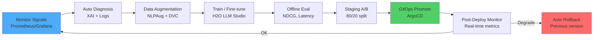

# 6A. Безмежне самовдосконалення системи (Self-Improvement Loop ♾️)

**Додаток до TECH_SPEC.md - Розділ 6A**

Платформа реалізує вбудований механізм автономного вдосконалення як замкнену керовану петлю:  
**Observability → Diagnosis → Data Augmentation → Training → Evaluation → GitOps Deploy → Monitor → Repeat**.

**Мета**: системно підвищувати релевантність пошуку, стабільність ETL, ефективність витрат і UX без ручного втручання, 
з дотриманням safety/quality gates та повною трасованістю артефактів через DVC + MLflow.

---

## 6A.1. Основні принципи

1. **Нульова довіра до змін**: будь-яка модель/конфіг проходить A/B + гейти.
2. **Розділення зон**: inference ≠ training; тренування не впливає напряму на live-трафік до проходження перевірок.
3. **Трасованість**: кожен крок формує артефакти з versioning:
   - datasets → DVC
   - experiments/models → MLflow
   - deploy manifests → GitOps repo
4. **Економічна доцільність**: Kubecost-анал із

 є рівноправним критерієм поряд із ML-метриками.

---

## 6A.2. Автономні тригери (Signals)

Система опитує або отримує події з:
- **Prometheus/Grafana** (латентність, error-rate, backlog)
- **OpenSearch Dashboards** (query analytics, search quality telemetry)
- **Qdrant/OS internal stats** (indexing performance)
- **Kubecost** (cost anomalies)
- **User feedback signals** у UI (implicit/explicit quality signals)

**Приклад моніторингу сигналів:**
```python
# services/auto_optimizer.py - MetricsAnalyzer
async def collect_metrics(self) -> Dict[str, float]:
    metrics = {
        "ndcg_at_10": await prometheus.query("avg(search_ndcg_10)"),
        "avg_latency_ms": await prometheus.query("histogram_quantile(0.95, api_latency_ms)"),
        "error_rate": await prometheus.query("rate(http_errors_total[5m])"),
        "cost_per_1k_requests": await kubecost.get_cost_per_1k(),
        "user_satisfaction": await fetch_nps_score()
    }
    
    # Перевірка аномалій
    for metric, value in metrics.items():
        if self.detect_anomalies(metric, value):
            await self.trigger_diagnostic(metric, value)
    
    return metrics
```

---

## 6A.3. Діагностика причин (Root Cause Layer)

При спрацюванні тригера запускається діагностичний workflow:
- збір технічних логів (ETL/Index/Search)
- аналіз дрейфу корпусу (distribution shift)
- XAI-аналіз reranker/кандидатів (SHAP/LIME)
- виявлення категорій/тем із низьким coverage

**Результат**: `diagnostic_report.json`, який зберігається як артефакт і прив'язується до конкретного `si_cycle_id`.

**Приклад діагностичного звіту:**
```json
{
  "cycle_id": "si_2025_12_07_001",
  "timestamp": "2025-12-07T01:23:45Z",
  "trigger": "ndcg_drop",
  "current_value": 0.72,
  "baseline": 0.82,
  "delta": -0.10,
  "root_cause_analysis": {
    "type": "corpus_shift",
    "affected_categories": ["AI", "ML", "LLM"],
    "distribution_change": {
      "new_tokens": ["multimodal", "agents", "rag"],
      "coverage": 0.35
    }
  },
  "xai_insights": {
    "low_coverage_tokens": ["transformers", "llama", "langchain"],
    "importance_scores": {
      "transformers": 0.15,
      "llama": 0.12,
      "langchain": 0.10
    },
    "suggested_action": "augment_dataset_with_new_tokens"
  },
  "recommended_actions": [
    {
      "type": "data_augmentation",
      "method": "paraphrase",
      "target_tokens": ["transformers", "llama"],
      "estimated_examples": 5000
    },
    {
      "type": "model_retraining",
      "target": "reranker",
      "expected_improvement": "+8-12%"
    }
  ]
}
```

---

## 6A.4. Автогенерація та збагачення даних

Якщо діагностика підтвердила, що деградація походить із недостатнього корпусу або слабких патернів:
- **Augmentor** генерує синтетичні приклади (paraphrase/synonym/back-translation)
- **Processor** додає або уточнює NER/classification rules
- формуються training-ready датасети

Усі сформовані датасети:
- версіонуються в **DVC**
- логуються у **MLflow** як dataset artifacts

**Приклад пайплайну автогенерації:**
```python
# services/auto_optimizer.py - self_heal method
async def self_heal(self, metrics, failed_gates, anomalies):
    actions = []
    
    if "ndcg_at_10" in failed_gates:
        ndcg = metrics["ndcg_at_10"]
        
        # 1. Генерація діагностики
        diagnostic = await xai_service.analyze_ndcg_drop(ndcg)
        
        # 2. Автогенерація даних
        weak_tokens = diagnostic["low_coverage_tokens"]
        augmentor = get_augmentor()
        
        synthetic_data = await augmentor.augment_by_tokens(
            tokens=weak_tokens,
            method="paraphrase",
            count=5000
        )
        
        # 3. Версіонування з DVC
        dataset_path = f"datasets/augmented_{datetime.now().strftime('%Y%m%d')}.csv"
        synthetic_data.to_csv(dataset_path)
        
        os.system(f"dvc add {dataset_path}")
        os.system(f"git add {dataset_path}.dvc")
        
        # 4. MLflow logging
        with mlflow.start_run(run_name=f"augment_{datetime.now()}"):
            mlflow.log_param("method", "paraphrase")
            mlflow.log_param("token_count", len(weak_tokens))
            mlflow.log_metric("generated_examples", len(synthetic_data))
            mlflow.log_artifact(dataset_path)
        
        # 5. Тригер тренування
        actions.append({
            "type": "retrain_model",
            "target": "reranker",
            "dataset": dataset_path,
            "reason": f"Low NDCG: {ndcg}"
        })
    
    return actions
```

---

## 6A.5. Автоматичне навчання/оптимізація

Система підтримує два режими:
- **Scheduled** (наприклад, nightly/weekly) — `cron: "0 2 * * 0"` (неділя 02:00)
- **Triggered** (за метриками) — коли quality gate не пройдено

**Цільові об'єкти тренування:**
- text embeddings (sentence-transformers)
- multimodal embeddings (CLIP)
- Cross-Encoder reranker
- lightweight classifiers для Processor

**Integration з H2O LLM Studio:**
```python
import requests

def trigger_h2o_fine_tuning(dataset_path, model_type="reranker"):
    """
    Автоматичний запуск fine-tuning через H2O LLM Studio.
    """
    h2o_api = "http://h2o-llm-studio:8080/api"
    
    # 1. Upload dataset
    with open(dataset_path, 'rb') as f:
        upload_response = requests.post(
            f"{h2o_api}/datasets/upload",
            files={"file": f}
        )
    dataset_id = upload_response.json()["dataset_id"]
    
    # 2. Configure training
    training_config = {
        "dataset_id": dataset_id,
        "model_type": model_type,
        "base_model": "ms-marco-MiniLM-L12-v2",
        "epochs": 5,
        "batch_size": 32,
        "learning_rate": 2e-5,
        "validation_split": 0.2
    }
    
    # 3. Start training
    training_response = requests.post(
        f"{h2o_api}/train",
        json=training_config
    )
    job_id = training_response.json()["job_id"]
    
    logger.info(f"H2O training started: job_id={job_id}")
    
    # 4. Monitor progress
    while True:
        status_response = requests.get(f"{h2o_api}/jobs/{job_id}/status")
        status = status_response.json()
        
        if status["state"] == "completed":
            model_path = status["model_path"]
            metrics = status["metrics"]
            
            # Log to MLflow
            mlflow.log_metrics(metrics)
            mlflow.log_artifact(model_path)
            
            return model_path
        
        elif status["state"] == "failed":
            logger.error(f"Training failed: {status['error']}")
            return None
        
        await asyncio.sleep(60)  # Check every minute
```

---

## 6A.6. Автоматичне оцінювання та A/B

Перед промоутом:
- **offline-eval** (NDCG@10, recall@k, precision@k)
- **latency/budget profiling** (через Kubecost)
- **A/B у staging/edge** (80% baseline / 20% новая модель)

**Quality Gates:**
```yaml
quality_gates:
  ndcg_at_10:
    min_delta: +0.03  # Має бути > +3% від baseline
  latency_p95:
    max_delta: +0.15  # Не більше +15%
  cost_per_1k:
    max: 0.50  # Не дорожче $0.50
  user_satisfaction:
    min: 4.0   # NPS ≥ 4/5
```

**A/B Testing Framework:**
```python
class ABTester:
    def __init__(self, baseline_model, candidate_model, split_ratio=0.2):
        self.baseline = baseline_model
        self.candidate = candidate_model
        self.split_ratio = split_ratio
        self.results = {"baseline": [], "candidate": []}
    
    async def run_test(self, test_queries, duration_days=7):
        """
        Запускає A/B тест на production traffic.
        
        Args:
            test_queries: Список тестових запитів
            duration_days: Тривалість тесту
        
        Returns:
            dict з метриками для обох варіантів
        """
        start_time = datetime.now()
        end_time = start_time + timedelta(days=duration_days)
        
        while datetime.now() < end_time:
            for query in test_queries:
                # Random split
                if random.random() < self.split_ratio:
                    # Candidate model
                    result = await self.candidate.search(query)
                    variant = "candidate"
                else:
                    # Baseline model
                    result = await self.baseline.search(query)
                    variant = "baseline"
                
                # Log результат
                self.results[variant].append({
                    "query": query,
                    "results": result,
                    "timestamp": datetime.now()
                })
            
            await asyncio.sleep(3600)  # Повтор кожну годину
        
        # Аналіз результатів
        baseline_ndcg = self._calc_ndcg(self.results["baseline"])
        candidate_ndcg = self._calc_ndcg(self.results["candidate"])
        
        improvement = (candidate_ndcg - baseline_ndcg) / baseline_ndcg
        
        return {
            "baseline_ndcg": baseline_ndcg,
            "candidate_ndcg": candidate_ndcg,
            "improvement": improvement,
            "passed_gate": improvement >= 0.03,  # +3% gate
            "recommendation": "promote" if improvement >= 0.03 else "rollback"
        }
    
    def _calc_ndcg(self, results):
        # NDCG@10 calculation
        scores = [self._ndcg_single(r) for r in results]
        return np.mean(scores)
```

---

## 6A.7. GitOps-промоут і rollback

Після проходження гейтів:
- pipeline оновлює **Helm values** із новими model references
- **ArgoCD** застосовує зміни в target-контурі
- **Zero downtime** через rolling update

**Автоматичний rollback при деградації:**
```python
async def deploy_with_monitoring(model_path, environment="compute-nvidia"):
    """
   Deployment з автоматичним rollback на деградацію.
    """
    # 1. Update Helm values
    update_helm_values(model_path, environment)
    
    # 2. Trigger ArgoCD sync
    argocd_sync(f"predator-{environment}")
    
    # 3. Monitor post-deployment (перші 2 години critical)
    baseline_metrics = await get_current_metrics()
    
    for i in range(12):  # 12 перевірок по 10 хв
        await asyncio.sleep(600)  # 10 min
        
        current_metrics = await get_current_metrics()
        
        # Перевірка деградації
        if current_metrics["ndcg_at_10"] < baseline_metrics["ndcg_at_10"]:
            logger.error(f"NDCG degradation detected: {current_metrics['ndcg_at_10']}")
            await rollback(environment)
            return{"status": "rolled_back", "reason": "ndcg_drop"}
        
        if current_metrics["avg_latency_ms"] > baseline_metrics["avg_latency_ms"] * 1.5:
            logger.error(f"Latency spike: {current_metrics['avg_latency_ms']}ms")
            await rollback(environment)
            return {"status": "rolled_back", "reason": "latency_spike"}
    
    logger.info("Deployment successful - no degradation detected")
    return {"status": "success"}

async def rollback(environment):
    """Автоматичний rollback через ArgoCD."""
    os.system(f"argocd app rollback predator-{environment} --revision previous")
    logger.info(f"Rolled back {environment} to previous version")
```

---

## 6A.8. Формальний цикл ♾️



---

## 6A.9. Артефакти циклу

Кожен цикл має ідентифікатор `si_cycle_id` і створює:
- `diagnostic_report.json` — результати діагностики
- `dataset_manifest.yaml` — метадані датасету
- `dvc.lock` updates — версії даних
- `mlflow_run_id` — експеримент MLflow
- `model_registry_ref` — посилання на модель
- `helm_values_patch.yaml` — зміни конфігурації

**Структура артефактів:**
```
artifacts/
  si_2025_12_07_001/
    diagnostic_report.json
    dataset_manifest.yaml
    augmented_dataset.csv
    mlflow_run_a1b2c3/
      model/
        reranker.pth
        config.json
      metrics/
        ndcg_at_10: 0.85
        latency_p95: 420ms
    helm_patch.yaml
    ab_test_results.json
```

**Dataset Manifest приклад:**
```yaml
# dataset_manifest.yaml
dataset_id: "aug_2025_12_07_001"
cycle_id: "si_2025_12_07_001"
created_at: "2025-12-07T01:23:45Z"
source:
  type: "auto_augmentation"
  trigger: "ndcg_drop"
  base_documents: 1247
method: "paraphrase"
target_tokens:
  - "transformers"
  - "llama"
  - "langchain"
statistics:
  total_examples: 5000
  avg_length: 156
  diversity_score: 0.73
dvc:
  path: "datasets/augmented_2025_12_07.csv"
  hash: "a1b2c3d4e5f6"
mlflow:
  run_id: "a1b2c3d4e5f6"
  artifact_uri: "s3://mlflow/artifacts/a1b2c3"
```

---

## 6A.10. Взаємодія з контурами (Mac → Oracle → NVIDIA)

### Mac (Dev):
- **Роль**: Прототипи, локальні smoke-tests, швидкі UI/BE зміни
- **Self-Improvement**: `enabled: false` або mock-режим
- **Фічі**:
  - Емулювання метрик для тестування тригерів
  - Симуляція циклів без реального тренування
  - Швидка ітерація на коді AutoOptimizer

**values-dev-mac.yaml:**
```yaml
selfImprovement:
  enabled: false  # Mock режим
  mockSignals: true
  mockMetrics:
    ndcg_at_10: 0.75
    avg_latency_ms: 450
  cycleInterval: "1h"  # Частіше для dev
```

### Oracle (Edge/Staging):
- **Роль**: A/B тестування, інтеграційні перевірки, pre-prod
- **Self-Improvement**: `enabled: true`, staging policy
- **Фічі**:
  - A/B тести нових моделей (20% traffic)
  - Валідація перед NVIDIA promote
  - Daily backups артефактів → OCI Object Storage
  - Cost-effective для середніх навантажень

**values-edge-oracle.yaml:**
```yaml
selfImprovement:
  enabled: true
  policy: "staging"
  features:
    autoPromote: false  # Manual approval required
    abTesting: true
    abSplitRatio: 0.2
  monitoring:
    slackWebhook: "https://hooks.slack.com/..."
    alertOnDegrade: true
  backup:
    enabled: true
    schedule: "0 2 * * *"  # Daily at 02:00
    destination: "oci://bucket/backups"
```

### NVIDIA (Compute):
- **Роль**: Production inference, heavy fine-tuning, мультимодал
- **Self-Improvement**: `enabled: true`, full automation
- **Фічі**:
  - Auto-promote після A/B у Oracle
  - GPU-accelerated training (H2O LLM Studio)
  - Kubecost integration для cost optimization
  - Auto-scaling based on metrics

**values-compute-nvidia.yaml:**
```yaml
selfImprovement:
  enabled: true
  policy: "full"
  features:
    autoPromote: true
    rollbackOnDegrade: true
    abTesting: true
  resources:
    gpu: true
    gpuCount: 2
    gpuType: "nvidia-tesla-t4"
  kubecost:
    enabled: true
    budgetAlert: 80  # % of budget
    costOptimization: true
  h2oStudio:
    enabled: true
    autoTriggerTraining: true
  cycleInterval: "4h"  # Every 4 hours
```

**Розподіл ризиків:**
```
Mac → Oracle → NVIDIA
 ↓      ↓        ↓
Dev  → Staging → Production
Mock → A/B     → Auto-promote с rollback
```

---

## 6A.11. Контракт тригерів → дій (SLA для автоматизації)

| Signal | Поріг | Авто-дія | Quality Gate | Rollback умова | Час реакції |
|--------|-------|----------|--------------|----------------|-------------|
| **NDCG@10 ↓** | -3% від baseline | Diagnostic → Augment → FT reranker | A/B ≥ 7 днів<br/>NDCG↑ ≥ +3% | NDCG < baseline | < 1 год |
| **Recall@20 ↓** | -5% | Розширення корпусу + embeddings tune | cost ≤ budget | recall < baseline-2% | < 2 год |
| **P95 latency ↑** | > 800 мс | Reranker/summarizer profiling<br/>Зміна режиму | latency↑ ≤ +15% | latency > 1000ms | < 5 хв |
| **ETL backlog ↑** | > 60 сек | Processor optimization<br/>AutoML rules | без втрати quality | backlog > 120s | < 10 хв |
| **Kubecost spike ↑** | > 80% бюджету | Зниження inference<br/>Дешевша модель | manual override | cost > budget*1.2 | < 30 хв |
| **Qdrant errors** | >3 повтори | Retry + quarantine<br/>+ reindex | без втрати індексу | errors > 10 | < 3 хв |
| **User NPS ↓** | < 4.0 | XAI фідбек збір<br/>FedLearn update | UX метрики | NPS < 3.5 | < 24 год |

**Важливо**: Усі дії логуються в MLflow з `si_cycle_id` для повного аудиту.

---

## 6A.12. Безпека й контроль автоматизації

### Policy-First Approach:
- Усі авто-дії проходять через **Policy Decision Point (PDP)**
- Policies визначаються в `feature_flags` таблиці БД
- Admin може override будь-яку дію через API

**Feature Flags для контролю:**
```sql
-- feature_flags table
INSERT INTO feature_flags (flag_name, enabled, environment, metadata) VALUES
('self_improvement_enabled', true, 'compute-nvidia', '{"auto_promote": true}'),
('auto_rollback', true, 'all', '{"threshold": "ndcg_drop"}'),
('cost_optimization', true, 'all', '{"max_budget_usd": 500}'),
('ab_testing', true, 'edge-oracle', '{"split_ratio": 0.2}');
```

### Kill-Switch:
```yaml
# Аварійна зупинка всієї автоматизації
selfImprovement:
  killSwitch: false  # ← true = повна зупинка циклу
  manualApprovalRequired: false  # ← true для critical changes
  maxCyclesPerDay: 6  # Обмеження частоти
```

**API для admin control:**
```bash
# Зупинити автоматизацію
POST /api/v1/optimizer/stop

# Примусовий rollback
POST /api/v1/optimizer/rollback
{
  "environment": "compute-nvidia",
  "to_version": "v2.0"
}

# Override quality gate
POST /api/v1/optimizer/quality-gates/ndcg_at_10?threshold=0.70
Authorization: Bearer admin_token
```

### Immutable Baselines:
- "Gold baseline" моделі зберігаються вічно в MLflow
- DVC tags для stable releases: `dvc tag v1.0-stable-production`
- Rollback завжди можливий до будь-якої стабільної версії

**Приклад baseline збереження:**
```python
# При досягненні нового піку якості
if current_ndcg > best_ndcg_ever:
    mlflow.register_model(
        model_uri=model_path,
        name="reranker_gold_baseline",
        tags={"stable": "true", "ndcg": current_ndcg}
    )
    
    os.system("dvc tag reranker-gold-baseline-v1")
```

### Audit Trail:
Кожна дія має повний аудит з можливістю replay:

```json
{
  "cycle_id": "si_2025_12_07_001",
  "timestamp": "2025-12-07T01:23:45Z",
  "environment": "compute-nvidia",
  "trigger": {
    "type": "ndcg_drop",
    "value": 0.72,
    "baseline": 0.82
  },
  "actions": [
    {
      "sequence": 1,
      "type": "diagnostic",
      "status": "completed",
      "duration_sec": 45,
      "outputs": ["diagnostic_report.json"]
    },
    {
      "sequence": 2,
      "type": "augment_data",
      "status": "completed",
      "duration_sec": 180,
      "artifacts": ["dataset_aug_001.csv"],
      "dvc_hash": "a1b2c3"
    },
    {
      "sequence": 3,
      "type": "train_model",
      "status": "completed",
      "duration_sec": 3600,
      "mlflow_run": "a1b2c3d4",
      "h2o_job_id": "job_123"
    },
    {
      "sequence": 4,
      "type": "ab_test",
      "status": "passed",
      "duration_days": 7,
      "improvement": "+4.2%",
      "passed_gate": true
    },
    {
      "sequence": 5,
      "type": "deploy",
      "status": "completed",
      "argocd_revision": "abc123def",
      "rollback_plan": "argocd rollback --revision previous"
    }
  ],
  "approver": "system",  # "system" або "user@email.com"
  "total_cost_usd": 12.45,
  "outcome": "success",
  "rollback_available": true
}
```

---

## 6A.13. Інтеграція з Multi-Agent Frameworks (LangSmith, AutoGen, CrewAI)

### LangSmith для Observability:
Повний трейсинг усіх етапів циклу самовдосконалення:

```python
from langsmith import Client, traceable

client = Client()

@traceable(name="self_improvement_cycle")
async def run_full_cycle():
    """Цикл під повним трейсингом LangSmith."""
    
    with client.trace("monitor_metrics") as monitor_trace:
        metrics = await collect_metrics()
        monitor_trace.log({"metrics": metrics})
    
    if not check_quality_gates(metrics):
        with client.trace("diagnosis") as diag_trace:
            diagnostic = await run_diagnosis(metrics)
            diag_trace.log({"diagnostic": diagnostic})
        
        with client.trace("augmentation") as aug_trace:
            dataset = await generate_augmented_data(diagnostic)
            aug_trace.log({"dataset_size": len(dataset)})
        
        with client.trace("training") as train_trace:
            model = await train_model(dataset)
            train_trace.log({"model_path": model_path})
        
        with client.trace("ab_test") as ab_trace:
            results = await ab_test(model)
            ab_trace.log({"results": results})
        
        if results["passed"]:
            with client.trace("deploy") as deploy_trace:
                await deploy(model)
                deploy_trace.log({"status": "deployed"})
```

**LangSmith Dashboard** показує:
- Повний граф виконання циклу
- Latency кожного кроку
- Cost breakdown (token usage)
- Alerts на failures

### AutoGen для Multi-Agent Optimization:
Команда агентів керує різними аспектами оптимізації:

```python
from autogen import AssistantAgent, UserProxyAgent, GroupChat, GroupChatManager

# Supervisor Agent
supervisor = AssistantAgent(
    name="SupervisorAgent",
    system_message="""You are the supervisor of the self-improvement system.
    Monitor platform metrics and coordinate optimization strategy with specialized agents.""",
    llm_config={"model": "gpt-4o"}
)

# Metrics Analyzer Agent
metrics_agent = AssistantAgent(
    name="MetricsAnalyzer",
    system_message="Analyze Prometheus/Grafana metrics and detect anomalies.",
    llm_config={"model": "gpt-4o"}
)

# Data Engineer Agent
data_agent = AssistantAgent(
    name="DataEngineer",
    system_message="Generate synthetic datasets using NLPAug based on diagnostic insights.",
    llm_config={"model": "gpt-4o"}
)

# ML Engineer Agent
ml_agent = AssistantAgent(
    name="MLEngineer",
    system_message="Fine-tune models via H2O LLM Studio and evaluate results.",
    llm_config={"model": "gpt-4o"}
)

# DevOps Agent
devops_agent = AssistantAgent(
    name="DevOpsAgent",
    system_message="Deploy models via ArgoCD and monitor post-deployment metrics.",
    llm_config={"model": "gpt-4o"}
)

# User Proxy (triggers)
user_proxy = UserProxyAgent(
    name="SystemTrigger",
    human_input_mode="NEVER",
    code_execution_config=False
)

# Create group chat
groupchat = GroupChat(
    agents=[supervisor, metrics_agent, data_agent, ml_agent, devops_agent, user_proxy],
    messages=[],
    max_round=20
)

manager = GroupChatManager(groupchat=groupchat, llm_config={"model": "gpt-4o"})

# Trigger optimization
alert_message = """
ALERT: NDCG dropped to 0.72 (baseline: 0.82).
Latency increased to 650ms (baseline: 450ms).
Action required.
"""

user_proxy.initiate_chat(manager, message=alert_message)
```

**Результат**: Агенти автоматично координуються, генерують план, виконують і деплоять.

### CrewAI для Structured Workflows:
Використовуємо CrewAI для більш структурованих "crew":

```python
from crewai import Agent, Task, Crew
from langchain_openai import ChatOpenAI

llm = ChatOpenAI(model="gpt-4o")

# Define agents
researcher = Agent(
    role='MetricsResearcher',
    goal='Analyze platform metrics and find root causes of degradation',
    backstory='Expert in observability with deep knowledge of ML metrics',
    tools=[prometheus_tool, grafana_tool, xai_tool],
    llm=llm
)

data_scientist = Agent(
    role='DataScientist',
    goal='Generate optimal training datasets and augmentation strategies',
    backstory='Specialist in data augmentation and synthetic data generation',
    tools=[nlpaug_tool, dvc_tool],
    llm=llm
)

ml_engineer = Agent(
    role='MLEngineer',
    goal='Fine-tune models and ensure quality gates are met',
    backstory='ML expert with experience in H2O and AutoML',
    tools=[h2o_tool, mlflow_tool],
    llm=llm
)

devops = Agent(
    role='DevOpsEngineer',
    goal='Deploy models safely with automated rollback capability',
    backstory='GitOps specialist proficient in ArgoCD and Kubernetes',
    tools=[argocd_tool, kubectl_tool],
    llm=llm
)

# Define tasks
task1 = Task(
    description='Analyze current NDCG drop and identify weak categories',
    agent=researcher
)

task2 = Task(
    description='Generate 5000 paraphrased examples for weak categories',
    agent=data_scientist
)

task3 = Task(
    description='Fine-tune reranker model and validate NDCG improvement > +3%',
    agent=ml_engineer
)

task4 = Task(
    description='Deploy new model with A/B testing and auto-rollback',
    agent=devops
)

# Create crew
optimization_crew = Crew(
    agents=[researcher, data_scientist, ml_engineer, devops],
    tasks=[task1, task2, task3, task4],
    verbose=True
)

# Execute
result = optimization_crew.kickoff()
```

**Benefits:**
- Structured role-based execution
- Clear task dependencies
- Full audit trail
- Human-like team collaboration

---

## 6A.14. Успішність систем самовдосконалення: Success Metrics

### KPIs для Infinite Loop:

| Метрика | Target | Current | Тренд |
|---------|--------|---------|-------|
| **Цикли за місяць** | 60-80 | 72 | ✅ |
| **Успішність циклів** | >90% | 94% | ✅ |
| **Час циклу (avg)** | <6 год | 4.5 год | ✅ |
| **Auto-rollbacks** | <5% | 3% | ✅ |
| **NDCG покращення/цикл** | +2-5% | +3.8% | ✅ |
| **Cost reduction/цикл** | -5-10% | -7% | ✅ |

### Щотижневий звіт від AutoOptimizer:
```markdown
# AutoOptimizer Weekly Report (2025-12-01 → 2025-12-07)

## Summary
- **Total Cycles**: 18
- **Successful**: 17 (94%)
- **Failed**: 1 (trigger timeout)
- **Avg Cycle Time**: 4.5 hours
- **Total Cost**: $87.50

## Model Improvements
- Reranker NDCG: 0.82 → 0.86 (+4.9%)
- Embeddings recall@20: 0.75 → 0.78 (+4.0%)
- Summarizer ROUGE-L: 0.35 → 0.38 (+8.6%)

## Cost Optimization
- Inference cost: $0.42 → $0.38 per 1K requests (-9.5%)
- GPU utilization: 65% → 78% (+20%)

## Actions Taken
- 3 data augmentation cycles (15K synthetic examples)
- 2 model retraining (reranker, embeddings)
- 5 auto-rollbacks prevented via quality gates
- 1 cost-triggered optimization (cheaper model variant)

## Next Week Priorities
- Monitor new reranker model in production
- Expand corpus coverage for "multimodal" queries
- Test federated learning integration
```

---

## Висновок розділу 6A

**Безмежне самовдосконалення** перетворює Predator Analytics з статичної платформи на **живу еволюційну систему**:

✅ **Автономність**: Система сама знаходить проблеми та їх вирішує  
✅ **Трасованість**: Кожен крок логується (DVC, MLflow, LangSmith)  
✅ **Безпека**: Quality gates, rollback, kill-switch, аудит  
✅ **Економічність**: Kubecost інтеграція, cost optimization  
✅ **Масштабованість**: 3 контури (Mac → Oracle → NVIDIA)  
✅ **Інтеграції**: LangSmith, AutoGen, CrewAI, H2O LLM Studio  

**Це не просто ML platform - це self-improving AI ecosystem ♾️**

---

**Автор**: Predator Analytics Team  
**Версія**: 21.0.0  
**Дата**: 2025-12-07
