# TECH_SPEC.md: Платформа "Predator Analytics" v45.0 (Implementation-Ready)

## 1. Вступ та Стратегічна Візія

### 1.1. Анотація та Цілі Версії v45.0

Даний документ є фундаментальною технічною специфікацією для платформи "Predator Analytics" версії v45.0. Цей реліз знаменує собою парадигмальний зсув від традиційних аналітичних систем до концепції "Автономної Когнітивної Екосистеми". Основною метою v45.0 є реалізація "Нескінченного Циклу" (The Infinite Loop) самовдосконалення, де процеси збору даних, навчання моделей, розгортання та отримання зворотного зв'язку є повністю автоматизованими, безшовними та керованими подіями (Event-Driven).

В умовах сучасного ринку станом на грудень 2025 року, де швидкість адаптації штучного інтелекту (AI) до нових даних є критичним фактором конкурентоспроможності, статичні моделі застарівають швидше, ніж впроваджуються. "Predator Analytics" v45.0 вирішує цю проблему шляхом інтеграції передових методологій LLMOps (Large Language Model Operations), Edge AI та FinOps. Ми переходимо від реактивного масштабування інфраструктури до проактивного управління витратами, використовуючи фінансові метрики як безпосередні тригери для автомасштабування кластерів Kubernetes.

Ця специфікація призначена для архітекторів систем, ML-інженерів, DevOps-фахівців та стейкхолдерів продукту. Вона містить вичерпні інструкції щодо конфігурації компонентів, стратегій розгортання та операційного управління. Документ готовий для старту розробки та не є комерційною пропозицією.

### 1.2. Концепція "Нескінченного Циклу" (Infinite Self-Improvement Loop)

Архітектурним ядром v45.0 є замкнений цикл, який усуває "людину-в-контурі" (human-in-the-loop) з рутинних операцій, залишаючи за операторами лише функцію нагляду та стратегічного управління. Процес функціонує наступним чином:

- **Генерація на Периферії (Edge Generation)**: Користувачі взаємодіють з платформою через PWA-інтерфейс, навіть у режимі офлайн. Їхні запити, виправлення відповідей та нові дані формують "сирий" потік знань.
- **Синхронізація та Агрегація (Sync & Aggregation)**: При відновленні зв'язку дані синхронізуються з центральним сховищем (Data Lake), проходячи первинну валідацію.
- **Стратегічна Аугментація (Strategic Augmentation)**: Використання бібліотеки AugLy для створення синтетичних варіацій даних. Це критичний етап для запобігання перенавчанню на малих обсягах нових даних та підвищення робастності моделі до помилок вводу.
- **Автономне Тонке Налаштування (Automated Fine-Tuning)**: H2O LLM Studio, працюючи в режимі CLI, автоматично ініціює процес навчання при досягненні певного порогу накопичених даних. Використовуються методи ефективного навчання (PEFT/LoRA) та оптимізації переваг (DPO).
- **Безперервне Розгортання (GitOps Rollout)**: Після успішної валідації нова модель реєструється, а ArgoCD автоматично оновлює маніфести Kubernetes, розгортаючи нову версію на інференс-серверах.
- **Фінансовий Контроль (FinOps Feedback)**: KEDA та Kubecost моніторять вартість циклу. Якщо вартість навчання або інференсу перевищує бюджетні ліміти, система автоматично адаптує ресурси (наприклад, перемикається на Spot-інстанси або зменшує кількість реплік).

### 1.3. Високорівнева Архітектура

Система побудована як набір слабко пов'язаних мікросервісів, розгорнутих у середовищі Kubernetes.

| Шар (Layer) | Компоненти | Технологічний Стек |
|-------------|------------|---------------------|
| Frontend / Edge | PWA, Offline Vector Search, Local Storage | React, Workbox, Transformers.js, RxDB/IndexedDB |
| Ingress / API | API Gateway, Load Balancing | NGINX Ingress, Cert-Manager |
| Knowledge Base | Vector Database, Hybrid Search Engine | Qdrant (Dense + Sparse), RRF Fusion |
| Training Core | LLM Fine-tuning, Experiment Tracking | H2O LLM Studio (CLI), Docker, Python |
| Data Ops | Augmentation, Preprocessing | AugLy, Pandas, Airflow/Prefect |
| Infrastructure Ops | GitOps, CD, Config Management | ArgoCD (App-of-Apps), Helm |
| Scaling & FinOps | Cost Monitoring, Event-driven Autoscaling | KEDA, Kubecost (OpenCost), Prometheus |

```mermaid
flowchart TB
    subgraph UI["Frontend (React 18 + TS)"]
        UIClient["SPA: Search + XAI + Dataset Studio + Admin Console + OpenSearch Dashboards Integration"]
    end

    subgraph BE["Backend (FastAPI)"]
        API["REST API v1"]
        Auth["Auth + RBAC + Tenant Guard"]
        Search["Hybrid Search Orchestrator"]
        Datasets["Dataset Control API"]
        MLAPI["ML Jobs API"]
        Integrations["OAuth2 Integrations"]
        Flags["Feature Flags"]
    end

    subgraph Inference["ML Inference Services"]
        EmbedText["Text Embeddings Service"]
        EmbedMM["CLIP/MM Embeddings"]
        Reranker["Cross-Encoder Reranker"]
        Summarizer["Summarizer"]
        XAI["SHAP/LIME XAI Service"]
    end

    subgraph MLOps["Training & Self-Improve"]
        Augmentor["Synthetic Data Augmentor (AugLy)"]
        AutoML["H2O AutoML"]
        H2O["H2O LLM Studio"]
        FedLearn["Flower FL"]
        DVC["DVC Remote + Pipelines"]
        MLflow["MLflow Tracking + Registry"]
        SIO["Self-Improve Orchestrator"]
        Policy["Policy Decision Point"]
    end

    subgraph Data["Storage & Search"]
        PG["PostgreSQL + pgvector"]
        OS["OpenSearch (with Dashboards)"]
        QD["Qdrant"]
        Redis["Redis Cache"]
        Obj["S3/MinIO (artifacts, DVC, snapshots)"]
    end

    subgraph Workers["Workers (Celery)"]
        Parser["ETL Parser"]
        Processor["Processor + NER + Classify"]
        Indexer["Indexer + Embeddings Builder"]
    end

    subgraph Queue["Queue"]
        MQ["RabbitMQ (to_process/to_index/to_augment/to_train)"]
    end

    subgraph Obs["Observability + FinOps"]
        Prom["Prometheus"]
        Graf["Grafana"]
        KCost["Kubecost"]
        OSD["OpenSearch Dashboards (embedded/integrated)"]
        Alert["Alertmanager"]
    end

    subgraph External["External"]
        Drive["Google Drive"]
        Notion["Notion"]
        Slack["Slack"]
        Sources["RSS/Web/Files"]
    end

    UIClient -->|"REST + JWT"| API

    API --> Auth
    API --> Search
    API --> Datasets
    API --> MLAPI
    API --> Integrations
    API --> Flags

    Search --> OS
    Search --> QD
    Search --> Reranker
    Search --> Summarizer
    Search --> XAI
    Search --> PG
    Search --> Redis

    Sources --> Parser --> PG
    Parser --> MQ

    MQ --> Processor --> PG
    Processor --> MQ

    MQ --> Indexer
    Indexer --> PG
    Indexer --> OS
    Indexer --> QD
    Indexer --> EmbedText
    Indexer --> EmbedMM

    MQ --> Augmentor
    Augmentor --> PG
    Augmentor --> DVC
    Augmentor --> MLflow
    Augmentor --> MQ

    MQ --> H2O
    H2O --> MLflow
    H2O --> DVC

    AutoML --> MLflow
    FedLearn --> MLflow

    SIO --> Prom
    SIO --> KCost
    SIO --> OSD
    SIO --> Policy
    Policy --> SIO

    Obs --> API
    Obs --> Workers
    Obs --> Data
    Alert --> Slack

    Integrations --> Drive
    Integrations --> Notion
    Integrations --> Slack

    DVC --> Obj
    MLflow --> Obj
    OS --> Obj
    QD --> Obj
```

## 0. Executive Summary

Платформа забезпечує глибокий семантичний пошук, аналітику та повний ML/LLMOps цикл з **вбудованими механізмами автономного вдосконалення**:

- **Гібридний пошук**: OpenSearch (BM25 з OpenSearch Dashboards для моніторингу логів та query analytics) + Qdrant (dense/sparse/multimodal) з RRF fusion.
- **Reranking**: Cross-Encoder з інтеграцією Cohere Rerank для підвищеної точності.
- **XAI**: SHAP/LIME для пояснення топ-результатів, з візуалізацією в UI через ECharts.
- **Автогенерація датасетів**: AugLy для стратегічної аугментації, закриття coverage-дір та cold-start.
- **No-code / low-code fine-tuning**: H2O LLM Studio з CLI для автоматизації, підтримка DPO для стабільного навчання.
- **AutoML для табличних та правил**: H2O AutoML з інтеграцією в пайплайни.
- **Federated Learning**: Flower для enterprise сценаріїв з TLS-шифруванням.
- **MLOps артефакти**: DVC + MLflow для трекінгу та версіонування.
- **FinOps**: Kubecost + KEDA для cost-based autoscaling, з алертами та policy actions.
- **GitOps**: ArgoCD з App-of-Apps патерном + Helm umbrella.
- **Контури**: Mac (Dev) → Oracle ARM (Edge/Staging) → NVIDIA GPU (Compute).
- **Edge AI**: Transformers.js + RxDB для offline vector search в PWA.
- **Голосовий інтерфейс**: Google Cloud TTS/STT з fallback на Whisper.js/eSpeak-ng для офлайн.
- **Автоматизації**: Повний набір – ETL пайплайни з Celery/RabbitMQ, auto-reindex jobs, tenant-based A/B, Policy Engine для сигналів, два профілі інференсу (full_quality/cost_saver), Cypress E2E тести в CI/CD.

Ключова ідея v45.0: **“♾️-Self-Improvement Loop”** з чіткими межами між **observability (включаючи OpenSearch Dashboards) → data → training → evaluation → GitOps**, інтеграцією Policy Engine та tenant-based A/B.

## 1. Головні цілі та вимірювані KPI/SLA

### 1.1 Search Quality

| Метрика | Ціль | Де вимірюємо | Примітка |
|---------|------|--------------|----------|
| precision@5 | ≥ 0.85 | offline + A/B | основний продукт-метрик |
| recall@20 | ≥ 0.90 | offline + A/B | критично для enterprise |
| NDCG@10 | ≥ baseline + 3% | offline + staging A/B (з OpenSearch Dashboards analytics) | гейт на промоут |

### 1.2 Performance

| Метрика | Ціль | Примітка |
|---------|------|----------|
| P95 latency (full pipeline: BM25+ANN+rerank+XAI) | ≤ 800 ms | default профіль |
| P95 latency (без XAI) | ≤ 500 ms | fallback режим (cost_saver) |
| ETL backlog | ≤ 60 s | середній лаг по черзі |

### 1.3 Reliability

| Метрика | Ціль |
|---------|------|
| Uptime (Search API) | 99.9% |
| Автоматичний rollback при деградації | 100% для model-promote |

### 1.4 FinOps

| Метрика | Ціль |
|---------|------|
| cost per 1k queries | < $0.05 |
| GPU idle > 60 хв | auto-scale/down або auto-shutdown |
| Kubecost budget breach | алерт + policy action (через Policy Engine) |

## 2. Архітектура системи

(Діаграма оновлена з інтеграцією OpenSearch Dashboards в Observability subgraph та UI.)

OpenSearch Dashboards інтегровано як основний інструмент для моніторингу логів, query analytics та візуалізації пошукових патернів. Він доступний через embedded iframe в Admin Console або окремий ingress, з RBAC-контролем.

## 3. Потоки даних

(Без змін, але з приміткою: логи потоків направляються в OpenSearch для реального часу моніторингу через Dashboards.)

## 4. Каталог баз даних та їх ролі

### 4.1 Основні

3. OpenSearch
   - Індекс тексту, BM25, query analytics, логи.
   - **OpenSearch Dashboards**: Візуалізація логів, дашборди для пошукових метрик, алерти на аномалії запитів (separate cluster за потреби).

Решта без змін.

## 9. Безмежне самоудосконалення системи (Self-Improvement Loop ♾️)

(Повний опис з доданими автоматизаціями:)

- **Policy Engine**: Окремий мікросервіс для обробки сигналів (з Prometheus, Kubecost, OpenSearch Dashboards). Приймає signal + context → allow/deny + план дій (наприклад, auto-reindex або downgrade профілю).
- **Два профілі інференсу**: full_quality (rerank+XAI) та cost_saver (без XAI/з дешевшим reranker) – автоматичне перемикання на основі Kubecost policy.
- **Авто-реіндексація**: Окремий контрольований Celery job, тригериться після model_ready, з метриками в Prometheus та rollback-планом через GitOps.
- **Тенантний A/B**: A/B тести по tenant_id для enterprise, з ізоляцією в Qdrant/OpenSearch.
- **Cypress автоматизація**: E2E тести в CI/CD для UI, включаючи OpenSearch Dashboards navigation.
- **OpenSearch Dashboards автоматизація**: Автоматичні дашборди для ETL backlog, query quality, logs з Workers/Orchestrator.

Решта розділів (KPI, конфіги, RACI тощо) без змін, з акцентом на інтеграцію Dashboards в observability.

## 15. Висновок

v45.0 формалізує платформу як Automation-First, Self-Improving, GitOps-native систему з повною інтеграцією OpenSearch Dashboards для моніторингу та всіх пророблених автоматизацій (Policy Engine, профілі інференсу, авто-реіндексація, тенантний A/B, Cypress E2E). Це забезпечує тотальну автономність ♾️-циклу станом на грудень 2025 року.

Статус документа: ЗАТВЕРДЖЕНО (v45.0)
Дата: 14.12.2025
Версія: Implementation-Ready
