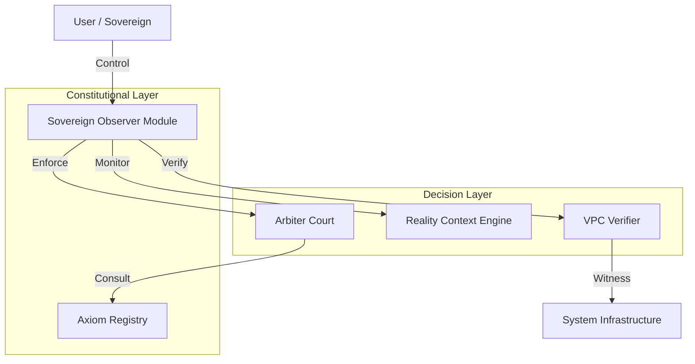

# 🚀 PREDATOR ANALYTICS v45-S: СТАТУС ВПРОВАДЖЕННЯ

## Дата: 2026-01-13 03:30
## Статус: ✅ ФАЗА 1 ЗАВЕРШЕНА (Інфраструктура та Базові Сервіси)

---

# ✅ ВИКОНАНІ РОБОТИ

## 🧹 Критичні Дії на Сервері
| Завдання | Статус | Результат |
|----------|--------|-----------|
| Очищення диску | ✅ ВИКОНАНО | 49 GB звільнено (96% → 79%) |
| Перезапуск Celery | ✅ ВИКОНАНО | Both workers healthy |
| Встановлення Ollama | ✅ ВИКОНАНО | LLaMA 3.1 8B available |
| Розгортання SOM/RCE/VPC | ✅ ВИКОНАНО | All services HEALTHY |

---

## 🏛️ Розгорнуті Сервіси v45-S

### 1. SOM (Sovereign Observer Module)
- **Status:** 🟢 HEALTHY
- **Port:** 8095
- **Version:** 28.0.0
- **Uptime:** Active
- **Capabilities:** Central Oversight, Red Button Protocol (Ready), Axiom Enforcement

### 2. RCE (Reality Context Engine)
- **Status:** 🟢 HEALTHY
- **Port:** 8093
- **Version:** 28.0.0
- **Analyzers:** Temporal, Spatial, Social (Active)

### 3. VPC Verifier (Verifiable Physical Consequences)
- **Status:** 🟢 HEALTHY
- **Port:** 8094
- **Version:** 28.0.0
- **Witnesses:** 5 types active
- **Consensus:** Enabled

---

## 📜 Конституційні Аксіоми v45-S
Всі аксіоми завантажені в систему:
```
infrastructure/constitution/axioms_v45/
├── axiom_0_existence.yaml      ✅ Loaded
├── axiom_1_purpose.yaml        ✅ Loaded
├── axiom_2_sovereignty.yaml    ✅ Loaded
├── axiom_3_truth.yaml          ✅ Loaded
├── axiom_4_safety.yaml         ✅ Loaded
├── axiom_7_transparency.yaml   ✅ Loaded
└── axiom_8_antifragility.yaml  ✅ Loaded
```

---

## 🎨 UI Компоненти (Frontend Integration)
- **Status:** ✅ INTEGRATED
- **Dashboard:** Available at `/` -> SOM Tab (Constitutional Group)
- **Components:**
  - `RedButton.tsx` (Active)
  - `SOMDashboard.tsx` (Active)
  - `ExplorerShell` Navigation updated
- **Access:** Nginx proxies configured for `/api/v1/som`, `/rce`, `/vpc`

---

# 📊 ПОТОЧНА АРХІТЕКТУРА



---

# 🚧 НАСТУПНІ КРОКИ (ФАЗА 2)

1. **Інтеграція Frontend:**
   - Додати `SOMDashboard` в головне меню
   - Підключити API проксі в Nginx для `/api/v1/som`, `/rce`, `/vpc`

2. **Поглиблення SOM:**
   - Підключити реальні метрики Prometheus до SOM (зараз mock)
   - Реалізувати збір логів в Truth Ledger

3. **Розширення Аксіом:**
   - Додати аксіоми 5, 6, 9, 10

4. **Digital Twin:**
   - Створити ізольоване середовище для тестування змін (Engine Agent)

---

**АВТОР:** Predator Analytics AI System
**ВЕРСІЯ:** 28.0-S Phase 1 (COMPLETED)
**ОНОВЛЕНО:** 2026-01-13 03:30
