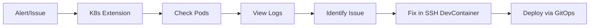

# 🔗 Kubernetes Extension — Operational Use Only

> **Важливо:** Kubernetes extension використовується ЛИШЕ для операційних задач, НЕ для розробки коду.

## 📋 Призначення

### ✅ Використовуйте Kubernetes extension для:

| Задача | Опис |
|--------|------|
| **Pod Monitoring** | Перегляд статусу подів |
| **Log Viewing** | Читання логів контейнерів |
| **Helm Operations** | `helm list`, `helm status` |
| **Cluster Diagnostics** | Перевірка ресурсів кластера |
| **Quick Debugging** | Швидка діагностика production |

### ❌ НЕ використовуйте для:

| Задача | Правильний підхід |
|--------|-------------------|
| **Code Development** | SSH + DevContainer |
| **Running Tests** | SSH + DevContainer |
| **Debugging Code** | SSH + DevContainer |
| **File Editing** | SSH + DevContainer |

---

## 🔧 Налаштування кількох кластерів

VS Code підтримує підключення до кількох Kubernetes кластерів одночасно:

1. `Cmd+Shift+P` → "Kubernetes: Set Kubeconfig"
2. Додайте файли kubeconfig для:
   - NVIDIA Server (production)
   - Local K3s (testing)
   - Oracle Cloud (backup)

---

## 📊 Типовий Ops Workflow



---

## ⚡ Корисні команди

### Через VS Code Kubernetes panel:
- Right-click pod → "Logs"
- Right-click deployment → "Describe"
- Right-click service → "Port Forward"

### Через terminal:
```bash
kubectl get pods -n predator
kubectl logs -f deployment/predator-backend -n predator
kubectl describe pod <pod-name> -n predator
```

---

## 🎯 Головне правило

> **"Code in SSH DevContainer, Monitor in K8s Extension"**

Розробка коду ЗАВЖДИ через:
```
VS Code → Remote SSH → dev-ngrok → Reopen in Container
```

Операційний моніторинг через:
```
VS Code → Kubernetes Extension → Select Cluster → View Resources
```
