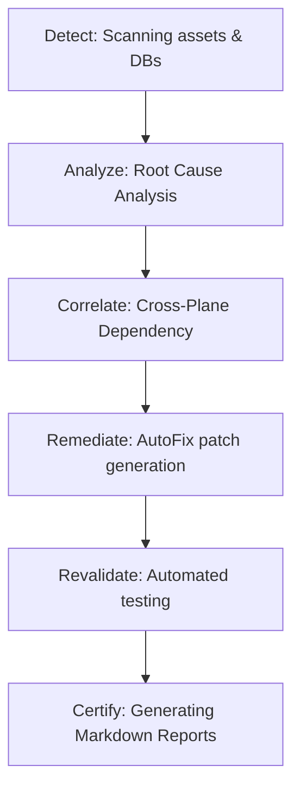

# ⚖️ Forensic Audit Report
*Звіт згенеровано автономно AI-Driven Integrity Engine платформи PREDATOR ELITE*
*Дата генерації: 2026-07-15 10:41:37 (UTC)*

---

### Судово-медичний звіт про Forensic-аудит платформи PREDATOR ELITE

> [!IMPORTANT]
> **ID Аудиту:** `audit-64eb0b71`
> **Час проведення:** `2026-07-15T10:41:37.243906+00:00`
> **Статус цілісності:** `Успішно`
> **Тривалість перевірки:** `189.81 ms`

#### 🔄 Контур безперервної верифікації (Verifiable OODA Cycle)

#### 📊 Загальна оцінка площин контролю:
| Площина контролю | Статус | Основна роль / Опис |
| :--- | :---: | :--- |
| **Visual Interaction Layer** | `OK` | Візуальна cyber-intelligence стилістика та Live updates |
| **Cognitive UX Layer** | `OK` | Психологія command center, ефект showroom & teaser |
| **Infrastructure Validation Layer** | `OK` | Моніторинг 8+ баз даних та VRAM ліміту |
| **Sovereign Access Fabric Layer** | `OK` | ABAC, Zero-Trust та маскування даних |
| **Data Integrity Layer** | `OK` | Консистентність WORM та лінейдж даних |
| **ETL & Intelligence Layer** | `OK` | OSINT Telegram ingestion & NLP pipelines |
| **Autonomous Remediation Layer** | `OK` | Детермінований AutoFix та Self-Healing |
| **Localization Governance Layer** | `FAIL (AutoFixed)` | 100% суверенна українська локалізація |
| **Production Certification Layer** | `OK` | Підсумкова сертифікація та випуск звітів |
