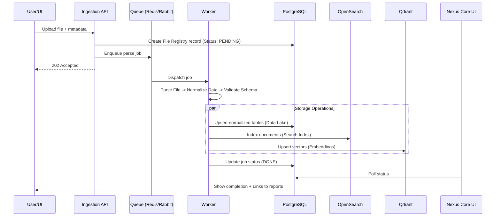

# 01. ETL & Ingestion Domain Specification

## 1. Огляд
Цей модуль відповідає за отримання даних із зовнішніх джерел, їх парсинг, нормалізацію, валідацію та збереження у відповідних сховищах системи.

## 2. Джерела даних
*   **XLSX/CSV**: Основні структуровані файли.
*   **PDF**: Неструктуровані документи (потребують OCR/парсингу).
*   **Telegram**: Повідомлення та медіа з каналів/чатів (через Telethon).
*   **Web/OSINT**: Дані з веб-сторінок (Playwright/Scrapy).
*   **Публічні реєстри**: Дані з державних баз України (через API/дампи).

## 3. Компоненти
1.  **Upload Gateway**: Точка входу для файлів (REST API / UI Upload).
2.  **Ingestion Manager**: Оркестратор процесів завантаження.
3.  **File Registry**: База метаданих файлів (хеші, статуси, власники).
4.  **Parser Workers**: Воркери для специфічних форматів (Excel parser, PDF extractor).
5.  **Normalizer/Validator**: Приведення даних до канонічної схеми.
6.  **Dedup/Idempotency Engine**: Запобігання дублям.

## 4. Потік даних (XLSX/CSV End-to-End)



## 5. Implementation Blueprints

### Directory Structure
```
backend/
  src/
    ingestion/
      parsers/
        excel.py
        pdf.py
      processors/
        normalizer.py
        deduplicator.py
      router.py
```

### Helm / Configs
*   **Queue**: Використовувати черги з dead-letter exchange для фейлів.
*   **Resources**: Воркери потребують більше CPU для PDF/OCR.
*   **Storage**: Великі файли вантажити в S3 (MinIO), в базу — посилання.
