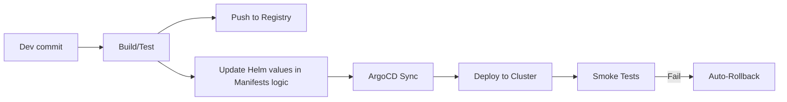

# 05. GitOps, Security & Infrastructure Specification

## 1. Огляд
Модуль описує інфраструктуру, процеси розгортання (CI/CD), безпеку та моніторинг платформи.

## 2. Infrastructure Setup
*   **Orchestrator**: K3s (Lightweight Kubernetes).
*   **GitOps Controller**: ArgoCD.
*   **Package Manager**: Helm (Umbrella chart pattern).
*   **Container Registry**: GHCR (GitHub Container Registry) або локальний (Harbor - опційно).

## 3. GitOps Workflow (The "Only Way")



1.  **Code Change**: Push в git.
2.  **CI (GitHub Actions/Tekton)**: Build Docker image, Run Unit Tests.
3.  **Publish**: Push image in Registry.
4.  **Config Update**: Оновлення тегу версії в `values.yaml` (Helm) в Git-репозиторії конфігурацій.
5.  **Sync**: ArgoCD бачить зміни і синхронізує стан кластера.

## 4. Security Domain
*   **Identity Provider**: Keycloak (OIDC/SAML). SSO, MFA support.
*   **Secret Management**: HashiCorp Vault + ExternalSecrets Operator (sync secrets to K8s Secrets).
*   **Network**:
    *   Ingress Controller (Traefik/Nginx).
    *   Network Policies (Zero Trust model - deny all by default).
    *   TLS termination (Cert-Manager).
*   **Audit**: Повне логування дій користувачів та API запитів.

## 5. Observability Domain
*   **Metrics**: Prometheus (з scraping configs для всіх сервісів).
*   **Dashboards**: Grafana (pre-built dashboards for System, App, Business KPIs).
*   **Logs**: Loki (збирання логів контейнерів).
*   **Tracing**: Tempo/Jaeger (end-to-end трейсинг запитів).

## 6. Definition of Done (DoD)
Для релізу компонента:
1.  Helm charts валідні (`helm lint`).
2.  ArgoCD статус `Synced` і `Healthy`.
3.  Unit/Integration тесті пройдені.
4.  Немає критичних вразливостей (Trivy scan).
5.  Метрики надходять в Prometheus.
6.  Документація оновлена.

## 7. Implementation Blueprints

### Directory Structure
```
infrastructure/
  k8s/
    apps/
      predator-backend/
      predator-frontend/
    core/
      argocd/
      monitoring/
  helm-charts/
    predator-umbrella/
```

### ArgoCD ApplicationSet
Використовувати pattern "App of Apps" для керування всім кластером через одну точку входу.
