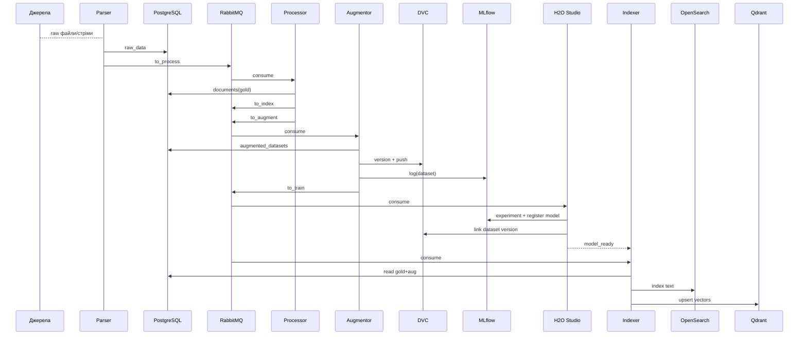
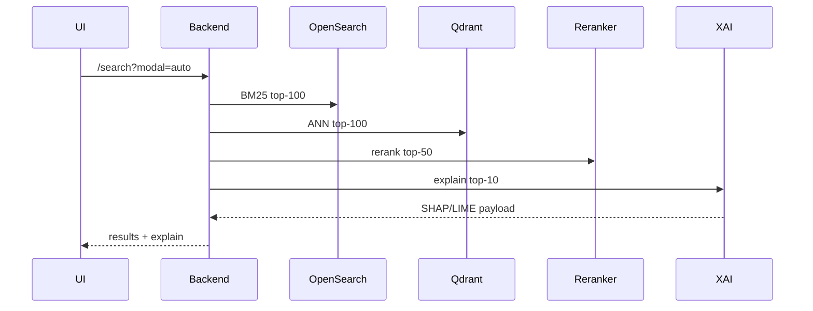
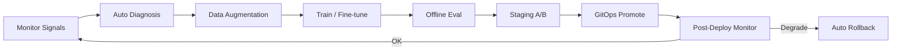

# Технічне Завдання
**Семантична Пошукова Платформа та Аналітика Даних**
**Implementation-Ready v25.0** — Dev/Arch Standard + Automation-First

> Документ призначений для:
> **(1)** команди розробників як implementation plan,
> **(2)** архітекторів як внутрішній стандарт.
> Не є комерційною пропозицією.

---

## 0. Executive Summary

Платформа забезпечує глибокий семантичний пошук, аналітику та повний ML/LLMOps цикл з **вбудованими механізмами автономного вдосконалення**:

- **Гібридний пошук**: OpenSearch (BM25) + Qdrant (dense/sparse/multimodal)
- **Reranking**: Cross-Encoder
- **XAI**: SHAP/LIME для пояснення топ-результатів
- **Автогенерація датасетів**: для закриття coverage-дір та cold-start
- **No-code / low-code fine-tuning**: H2O LLM Studio
- **AutoML для табличних та правил**: H2O AutoML
- **Federated Learning**: Flower (enterprise сценарії)
- **MLOps артефакти**: DVC + MLflow
- **FinOps**: Kubecost + GPU telemetry
- **GitOps**: ArgoCD + Helm umbrella
- **Контури**: Mac (Dev) → Oracle (Edge/Staging) → NVIDIA (Compute)

Ключова ідея v25.0:
**“♾️-Self-Improvement Loop”** з чіткими межами між **observability → data → training → evaluation → GitOps**.

---

## 1. Головні цілі та вимірювані KPI/SLA

### 1.1 Search Quality
| Метрика | Ціль | Де вимірюємо | Примітка |
|---|---:|---|---|
| precision@5 | ≥ 0.85 | offline + A/B | основний продукт-метрик |
| recall@20 | ≥ 0.90 | offline + A/B | критично для enterprise |
| NDCG@10 | ≥ baseline + 3% | offline + staging A/B | гейт на промоут |

### 1.2 Performance
| Метрика | Ціль | Примітка |
|---|---:|---|
| P95 latency (full pipeline: BM25+ANN+rerank+XAI) | ≤ 800 ms | default профіль |
| P95 latency (без XAI) | ≤ 500 ms | fallback режим |
| ETL backlog | ≤ 60 s | середній лаг по черзі |

### 1.3 Reliability
| Метрика | Ціль |
|---|---:|
| Uptime (Search API) | 99.9% |
| Автоматичний rollback при деградації | 100% для model-promote |

### 1.4 FinOps
| Метрика | Ціль |
|---|---:|
| cost per 1k queries | < $0.05 |
| GPU idle > 60 хв | auto-scale/down або auto-shutdown |
| Kubecost budget breach | алерт + policy action |

---

## 2. Архітектура системи

```mermaid
flowchart TB
    subgraph UI["Frontend (React 18 + TS)"]
        UIClient["SPA: Search + XAI + Dataset Studio + Admin Console"]
    end

    subgraph BE["Backend (FastAPI)"]
        API["REST API v1"]
        Auth["Auth + RBAC + Tenant Guard"]
        Search["Hybrid Search Orchestrator"]
        Datasets["Dataset Control API"]
        MLAPI["ML Jobs API"]
        Integrations["OAuth2 Integrations"]
        Flags["Feature Flags"]
    end

    subgraph Inference["ML Inference Services"]
        EmbedText["Text Embeddings Service"]
        EmbedMM["CLIP/MM Embeddings"]
        Reranker["Cross-Encoder Reranker"]
        Summarizer["Summarizer"]
        XAI["SHAP/LIME XAI Service"]
    end

    subgraph MLOps["Training & Self-Improve"]
        Augmentor["Synthetic Data Augmentor"]
        AutoML["H2O AutoML"]
        H2O["H2O LLM Studio"]
        FedLearn["Flower FL"]
        DVC["DVC Remote + Pipelines"]
        MLflow["MLflow Tracking + Registry"]
        SIO["Self-Improve Orchestrator"]
        Policy["Policy Decision Point"]
    end

    subgraph Data["Storage & Search"]
        PG["PostgreSQL + pgvector"]
        OS["OpenSearch"]
        QD["Qdrant"]
        Redis["Redis Cache"]
        Obj["S3/MinIO (artifacts, DVC, snapshots)"]
    end

    subgraph Workers["Workers (Celery)"]
        Parser["ETL Parser"]
        Processor["Processor + NER + Classify"]
        Indexer["Indexer + Embeddings Builder"]
    end

    subgraph Queue["Queue"]
        MQ["RabbitMQ (to_process/to_index/to_augment/to_train)"]
    end

    subgraph Obs["Observability + FinOps"]
        Prom["Prometheus"]
        Graf["Grafana"]
        KCost["Kubecost"]
        OSD["OpenSearch Dashboards"]
        Alert["Alertmanager"]
    end

    subgraph External["External"]
        Drive["Google Drive"]
        Notion["Notion"]
        Slack["Slack"]
        Sources["RSS/Web/Files"]
    end

    UIClient -->|"REST + JWT"| API

    API --> Auth
    API --> Search
    API --> Datasets
    API --> MLAPI
    API --> Integrations
    API --> Flags

    Search --> OS
    Search --> QD
    Search --> Reranker
    Search --> Summarizer
    Search --> XAI
    Search --> PG
    Search --> Redis

    Sources --> Parser --> PG
    Parser --> MQ

    MQ --> Processor --> PG
    Processor --> MQ

    MQ --> Indexer
    Indexer --> PG
    Indexer --> OS
    Indexer --> QD
    Indexer --> EmbedText
    Indexer --> EmbedMM

    MQ --> Augmentor
    Augmentor --> PG
    Augmentor --> DVC
    Augmentor --> MLflow
    Augmentor --> MQ

    MQ --> H2O
    H2O --> MLflow
    H2O --> DVC

    AutoML --> MLflow
    FedLearn --> MLflow

    SIO --> Prom
    SIO --> KCost
    SIO --> OSD
    SIO --> Policy
    Policy --> SIO

    Obs --> API
    Obs --> Workers
    Obs --> Data
    Alert --> Slack

    Integrations --> Drive
    Integrations --> Notion
    Integrations --> Slack

    DVC --> Obj
    MLflow --> Obj
    OS --> Obj
    QD --> Obj
```



---

## 3. Потоки даних

### 3.1 ETL → Augment → Train → Index



### 3.2 Search → Rerank → XAI



---

## 4. Каталог баз даних та їх ролі

4.1 Основні
*   **PostgreSQL**: system of record для користувачів, тенантів, документів, датасет-метаданих, ml_jobs. Транзакційна цілісність.
*   **pgvector (extension)**: допоміжний векторний шар для light-сценаріїв, прототипів або secondary retrieval.
*   **OpenSearch**: індекс тексту, BM25, query analytics, логи (за потреби — separate cluster).
*   **Qdrant**: primary vector DB для text + multimodal. Підтримка named vectors, sparse, multivectors.
*   **Redis**: кеш search results, feature flags cache, rate-limiters, короткоживучі state-и.
*   **S3/MinIO (Object Storage)**: артефакти моделей, DVC remote, снапшоти OpenSearch/Qdrant, експорти.

4.2 MLOps storage pattern
*   **MLflow backend store**: PostgreSQL
*   **MLflow artifact store**: S3/MinIO
*   **DVC remote**: S3/MinIO

4.3 Головні правила вибору
*   Search truth: OS + QD
*   Operational truth: PostgreSQL
*   Artifacts truth: Object Storage
*   Cache truth: Redis (non-authoritative)

---

## 5. Схема БД (мінімально необхідні таблиці)

```sql
-- Документи/корпус
CREATE TABLE documents (
  id UUID PRIMARY KEY,
  tenant_id UUID NOT NULL,
  title TEXT,
  content TEXT,
  source_type VARCHAR(30),
  meta JSONB,
  created_at TIMESTAMP DEFAULT NOW()
);

-- Синтетичні дані
CREATE TABLE augmented_datasets (
  id UUID PRIMARY KEY,
  tenant_id UUID NOT NULL,
  original_id UUID REFERENCES documents(id),
  content TEXT,
  aug_type VARCHAR(50), -- synonym/paraphrase/backtranslate/ocr_noise
  created_at TIMESTAMP DEFAULT NOW()
);

-- ML датасети (логічні одиниці)
CREATE TABLE ml_datasets (
  id UUID PRIMARY KEY,
  tenant_id UUID NOT NULL,
  name TEXT NOT NULL,
  dvc_path TEXT NOT NULL,
  size_rows INT,
  tags TEXT[],
  created_by UUID,
  created_at TIMESTAMP DEFAULT NOW()
);

-- Джоби навчання
CREATE TABLE ml_jobs (
  id UUID PRIMARY KEY,
  tenant_id UUID NOT NULL,
  dataset_id UUID REFERENCES ml_datasets(id),
  target VARCHAR(50), -- embeddings/reranker/classifier/summarizer
  status VARCHAR(30), -- queued/running/succeeded/failed
  metrics JSONB,
  model_ref TEXT,     -- MLflow registry ref
  si_cycle_id UUID,   -- прив'язка до ♾️-циклу
  created_at TIMESTAMP DEFAULT NOW()
);

-- Мультимодальні активи
CREATE TABLE multimodal_assets (
  id UUID PRIMARY KEY,
  tenant_id UUID NOT NULL,
  doc_id UUID REFERENCES documents(id),
  asset_type VARCHAR(20), -- image/pdf_preview/audio
  uri TEXT,
  embedding_version INT,
  created_at TIMESTAMP DEFAULT NOW()
);

-- Артефакти self-improve циклу
CREATE TABLE si_cycles (
  id UUID PRIMARY KEY,
  tenant_id UUID NOT NULL,
  trigger_type VARCHAR(50),
  diagnostic_ref TEXT,  -- шлях до diagnostic_report.json
  dataset_ref TEXT,     -- dataset_manifest.yaml
  mlflow_run_id TEXT,
  status VARCHAR(30),
  created_at TIMESTAMP DEFAULT NOW()
);
```

---

## 6. Контури середовищ (Mac → Oracle → NVIDIA)

| Контур | Призначення | Обладнання/кластер | Що дозволено |
|---|---|---|---|
| **Dev (Mac)** | швидка розробка | Docker Compose | локальні smoke, mock сигналів |
| **Edge/Staging** | A/B, інтеграційні тести | K3s | безпечні pre-prod промоути |
| **Compute (NVIDIA)** | heavy training/індексація | K3s/K8s GPU pool | реальні jobs + batch |

**Політика ризику**: Ні одна модель не потрапляє в прод напряму з Dev.

---

## 7. DevOps/GitOps стандарт

7.1 Репозиторії
*   `app-monorepo/` — код сервісів
*   `platform-deploy/` — GitOps manifests + Helm values

7.2 App-of-Apps
*   ArgoCD керує підчартами: `backend`, `workers`, `opensearch`, `qdrant`, `mlflow`, `self-improve-orchestrator`, `observability`.

7.3 Backup/DR
*   PostgreSQL: WAL + daily
*   OpenSearch/Qdrant: snapshots
*   DVC/MLflow artifacts: versioned bucket

---

## 8. Quality & Safety Gates

| Функція | Умова старту | Блокування |
|---|---|---|
| **Автогенерація** | ≥ 1000 документів у категорії + coverage < 70% | без premium або manual approve |
| **Fine-tuning** | dataset ≥ 5000 + baseline NDCG@10 зафіксовано | cost > $50 або policy deny |
| **Promote моделі** | A/B ≥ 7 днів + NDCG@10 ↑ ≥ 3% + latency ↑ ≤ 15% | auto-reject |

---

## 9. Безмежне самоудосконалення системи (Self-Improvement Loop ♾️)

Платформа реалізує автономний керований цикл:
**Monitor → Diagnose → Augment → Train → Evaluate → A/B → GitOps Promote → Post-Monitor → Repeat.**

### 9.1 Принципи
1.  **Zero-trust до змін**: жоден model/config не минає A/B+gates.
2.  **Чітке розділення зон**: inference ≠ training.
3.  **Traceability-by-default**: datasets → DVC, experiments → MLflow, manifests → GitOps.
4.  **FinOps як критерій**: Kubecost впливає на policy.
5.  **Kill-switch**: один прапорець вимикає auto-promote.

### 9.2 Сигнали (Signals)
*   Prometheus/Grafana: latency, error-rate, backlog
*   OpenSearch analytics: query quality/usage
*   Qdrant/OS internal stats
*   Kubecost: budget anomalies
*   UI feedback: implicit/explicit

### 9.3 Root Cause
Формується `diagnostic_report.json`: технічні логи, drift/coverage check, XAI-аналіз.

### 9.7 GitOps Promote + Rollback
pipeline створює `helm_values_patch.yaml` → ArgoCD застосовує → при деградації auto rollback.



---

## 10. Мінімальні робочі конфіги

### 10.1 Qdrant collection (YAML-патерн)
```yaml
collection: multimodal_index
vectors:
  text_dense:
    size: 768
    distance: Cosine
  image_clip:
    size: 512
    distance: Cosine
sparse_vectors:
  text_sparse:
    modifier: idf
payload_schema:
  tenant_id: keyword
  doc_id: keyword
  source_type: keyword
```

### 10.2 OpenSearch mapping (мінімум)
```json
{
  "mappings": {
    "properties": {
      "tenant_id": {"type": "keyword"},
      "doc_id": {"type": "keyword"},
      "title": {"type": "text"},
      "content": {"type": "text"},
      "created_at": {"type": "date"}
    }
  }
}
```

### 10.3 DVC remote
```bash
dvc init
dvc remote add -d storage s3://predator-datasets/semantic-platform
dvc remote modify storage endpointurl http://minio:9000
dvc remote modify storage access_key_id ${MINIO_ACCESS_KEY}
dvc remote modify storage secret_access_key ${MINIO_SECRET_KEY}
```

---

## 11. RACI (3 команди)

| Область | Backend+API | ML/Data Science | DevOps/MLOps |
|---|---|---|---|
| Search Orchestrator | R/A | C | C |
| ETL Parser/Processor | R | C | C |
| Reranker/Embeddings логіка | C | R/A | C |
| H2O/AutoML сценарії | C | R/A | C |
| DVC/MLflow стандарти | C | R | A |
| GitOps/Helm/ArgoCD | C | C | R/A |
| Observability + Kubecost | C | C | R/A |
| ♾️ Self-Improve Orchestrator | R | R | A |

---

## 12. Road Map

**Місяці 1–2**: Базова інфраструктура, observability, MinIO/S3, PostgreSQL + OS + Qdrant, базові indexing pipelines.
**Місяці 3–4**: Hybrid Search Orchestrator, Reranker v1, DVC + MLflow стандарти.
**Місяці 5–6**: H2O LLM Studio automation, AutoML rules для Processor, staging A/B.
**Місяці 7+**: ♾️ Self-Improve Orchestrator, FL пілоти, cost-aware policy engine.

---

## 13. Definition of Done (DoD)
Функція вважається завершеною, якщо:
1.  Має unit/integration тести.
2.  Має метрики в Prometheus.
3.  Має дашборд у Grafana.
4.  Проходить gates.
5.  Має GitOps manifests.
6.  Має опис у docs.
