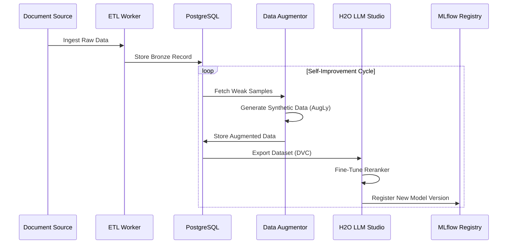

# Predator Analytics Platform v22.0 - Architecture Documentation

## 1. System Overview

Predator Analytics v22.0 is an AI-Native Enterprise Search & Analytics Platform designed for Autonomous Intelligence. It transitions from a traditional ETL-based system to a continuous "ingest-learn-optimize" loop driven by the **Self-Improvement Orchestrator (SIO)**.

### Core Philosophy
- **AI-First**: Every search query feeds the reinforcement learning loop.
- **Self-Healing**: The system autonomously scales and retrains components based on performance metrics.
- **Multi-Tenant**: Native isolation for different corporate entities or departments at the database level.
- **GitOps Driven**: Infrastructure as Code (IaC) with automated rollouts via ArgoCD.

## 2. Architecture Diagrams

### 2.1 High-Level Infrastructure

```mermaid
graph TD
    User[Client / Frontend] -->|HTTPS/WSS| IG[Ingress Gateway / Nginx]
    
    subgraph K8s_Cluster["Kubernetes Cluster (NVIDIA GPU Nodes)"]
        IG -->|Route| API[FastAPI Backend Gateway]
        IG -->|Route| MINIO[MinIO Console]
        
        subgraph Data_Layer["Data Layer"]
            PG[(PostgreSQL v16)]
            OS[(OpenSearch v2.11)]
            QD[(Qdrant Vector DB)]
            REDIS[(Redis Cache)]
        end
        
        subgraph Compute_Layer["Compute Layer"]
            API -->|Reads/Writes| PG
            API -->|Search| OS
            API -->|Search| QD
            API -->|Cache| REDIS
            
            WORKER[Celery Workers] -->|ETL| PG
            WORKER -->|Vectorize| QD
        end
        
        subgraph AI_Layer["AI & MLOps"]
            SIO[SI Orchestrator] -->|Monitor| PROM[Prometheus]
            SIO -->|Trigger| TR[Training Job (H2O LLM Studio)]
            TR -->|Artifacts| MINIO
            TR -->|Register| MLFLOW[MLflow]
            
            ModelSvc[Model Service] -->|Load| MLFLOW
            API -->|Inference| ModelSvc
        end
    end
```

### 2.2 Data Pipeline & MLOps



## 3. Metrics (KPIs & SLAs)

### 3.1 Key Performance Indicators (KPIs)

| Metric | Definition | Target (v22.0) |
|--------|------------|----------------|
| **Search Relevance (nDCG@10)** | Normalized Discounted Cumulative Gain at rank 10. | > 0.90 |
| **Mean Reciprocal Rank (MRR)** | Average of reciprocal ranks of the first relevant result. | > 0.85 |
| **Self-Correction Rate** | % of queries where hybrid fusion outperforms single-mode search. | > 40% |
| **Ingestion Throughput** | Documents processed per minute per node. | > 500 docs/min |

### 3.2 Service Level Agreements (SLAs)

| Service | Metric | SLA Limit |
|---------|--------|-----------|
| **Search API** | Latency (P95) | < 200 ms |
| **Search API** | Availability | 99.9% |
| **Ingestion** | End-to-End Lag (Source to Searchable) | < 5 mins |
| **Vector Search** | KNN Latency (1M vectors) | < 50 ms |

## 4. RACI Matrix

**Roles:**
- **AI Eng**: AI Engineer (Model Training, SIO)
- **DevOps**: DevOps Engineer (K8s, CI/CD)
- **Backend**: Backend Developer (FastAPI, DB)
- **Frontend**: Frontend Developer (React, UI/UX)
- **PO**: Product Owner

| Task / Deliverable | AI Eng | DevOps | Backend | Frontend | PO |
|--------------------|:------:|:------:|:-------:|:--------:|:--:|
| **Platform Architecture** | C | C | R | I | A |
| **ML Model Training** | R/A | C | I | I | I |
| **K8s Deployment** | I | R/A | C | I | I |
| **API Development** | C | I | R/A | C | I |
| **User Interface** | I | I | C | R/A | C |
| **Self-Improvement Loop** | R/A | I | C | I | I |
| **Security Audits** | C | R/A | C | I | I |

*R = Responsible, A = Accountable, C = Consulted, I = Informed*

## 5. Technology Stack (v22.0)

- **Backend**: Python 3.11, FastAPI, SQLAlchemy (Async), Celery
- **Frontend**: React 18, TypeScript, TailwindCSS, Vite
- **Data Stores**: PostgreSQL 16 (Relational), OpenSearch 2.11 (Text), Qdrant 1.7 (Vector), Redis 7 (Cache), MinIO (Object)
- **MLOps**: DVC (Data Versioning), MLflow (Registry), H2O LLM Studio (Training), AugLy (Augmentation)
- **Infra**: Kubernetes, Helm, Docker, NVIDIA Drivers
