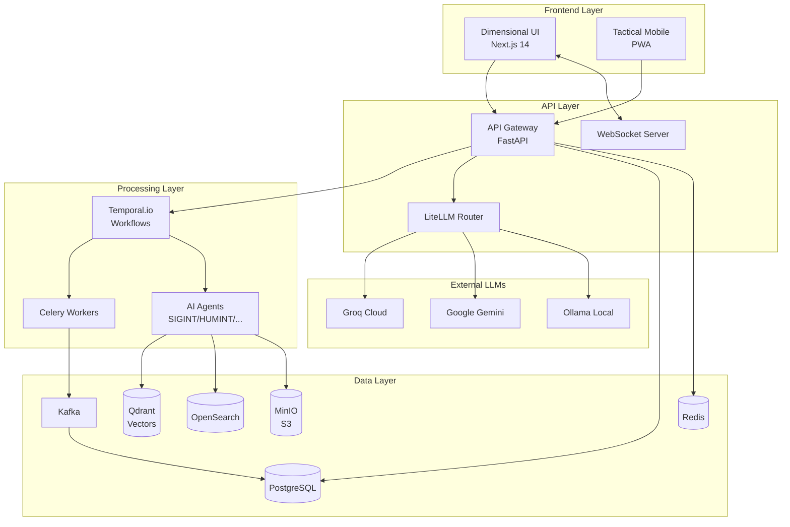
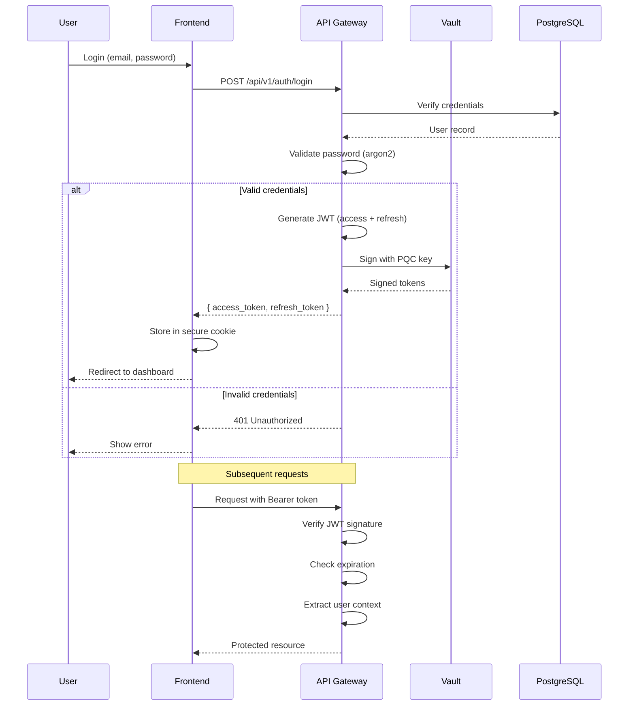
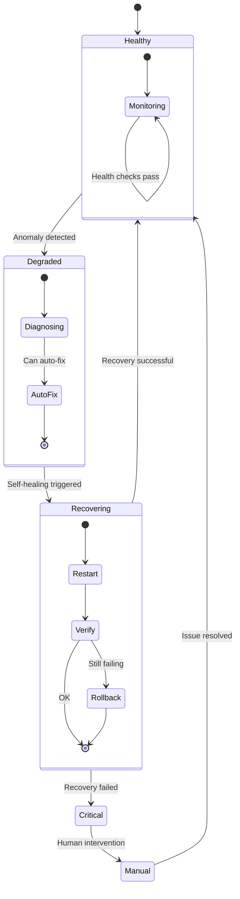
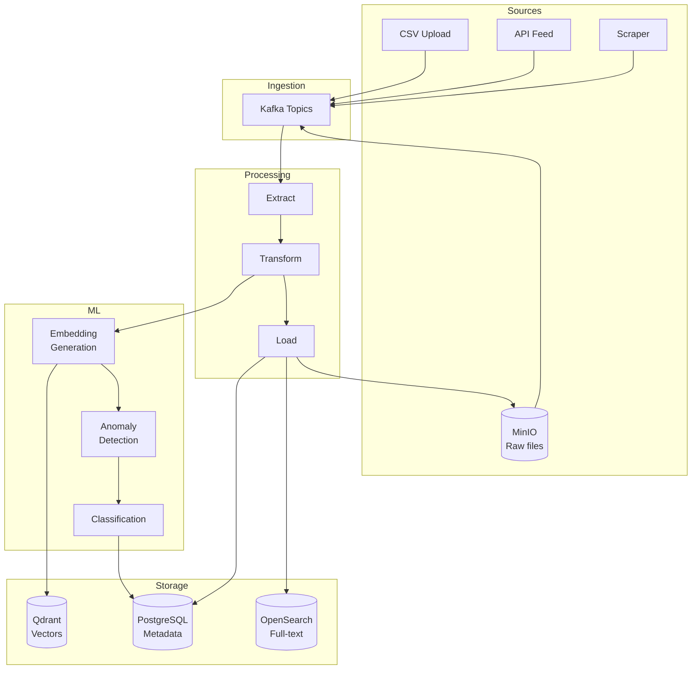
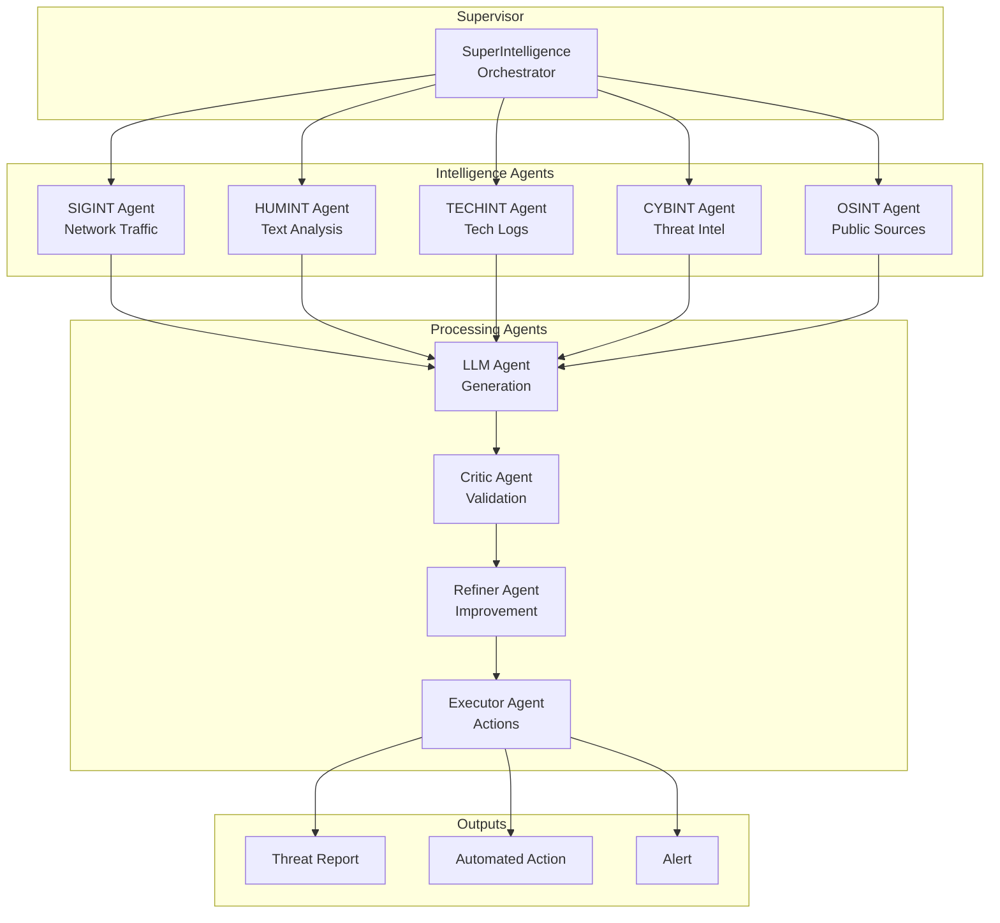
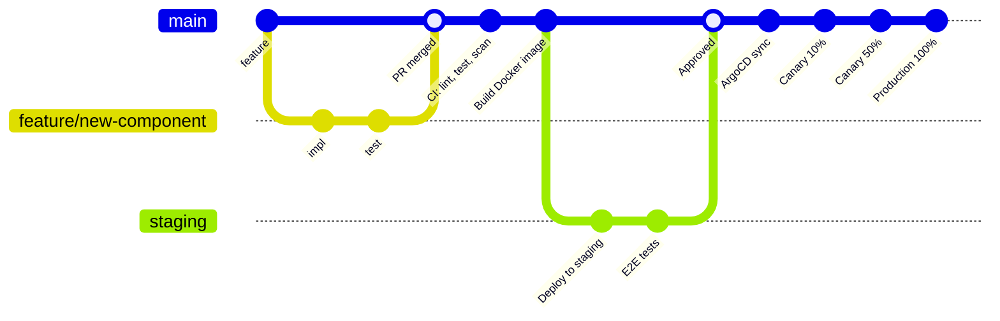
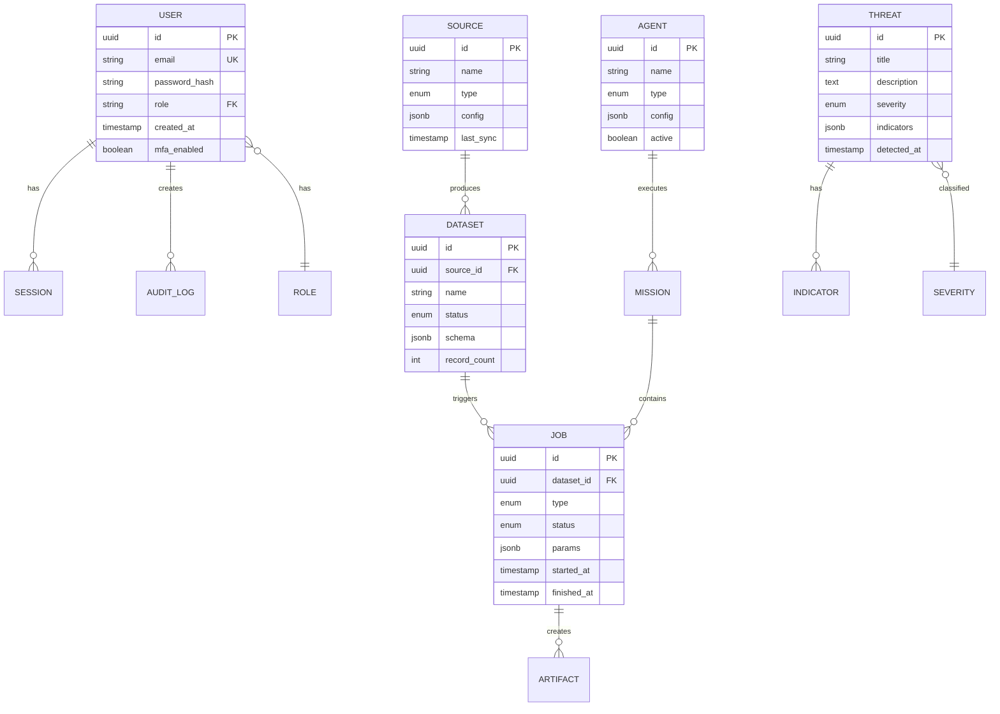
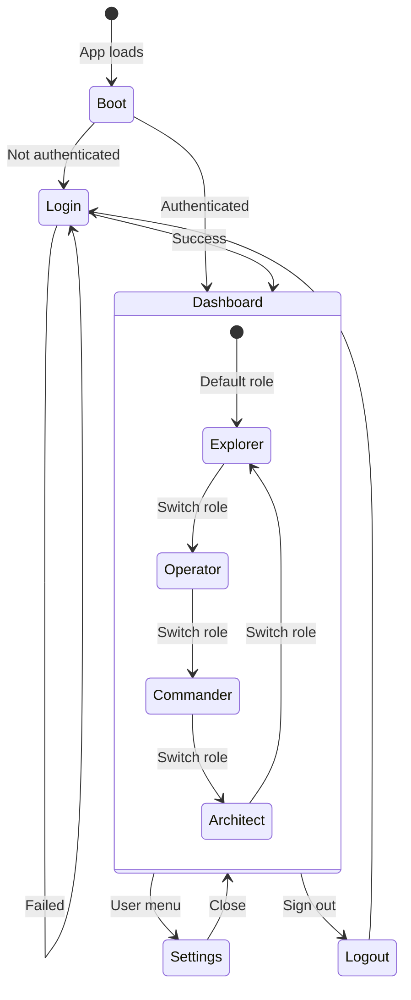

# 📊 System Diagrams (Mermaid) — Predator v45 | Neural Analytics.0

> **Версія:** 25.0
> **Оновлено:** 10.01.2026

Інтерактивні діаграми для візуалізації архітектури системи.

---

## 1. High-Level Architecture



---

## 2. Authentication Flow



---

## 3. Hybrid Search Flow

```mermaid
flowchart LR
    subgraph Input
        Q[Query: "APT29 malware"]
    end

    subgraph "Parallel Execution"
        direction TB
        subgraph Keyword
            OS[OpenSearch]
            BM25[BM25 Ranking]
        end

        subgraph Semantic
            EMB[Embedding Model]
            QD[Qdrant]
            SPLADE[SPLADE Vectors]
        end
    end

    subgraph Fusion
        RRF[RRF Fusion<br/>k=60]
        XAI[XAI Explanation<br/>LLM Summary]
    end

    subgraph Output
        R[Ranked Results]
    end

    Q --> OS
    Q --> EMB

    OS --> BM25
    EMB --> SPLADE
    SPLADE --> QD

    BM25 --> RRF
    QD --> RRF

    RRF --> XAI
    XAI --> R
```

---

## 4. Self-Healing Flow



---

## 5. ETL Pipeline



---

## 6. Agent Orchestration



---

## 7. Deployment Pipeline (GitOps)



---

## 8. Database Schema (ERD)



---

## 9. Dimensional UI States



---

## Як використовувати

1. **GitHub/GitLab** — автоматично рендерить Mermaid
2. **VS Code** — плагін "Markdown Preview Mermaid Support"
3. **Confluence** — вбудована підтримка Mermaid
4. **Online** — [mermaid.live](https://mermaid.live)

---

*© 2026 Predator Analytics. Усі права захищено.*
