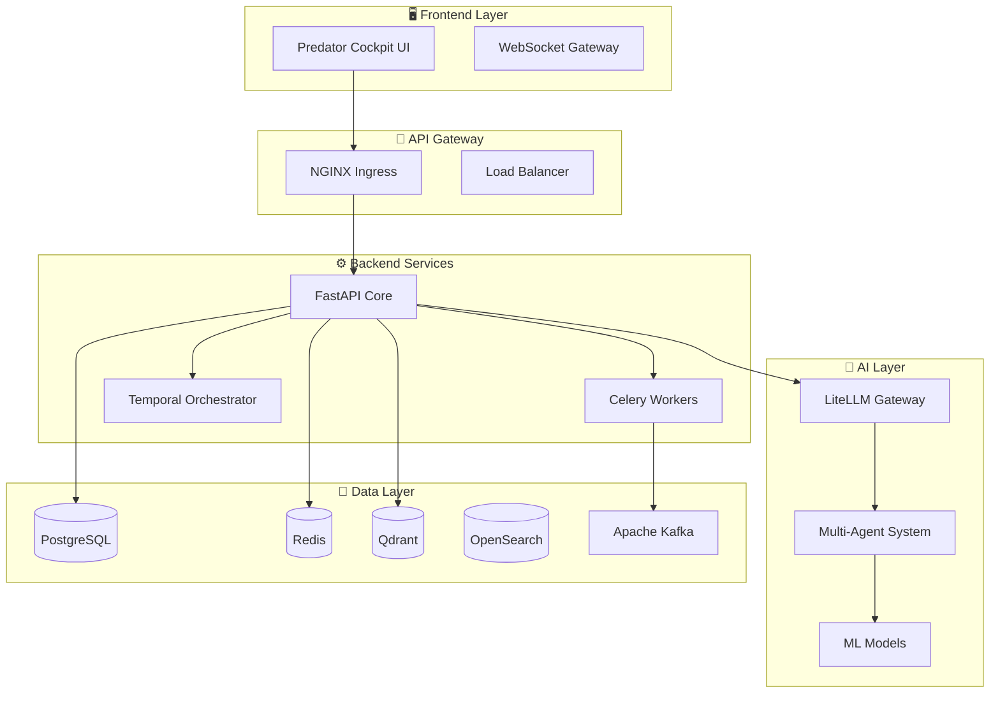
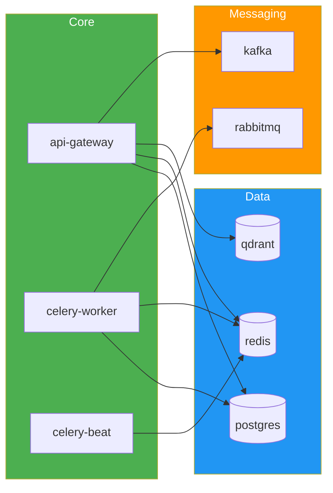

# 🛡️ PREDATOR ANALYTICS v25.0 — ПОВНА ТЕХНІЧНА СПЕЦИФІКАЦІЯ

> **Версія документа:** 1.0
> **Дата створення:** 10.01.2026
> **Статус:** Затверджено
> **Класифікація:** Внутрішній документ

---

## Зміст

1. [Вступ та Стратегічне Бачення](#1-вступ-та-стратегічне-бачення)
2. [Базові Принципи Архітектури](#2-базові-принципи-архітектури)
3. [Компоненти Системи](#3-компоненти-системи)
4. [Frontend Архітектура](#4-frontend-архітектура)
5. [Backend Архітектура](#5-backend-архітектура)
6. [AI Core та Агентна Система](#6-ai-core-та-агентна-система)
7. [Сховища Даних](#7-сховища-даних)
8. [DevOps та CI/CD](#8-devops-та-cicd)
9. [Самовідновлення та Self-Healing](#9-самовідновлення-та-self-healing)
10. [Безпека](#10-безпека)
11. [API Специфікація](#11-api-специфікація)
12. [Моніторинг та Алертинг](#12-моніторинг-та-алертинг)
13. [Локальна Розробка](#13-локальна-розробка)
14. [Хаос-Інженіринг](#14-хаос-інженіринг)
15. [CLI Інструменти](#15-cli-інструменти)
16. [Ліцензування та Компоненти](#16-ліцензування-та-компоненти)

---

## 1. Вступ та Стратегічне Бачення

### 1.1. Місія

**Predator v25.0** — це еволюційна версія **автономної системи кібербезпеки**, що інтегрує:

- **Мультиагентну архітектуру** з AI-оркестрацією (SIGINT, HUMINT, TECHINT, CYBINT)
- **Суперінтелектуальне ядро** для динамічного прийняття рішень
- **Квантово-стійку криптографію** (Kyber, Dilithium)
- **Адаптивний Dimensional UI** з ролями (Explorer, Operator, Commander, Architect)
- **Self-improvement loop** — аналіз продуктивності та автодонавчання моделей

Система побудована за принципами **"незламності" (self-healing)**, забезпечуючи автоматичне відновлення після збоїв, безперервне самовдосконалення та інтеграцію з GitOps.

### 1.2. Ключові Можливості

| Категорія | Можливість | Опис | Вдосконалення у v25.0 |
|-----------|------------|------|-----------------------|
| **Розвідка** | OSINT & Multi-INT | Збір з відкритих/закритих джерел | Qdrant семантичний пошук, XAI-пояснення |
| **Аналіз** | Threat Intelligence | Реальний час з ML-моделями (H2O) | Гібридний rerank + LLM-резюмування |
| **Захист** | Proactive Defense | Превентивне блокування | Auto-recovery через K8s Operators |
| **Атака** | Red Team Automation | Автопентестинг | Хаос-тести для симуляції атак |
| **Відновлення** | Self-Healing | Автовідновлення | GitOps з ArgoCD rollback |
| **Моніторинг** | Observability | Метрики і логи | Grafana дашборди з алертами |
| **Аналітика** | Data Hub & Search | Гібридний пошук | Upload Wizard, ETL з Kafka |

### 1.3. Цільова Аудиторія

| Роль | Використання | UI Shell |
|------|--------------|----------|
| **SOC Analysts** | Оперативний моніторинг | ExplorerShell |
| **Red/Blue Teams** | Тестування безпеки | OperatorShell |
| **CISO/Managers** | Стратегічне планування | CommanderShell |
| **Threat Hunters** | Аналіз загроз | ExplorerShell |
| **DevOps Engineers** | Моніторинг інфраструктури | ArchitectShell |

### 1.4. Канонічні Сутності

```
┌─────────────────────────────────────────────────────────────────┐
│                    CANONICAL ENTITIES                            │
├─────────────────────────────────────────────────────────────────┤
│  📥 Source    — Джерело даних (файл, API, stream)               │
│  📊 Dataset   — Оброблений набір даних                          │
│  ⚙️ Job       — Фонова задача (ingest, ETL, ML)                 │
│  🔍 Index     — Пошуковий індекс (OpenSearch/Qdrant)            │
│  📦 Artifact  — Згенерований об'єкт (модель, звіт, лог)         │
│  🎯 Case      — Справа для розслідування                        │
│  🤖 Agent     — AI агент для аналізу                            │
│  📋 Mission   — Завдання для агентів                            │
└─────────────────────────────────────────────────────────────────┘
```

### 1.5. Цілі Проекту (KPIs)

| Метрика | Target | Опис |
|---------|--------|------|
| **Uptime** | 99.99% | Відмовостійкість |
| **MTTR** | < 30s | Час відновлення |
| **P99 Latency** | < 100ms | Швидкість відповіді |
| **RPS** | 10,000+ | Масштабованість |
| **Security** | Zero-Trust | + Post-Quantum Crypto |

### 1.6. Формат Системи

- **Обсяг:** Повноцінна end-to-end система кібербезпеки
- **Тип:** Production v25.0 — максимально відмовостійка система
- **Парадигма:** Мікросервісна архітектура + Kubernetes + GitOps
- **Ліцензії:** Виключно безкоштовний open-source стек

---

## 2. Базові Принципи Архітектури

### 2.1. Мікросервісна Архітектура

Система складається з незалежних сервісів, кожен з яких:
- Має власний код та схему даних
- Оновлюється та масштабується окремо
- Використовує відповідний технологічний стек



### 2.2. Принципи Проектування

| Принцип | Реалізація |
|---------|------------|
| **Loose Coupling** | Сервіси комунікують через API/Events |
| **High Cohesion** | Кожен сервіс — один домен |
| **Fault Isolation** | Збій одного не впливає на інші |
| **Observability** | Логи, метрики, трейси для кожного |
| **Immutability** | Контейнери не змінюються після збірки |

### 2.3. Інфраструктурна Модель

```
┌─────────────────────────────────────────────────────────────────┐
│                      KUBERNETES CLUSTER                          │
├─────────────────────────────────────────────────────────────────┤
│  📦 NAMESPACES                                                   │
│  ├── predator (основні сервіси)                                 │
│  ├── monitoring (Prometheus + Grafana)                          │
│  ├── argocd (GitOps контролер)                                  │
│  └── chaos-mesh (Хаос-інженіринг)                               │
├─────────────────────────────────────────────────────────────────┤
│  🔧 OPERATORS                                                    │
│  ├── Postgres Operator                                          │
│  ├── Redis Operator                                             │
│  ├── Qdrant Operator                                            │
│  └── Predator Auto-Remediation Operator                         │
└─────────────────────────────────────────────────────────────────┘
```

---

## 3. Компоненти Системи

### 3.1. Повний Перелік Сервісів

| Компонент | Технологія | Порт | Призначення |
|-----------|------------|------|-------------|
| **predator-ui** | React + Vite | 80 | Веб-інтерфейс |
| **api-gateway** | FastAPI | 8000 | REST API |
| **celery-worker** | Celery | - | Фонові задачі |
| **celery-beat** | Celery Beat | - | Планувальник |
| **orchestrator** | Python | 8001 | ML оркестрація |
| **telegram-bot** | Aiogram | - | Telegram інтеграція |
| **postgres** | TimescaleDB | 5432 | Основна БД |
| **redis** | Redis 7 | 6379 | Кеш + Брокер |
| **qdrant** | Qdrant | 6333 | Векторний пошук |
| **opensearch** | OpenSearch | 9200 | Повнотекстовий пошук |
| **kafka** | Kafka | 9092 | Event streaming |
| **minio** | MinIO | 9000 | Object storage |
| **rabbitmq** | RabbitMQ | 5672 | Message broker |
| **prometheus** | Prometheus | 9090 | Метрики |
| **grafana** | Grafana | 3000 | Дашборди |
| **mlflow** | MLflow | 5000 | ML Tracking |

### 3.2. Залежності Між Сервісами



---

## 4. Frontend Архітектура

### 4.1. Технологічний Стек

```yaml
Frontend Stack:
  Framework: React 18
  Build Tool: Vite 5
  Language: TypeScript 5
  Styling:
    - TailwindCSS
    - CSS Modules
    - Framer Motion (анімації)
  3D Graphics: React Three Fiber (R3F)
  State Management: Zustand
  API Client: TanStack Query
  Forms: React Hook Form + Zod
  Charts: Recharts / Victory
  Routing: React Router v6
```

### 4.2. Структура Проекту

```
apps/predator-analytics-ui/
├── src/
│   ├── components/           # UI компоненти
│   │   ├── ai/               # AI панелі
│   │   ├── dimensional/      # 3D візуалізації
│   │   ├── ui/               # Базові UI елементи
│   │   └── views/            # Сторінки
│   ├── hooks/                # React хуки
│   ├── services/             # API клієнти
│   ├── stores/               # Глобальний стан
│   ├── types/                # TypeScript типи
│   └── utils/                # Утиліти
├── public/                   # Статичні файли
├── Dockerfile                # Збірка для Docker
└── package.json              # Залежності
```

### 4.3. Ключові Компоненти UI

#### 4.3.1. Dimensional UI

```typescript
// Головна 3D візуалізація
export const DimensionalDashboard = () => {
  return (
    <Canvas frameloop="demand">
      <Scene>
        <ThreatMap data={threats} />
        <DataFlow streams={dataStreams} />
        <AgentOrbit agents={activeAgents} />
      </Scene>
      <OrbitControls />
    </Canvas>
  );
};
```

#### 4.3.2. Адаптивна Bento Grid

```typescript
// Модульна сітка віджетів
export const BentoGrid = ({ widgets }: { widgets: Widget[] }) => {
  return (
    <GridLayout
      layout={calculateLayout(widgets)}
      cols={12}
      rowHeight={100}
      draggableHandle=".drag-handle"
    >
      {widgets.map(widget => (
        <motion.div key={widget.id} layoutId={widget.id}>
          <WidgetRenderer widget={widget} />
        </motion.div>
      ))}
    </GridLayout>
  );
};
```

### 4.4. Дизайн-система

```css
/* Predator Design Tokens */
:root {
  /* Кольори */
  --primary: hsl(220, 90%, 56%);
  --secondary: hsl(280, 80%, 60%);
  --accent: hsl(160, 100%, 45%);
  --danger: hsl(0, 75%, 55%);
  --warning: hsl(35, 100%, 50%);

  /* Тіні */
  --shadow-glow: 0 0 40px rgba(79, 70, 229, 0.4);
  --glass-blur: blur(20px);

  /* Анімації */
  --transition-smooth: 0.3s cubic-bezier(0.4, 0, 0.2, 1);
}

/* Glassmorphism */
.glass-panel {
  background: rgba(17, 24, 39, 0.8);
  backdrop-filter: var(--glass-blur);
  border: 1px solid rgba(255, 255, 255, 0.1);
  border-radius: 16px;
}
```

---

## 5. Backend Архітектура

### 5.1. FastAPI Core

```python
# services/api-gateway/app/main.py
from fastapi import FastAPI
from fastapi.middleware.cors import CORSMiddleware

app = FastAPI(
    title="Predator Analytics API",
    version="25.0.0",
    description="Self-healing Analytics Platform"
)

# Middleware
app.add_middleware(
    CORSMiddleware,
    allow_origins=["*"],
    allow_credentials=True,
    allow_methods=["*"],
    allow_headers=["*"],
)

# Routes
app.include_router(health_router, prefix="/health")
app.include_router(v25_router, prefix="/api/v25")
app.include_router(agents_router, prefix="/api/v25/agents")
app.include_router(data_router, prefix="/api/v25/data")
```

### 5.2. Структура Backend

```
services/api-gateway/
├── app/
│   ├── api/                  # API endpoints
│   │   ├── routes/           # Роутери
│   │   └── dependencies/     # Залежності
│   ├── core/                 # Ядро
│   │   ├── config.py         # Конфігурація
│   │   ├── database.py       # DB з'єднання
│   │   ├── celery_app.py     # Celery
│   │   └── security.py       # Автентифікація
│   ├── models/               # SQLAlchemy моделі
│   ├── schemas/              # Pydantic схеми
│   ├── services/             # Бізнес-логіка
│   └── agents/               # AI агенти
├── alembic/                  # Міграції
├── tests/                    # Тести
└── Dockerfile
```

### 5.3. Celery Workers

```python
# app/core/celery_app.py
from celery import Celery

celery_app = Celery(
    "predator",
    broker=settings.REDIS_URL,
    backend=settings.REDIS_URL,
)

celery_app.conf.update(
    task_serializer="json",
    accept_content=["json"],
    result_serializer="json",
    timezone="UTC",
    enable_utc=True,
    task_routes={
        "app.tasks.etl.*": {"queue": "etl"},
        "app.tasks.ml.*": {"queue": "ml"},
        "app.tasks.ingestion.*": {"queue": "ingestion"},
    },
)

# Черги
CELERY_QUEUES = [
    "etl",           # ETL процеси
    "ingestion",     # Завантаження даних
    "maintenance",   # Технічне обслуговування
    "monitoring",    # Моніторинг
    "ml",            # Machine Learning
]
```

### 5.4. Temporal Workflows

```python
# Durable Execution з Temporal
from temporalio import workflow, activity

@workflow.defn
class DataProcessingSaga:
    """Гарантоване виконання ETL процесу"""

    @workflow.run
    async def run(self, file_id: str) -> dict:
        # Step 1: Валідація
        validated = await workflow.execute_activity(
            validate_data,
            file_id,
            start_to_close_timeout=timedelta(minutes=5),
        )

        try:
            # Step 2: Трансформація
            transformed = await workflow.execute_activity(
                transform_data,
                validated,
                start_to_close_timeout=timedelta(minutes=10),
            )

            # Step 3: Завантаження
            await workflow.execute_activity(
                load_to_warehouse,
                transformed,
                start_to_close_timeout=timedelta(minutes=5),
            )

        except Exception as e:
            # Компенсаційні дії
            await workflow.execute_activity(
                rollback_changes,
                file_id,
            )
            raise

        return {"status": "completed", "file_id": file_id}
```

---

## 6. AI Core та Агентна Система

### 6.1. LiteLLM Gateway

```yaml
# configs/litellm_config.yaml
model_list:
  - model_name: main-agent
    litellm_params:
      model: anthropic/claude-3-5-sonnet
      api_key: os.environ/ANTHROPIC_KEY
      max_tokens: 8192

  - model_name: fast-agent
    litellm_params:
      model: groq/llama-3.3-70b-versatile
      api_key: os.environ/GROQ_KEY
      max_tokens: 4096

  - model_name: vision-agent
    litellm_params:
      model: google/gemini-2.0-flash
      api_key: os.environ/GEMINI_KEY

  - model_name: local-agent
    litellm_params:
      model: ollama/qwen2.5:14b
      api_base: http://localhost:11434

router_settings:
  routing_strategy: latency-based
  redis_cache_enabled: true
  fallbacks:
    - main-agent: [fast-agent, local-agent]
```

### 6.2. Intelligence Agent Екосистема

```
┌─────────────────────────────────────────────────────────────────────────────┐
│                        AGENT ECOSYSTEM                                       │
├─────────────────────────────────────────────────────────────────────────────┤
│                                                                              │
│  ┌───────────────────────────────────────────────────────────────────────┐  │
│  │                    SUPERINTELLIGENCE ORCHESTRATOR                      │  │
│  │                (Task Planning, Resource Allocation)                    │  │
│  └───────────────────────────────┬───────────────────────────────────────┘  │
│                                  │                                           │
│  ┌───────┬───────┬───────┬───────┼───────┬───────┬───────┬───────┐         │
│  │       │       │       │       │       │       │       │       │         │
│  ▼       ▼       ▼       ▼       ▼       ▼       ▼       ▼       ▼         │
│┌──────┐┌──────┐┌──────┐┌──────┐┌──────┐┌──────┐┌──────┐┌──────┐┌──────┐   │
││SIGINT││HUMINT││TECHINT│CYBINT││OSINT ││ LLM  ││CRITIC││REFINER│ EXEC ││   │
││Agent ││Agent ││Agent ││Agent ││Agent ││Agent ││Agent ││Agent ││Agent │   │
│└──────┘└──────┘└──────┘└──────┘└──────┘└──────┘└──────┘└──────┘└──────┘   │
│                                                                              │
└─────────────────────────────────────────────────────────────────────────────┘
```

#### Типи Агентів

| Agent | Призначення | Capabilities |
|-------|-------------|--------------|
| **SIGINT** | Signals Intelligence | Аналіз мережевого трафіку, перехоплення сигналів |
| **HUMINT** | Human Intelligence | Виявлення соціальної інженерії, аналіз поведінки |
| **TECHINT** | Technical Intelligence | Сканування вразливостей, технічний аудит |
| **CYBINT** | Cyber Intelligence | Threat hunting, IoC кореляція, APT tracking |
| **OSINT** | Open Source | Dark web моніторинг, OSINT збір |
| **LLM** | Reasoning | XAI-пояснення, семантичний аналіз |
| **CRITIC** | Validation | Перевірка якості, fact-checking |
| **REFINER** | Enhancement | Покращення результатів, ітеративне уточнення |
| **EXEC** | Execution | Виконання дій, tool invocation |

```python
# Архітектура агентів
class PredatorAgentSystem:
    """Мультиагентна система кібербезпеки Predator"""

    def __init__(self):
        # Intelligence Agents
        self.sigint = SIGINTAgent()    # Signals Intelligence
        self.humint = HUMINTAgent()    # Human Intelligence
        self.techint = TECHINTAgent()  # Technical Intelligence
        self.cybint = CYBINTAgent()    # Cyber Intelligence
        self.osint = OSINTAgent()      # Open Source Intelligence

        # Processing Agents
        self.supervisor = SupervisorAgent()
        self.llm = LLMAgent()
        self.critic = CriticAgent()
        self.refiner = RefinerAgent()
        self.executor = ExecutorAgent()

    async def process_threat(self, threat_data: dict) -> ThreatAnalysis:
        # 1. Supervisor розподіляє задачу
        plan = await self.supervisor.plan(threat_data)

        # 2. Паралельний збір інтелекту
        intel = await asyncio.gather(
            self.sigint.analyze(plan.network_data),
            self.humint.analyze(plan.behavior_data),
            self.techint.scan(plan.technical_data),
            self.cybint.hunt(plan.threat_indicators),
            self.osint.search(plan.external_queries),
        )

        # 3. LLM синтез з XAI
        synthesis = await self.llm.synthesize(intel, explain=True)

        # 4. Critic перевірка
        validated = await self.critic.validate(synthesis)

        # 5. Refiner покращення якщо потрібно
        if validated.score < 0.9:
            synthesis = await self.refiner.improve(synthesis, validated.feedback)

        return synthesis
```

### 6.3. SuperIntelligence Self-Improvement Loop

```
┌─────────────────────────────────────────────────────────────────────────────┐
│                    SELF-IMPROVEMENT LOOP                                     │
├─────────────────────────────────────────────────────────────────────────────┤
│                                                                              │
│     ┌─────────────┐                                                          │
│     │   DIAGNOSE  │◄──────────────────────────────────────────────┐         │
│     │  Analyze    │                                                │         │
│     │ Performance │                                                │         │
│     └──────┬──────┘                                                │         │
│            │                                                        │         │
│            ▼                                                        │         │
│     ┌─────────────┐                                                │         │
│     │   AUGMENT   │      Self-Improvement                          │         │
│     │  Generate   │          Cycle                                 │         │
│     │  Synthetic  │                                                │         │
│     │    Data     │                                                │         │
│     └──────┬──────┘                                                │         │
│            │                                                        │         │
│            ▼                                                        │         │
│     ┌─────────────┐                                                │         │
│     │    TRAIN    │                                                │         │
│     │  Fine-tune  │                                                │         │
│     │   Models    │                                                │         │
│     └──────┬──────┘                                                │         │
│            │                                                        │         │
│            ▼                                                        │         │
│     ┌─────────────┐                                                │         │
│     │  EVALUATE   │                                                │         │
│     │   A/B Test  │                                                │         │
│     │   Results   │                                                │         │
│     └──────┬──────┘                                                │         │
│            │                                                        │         │
│            ▼                                                        │         │
│     ┌─────────────┐                                                │         │
│     │   PROMOTE   │────────────────────────────────────────────────┘         │
│     │   Deploy    │                                                          │
│     │  if better  │                                                          │
│     └─────────────┘                                                          │
│                                                                              │
└─────────────────────────────────────────────────────────────────────────────┘
```

```python
class SuperIntelligenceCore:
    """Ядро самовдосконалення системи"""

    async def self_improve_cycle(self):
        while True:
            # 1. DIAGNOSE - аналіз поточної продуктивності
            metrics = await self.collect_metrics()
            weak_areas = await self.identify_weaknesses(metrics)

            # 2. AUGMENT - генерація синтетичних даних
            if weak_areas:
                synthetic_data = await self.generate_training_data(weak_areas)

            # 3. TRAIN - донавчання моделей
            new_model = await self.train_model(
                base_model=self.current_model,
                data=synthetic_data,
                config=self.training_config,
            )

            # 4. EVALUATE - A/B тестування
            evaluation = await self.ab_test(
                model_a=self.current_model,
                model_b=new_model,
                test_cases=self.test_suite,
            )

            # 5. PROMOTE - деплой якщо краще
            if evaluation.new_model_better:
                await self.promote_model(new_model)
                await self.notify_improvement(evaluation.improvement_pct)

            await asyncio.sleep(3600)  # Кожну годину
```

### 6.4. Reflective Loop (Quality Assurance)

```
┌─────────────┐    ┌─────────────┐    ┌─────────────┐
│   Writer    │───▶│   Critic    │───▶│  Refiner    │
│   Agent     │    │   Agent     │    │   Agent     │
└─────────────┘    └─────────────┘    └──────┬──────┘
       ▲                                      │
       └──────────────────────────────────────┘
                 (Ітерації до досягнення якості ≥ 0.9)
```

### 6.5. Hybrid Search (Qdrant)

```python
# Гібридний пошук: Dense + Sparse vectors
async def hybrid_search(query: str, limit: int = 10) -> list[SearchResult]:
    # Dense vectors (semantic)
    dense_embedding = await embed_dense(query)

    # Sparse vectors (SPLADE)
    sparse_embedding = await embed_sparse(query)

    # Пошук в Qdrant
    results = await qdrant.query_points(
        collection_name="documents",
        query=models.FusionQuery(
            fusion=models.Fusion.RRF,  # Reciprocal Rank Fusion
            prefetch=[
                models.Prefetch(
                    query=dense_embedding,
                    using="dense",
                    limit=20,
                ),
                models.Prefetch(
                    query=sparse_embedding,
                    using="sparse",
                    limit=20,
                ),
            ],
        ),
        limit=limit,
    )

    return results.points
```

---

## 7. Сховища Даних

### 7.1. PostgreSQL + TimescaleDB

```sql
-- Основні таблиці

-- Справи для аналізу
CREATE TABLE cases (
    id UUID PRIMARY KEY DEFAULT gen_random_uuid(),
    title VARCHAR(255) NOT NULL,
    description TEXT,
    status VARCHAR(50) DEFAULT 'pending',
    risk_score DECIMAL(5,2),
    created_at TIMESTAMPTZ DEFAULT NOW(),
    updated_at TIMESTAMPTZ DEFAULT NOW()
);

-- TimescaleDB hypertable для метрик
CREATE TABLE system_metrics (
    time TIMESTAMPTZ NOT NULL,
    service_name VARCHAR(100),
    metric_name VARCHAR(100),
    value DOUBLE PRECISION,
    labels JSONB
);

SELECT create_hypertable('system_metrics', 'time');

-- Індекси
CREATE INDEX idx_cases_status ON cases(status);
CREATE INDEX idx_cases_risk ON cases(risk_score DESC);
CREATE INDEX idx_metrics_service ON system_metrics(service_name, time DESC);
```

### 7.2. Redis

```yaml
# Структура ключів Redis
redis_keys:
  cache:
    - "cache:query:{hash}"          # Кеш запитів (TTL: 1hr)
    - "cache:user:{id}"             # Профілі користувачів

  sessions:
    - "session:{token}"             # JWT сесії (TTL: 24hr)

  rate_limiting:
    - "ratelimit:{ip}:{endpoint}"   # Rate limiting

  queues:
    - "celery"                      # Celery broker
    - "celery:results"              # Результати задач

  pubsub:
    - "events:system"               # Системні події
    - "events:alerts"               # Алерти
```

### 7.3. Qdrant Collections

```python
# Конфігурація колекцій Qdrant
collections = {
    "documents": {
        "vectors": {
            "dense": {
                "size": 384,  # all-MiniLM-L6-v2
                "distance": "Cosine",
            },
            "sparse": {
                "type": "sparse",  # SPLADE
            },
        },
        "payload_schema": {
            "title": "keyword",
            "content": "text",
            "source": "keyword",
            "created_at": "datetime",
        },
    },
    "embeddings": {
        "vectors": {
            "default": {
                "size": 1536,  # OpenAI Ada
                "distance": "Cosine",
            },
        },
    },
}
```

### 7.4. OpenSearch Indices

```json
// Індекс для логів
{
  "mappings": {
    "properties": {
      "timestamp": { "type": "date" },
      "level": { "type": "keyword" },
      "message": { "type": "text" },
      "service": { "type": "keyword" },
      "trace_id": { "type": "keyword" },
      "metadata": { "type": "object" }
    }
  },
  "settings": {
    "number_of_shards": 3,
    "number_of_replicas": 1,
    "refresh_interval": "5s"
  }
}
```

---

## 8. DevOps та CI/CD

### 8.1. GitHub Actions Pipeline

```yaml
# .github/workflows/ci-cd-pipeline.yml
name: CI/CD Pipeline

on:
  push:
    branches: [main, develop]
  pull_request:
    branches: [main]

jobs:
  test:
    runs-on: ubuntu-latest
    steps:
      - uses: actions/checkout@v4

      - name: Set up Python
        uses: actions/setup-python@v5
        with:
          python-version: '3.12'

      - name: Install dependencies
        run: |
          pip install -r services/api-gateway/requirements.txt
          pip install pytest pytest-cov

      - name: Run tests
        run: |
          cd services/api-gateway
          pytest tests/ -v --cov=app --cov-report=xml

  lint:
    runs-on: ubuntu-latest
    steps:
      - uses: actions/checkout@v4

      - name: Lint Python
        uses: chartboost/ruff-action@v1
        with:
          src: 'services/api-gateway/app'

      - name: Lint TypeScript
        run: |
          cd apps/predator-analytics-ui
          npm ci
          npm run lint

  build:
    needs: [test, lint]
    runs-on: ubuntu-latest
    steps:
      - uses: actions/checkout@v4

      - name: Build Docker images
        run: |
          docker build -t predator-backend:${{ github.sha }} -f services/api-gateway/Dockerfile .
          docker build -t predator-frontend:${{ github.sha }} -f apps/predator-analytics-ui/Dockerfile .

      - name: Push to Registry
        run: |
          docker push ghcr.io/org/predator-backend:${{ github.sha }}
          docker push ghcr.io/org/predator-frontend:${{ github.sha }}

  deploy:
    needs: [build]
    if: github.ref == 'refs/heads/main'
    runs-on: ubuntu-latest
    steps:
      - name: Update ArgoCD manifest
        run: |
          # Оновлення версії в Helm values
          yq -i '.image.tag = "${{ github.sha }}"' helm/predator/values.yaml
          git commit -am "chore: deploy ${{ github.sha }}"
          git push
```

### 8.2. ArgoCD GitOps

```yaml
# argocd/application.yaml
apiVersion: argoproj.io/v1alpha1
kind: Application
metadata:
  name: predator-analytics
  namespace: argocd
spec:
  project: default

  source:
    repoURL: https://github.com/org/predator-21
    targetRevision: main
    path: helm/predator
    helm:
      valueFiles:
        - values.yaml
        - values-production.yaml

  destination:
    server: https://kubernetes.default.svc
    namespace: predator

  syncPolicy:
    automated:
      prune: true           # Видалення зайвих ресурсів
      selfHeal: true        # Автоматичне відновлення
      allowEmpty: false

    syncOptions:
      - CreateNamespace=true
      - PruneLast=true
      - ApplyOutOfSyncOnly=true

    retry:
      limit: 5
      backoff:
        duration: 5s
        factor: 2
        maxDuration: 3m
```

### 8.3. Helm Chart

```yaml
# helm/predator/Chart.yaml
apiVersion: v2
name: predator
description: Predator Analytics Helm Chart
type: application
version: 25.0.0
appVersion: "25.0.0"

dependencies:
  - name: postgresql
    version: "13.0.0"
    repository: https://charts.bitnami.com/bitnami
    condition: postgresql.enabled

  - name: redis
    version: "18.0.0"
    repository: https://charts.bitnami.com/bitnami
    condition: redis.enabled
```

```yaml
# helm/predator/values.yaml
replicaCount:
  backend: 3
  frontend: 2
  worker: 4

image:
  backend:
    repository: ghcr.io/org/predator-backend
    tag: latest
  frontend:
    repository: ghcr.io/org/predator-frontend
    tag: latest

resources:
  backend:
    requests:
      memory: "512Mi"
      cpu: "250m"
    limits:
      memory: "2Gi"
      cpu: "1000m"

autoscaling:
  enabled: true
  minReplicas: 2
  maxReplicas: 10
  targetCPUUtilizationPercentage: 70

ingress:
  enabled: true
  className: nginx
  annotations:
    cert-manager.io/cluster-issuer: letsencrypt-prod
  hosts:
    - host: predator.example.com
      paths:
        - path: /
          pathType: Prefix
```

---

## 9. Самовідновлення та Self-Healing

### 9.1. Kubernetes Self-Healing

```yaml
# Deployment з self-healing
apiVersion: apps/v1
kind: Deployment
metadata:
  name: predator-backend
spec:
  replicas: 3
  strategy:
    type: RollingUpdate
    rollingUpdate:
      maxSurge: 1
      maxUnavailable: 0

  template:
    spec:
      containers:
        - name: backend
          image: predator-backend:v25

          # Liveness Probe - перезапуск при зависанні
          livenessProbe:
            httpGet:
              path: /health/live
              port: 8000
            initialDelaySeconds: 30
            periodSeconds: 10
            failureThreshold: 3

          # Readiness Probe - виключення з балансера
          readinessProbe:
            httpGet:
              path: /health/ready
              port: 8000
            periodSeconds: 5
            failureThreshold: 3

          # Startup Probe - для повільного старту
          startupProbe:
            httpGet:
              path: /health/startup
              port: 8000
            failureThreshold: 30
            periodSeconds: 10
```

### 9.2. Python Operator для Auto-Remediation

```python
# operators/auto_remediation.py
import kopf
import kubernetes

@kopf.on.event('v1', 'pods', labels={'app': 'predator'})
async def auto_remediate(event, logger, **kwargs):
    """Автоматичне відновлення подів"""
    pod = event['object']
    pod_name = pod['metadata']['name']
    namespace = pod['metadata']['namespace']

    # Перевірка статусів контейнерів
    for status in pod.get('status', {}).get('containerStatuses', []):
        terminated = status.get('lastState', {}).get('terminated', {})

        # OOMKilled - збільшити пам'ять
        if terminated.get('reason') == 'OOMKilled':
            logger.warning(f"Pod {pod_name} OOMKilled, triggering remediation")
            await increase_memory_limit(namespace, pod_name)

        # CrashLoopBackOff - rollback
        if status.get('state', {}).get('waiting', {}).get('reason') == 'CrashLoopBackOff':
            restart_count = status.get('restartCount', 0)
            if restart_count > 5:
                logger.error(f"Pod {pod_name} in CrashLoop, rolling back")
                await trigger_rollback(namespace)

async def increase_memory_limit(namespace: str, pod_name: str):
    """Автоматичне збільшення ліміту пам'яті"""
    # Отримати поточний ліміт
    deployment = await get_deployment(namespace, pod_name)
    current_limit = parse_memory(deployment['resources']['limits']['memory'])

    # Збільшити на 50%
    new_limit = int(current_limit * 1.5)

    # Створити PR з новою конфігурацією
    await create_remediation_pr(
        title=f"[Auto] Increase memory for {pod_name}",
        changes={
            'resources.limits.memory': format_memory(new_limit)
        }
    )

async def trigger_rollback(namespace: str):
    """Автоматичний rollback через ArgoCD"""
    await argocd_api.rollback(
        application="predator-analytics",
        revision=-1  # Попередня версія
    )
```

### 9.3. Механізм Auto-Recovery

```
┌─────────────────────────────────────────────────────────────────┐
│                    SELF-HEALING FLOW                             │
├─────────────────────────────────────────────────────────────────┤
│                                                                  │
│  ┌─────────┐     ┌───────────┐     ┌─────────────┐              │
│  │  Alert  │────▶│  Analyze  │────▶│  Remediate  │              │
│  │ Trigger │     │   Cause   │     │   Action    │              │
│  └─────────┘     └───────────┘     └──────┬──────┘              │
│                                           │                      │
│       ┌───────────────────────────────────┼───────────────────┐  │
│       │                                   ▼                   │  │
│       │   ┌─────────────┐   ┌─────────────┐   ┌────────────┐  │  │
│       │   │  Restart    │   │  Scale Up   │   │  Rollback  │  │  │
│       │   │   Pod       │   │  Replicas   │   │  Version   │  │  │
│       │   └─────────────┘   └─────────────┘   └────────────┘  │  │
│       │                                                       │  │
│       │   ┌─────────────┐   ┌─────────────┐   ┌────────────┐  │  │
│       │   │  Increase   │   │  Failover   │   │  Notify    │  │  │
│       │   │  Memory     │   │  to DR      │   │  Human     │  │  │
│       │   └─────────────┘   └─────────────┘   └────────────┘  │  │
│       └───────────────────────────────────────────────────────┘  │
│                                                                  │
│  Recovery Time Objective (RTO): < 30 seconds                     │
│  Recovery Point Objective (RPO): < 1 minute                      │
└─────────────────────────────────────────────────────────────────┘
```

---

## 10. Безпека

### 10.1. Zero-Trust Architecture

```yaml
# Принципи Zero-Trust
security_model:
  authentication:
    - JWT tokens (RS256)
    - API Keys for services
    - mTLS for inter-service

  authorization:
    - RBAC (Role-Based Access Control)
    - ABAC (Attribute-Based Access Control)
    - Policy Engine (OPA/Rego)

  encryption:
    at_rest: AES-256-GCM
    in_transit: TLS 1.3
    secrets: HashiCorp Vault / K8s Secrets

  network:
    - Network Policies
    - Service Mesh (optional)
    - WAF (Web Application Firewall)
```

### 10.2. RBAC Roles

```python
# Ролі та дозволи
ROLES = {
    "commander": {
        "description": "Повний доступ до всієї системи",
        "permissions": ["*"],
    },
    "operator": {
        "description": "Управління та моніторинг",
        "permissions": [
            "cases:read", "cases:write",
            "agents:read", "agents:execute",
            "data:read", "data:upload",
            "dashboard:read",
        ],
    },
    "analyst": {
        "description": "Аналіз та звіти",
        "permissions": [
            "cases:read",
            "agents:read",
            "data:read",
            "dashboard:read",
            "reports:create",
        ],
    },
    "explorer": {
        "description": "Тільки перегляд",
        "permissions": [
            "cases:read",
            "dashboard:read",
        ],
    },
}
```

### 10.3. Post-Quantum Cryptography (Готовність)

```python
# Гібридне шифрування для майбутнього
from oqs import KeyEncapsulation, Signature

class HybridCrypto:
    """Гібридна криптографія: Classic + Post-Quantum"""

    def __init__(self):
        # Класичні алгоритми
        self.classical_kem = ECDH_X25519()
        self.classical_sign = Ed25519()

        # Постквантові алгоритми (NIST 2024)
        self.pqc_kem = KeyEncapsulation("Kyber768")
        self.pqc_sign = Signature("Dilithium3")

    def hybrid_key_exchange(self, peer_public):
        """Гібридний обмін ключами"""
        # Класичний secret
        classical_secret = self.classical_kem.exchange(
            peer_public.classical
        )

        # Постквантовий secret
        pqc_ciphertext, pqc_secret = self.pqc_kem.encap(
            peer_public.pqc
        )

        # Комбінований ключ через HKDF
        combined = HKDF(
            classical_secret + pqc_secret,
            salt=b"predator-hybrid-v25"
        )

        return combined, pqc_ciphertext
```

---

## 11. API Специфікація

### 11.1. REST API Endpoints

```yaml
# Основні ендпоінти API v25
endpoints:
  # Health
  - path: /health
    method: GET
    description: Повна перевірка здоров'я системи

  - path: /health/live
    method: GET
    description: Liveness probe

  - path: /health/ready
    method: GET
    description: Readiness probe

  # Cases (Справи)
  - path: /api/v25/cases
    methods: [GET, POST]
    description: Список та створення справ

  - path: /api/v25/cases/{id}
    methods: [GET, PUT, DELETE]
    description: Операції з окремою справою

  - path: /api/v25/cases/{id}/analyze
    method: POST
    description: Запуск AI аналізу справи

  # Data (Дані)
  - path: /api/v25/data/sources
    method: GET
    description: Список джерел даних

  - path: /api/v25/data/upload
    method: POST
    description: Завантаження файлу

  - path: /api/v25/data/etl/status
    method: GET
    description: Статус ETL процесів

  # Agents (Агенти)
  - path: /api/v25/agents/chat
    method: POST
    description: Чат з AI агентом

  - path: /api/v25/agents/analyze
    method: POST
    description: Аналіз даних агентом

  # Optimizer
  - path: /api/v25/optimizer/status
    method: GET
    description: Статус автооптимізатора

  - path: /api/v25/optimizer/metrics
    method: GET
    description: Метрики оптимізації
```

### 11.2. OpenAPI Specification

Повна OpenAPI специфікація доступна у файлі [openapi.yaml](./openapi.yaml).

### 11.3. WebSocket API

```typescript
// WebSocket з'єднання для real-time оновлень
const ws = new WebSocket('wss://predator.example.com/ws');

// Підписка на події
ws.send(JSON.stringify({
  type: 'subscribe',
  channels: ['alerts', 'metrics', 'agents']
}));

// Обробка подій
ws.onmessage = (event) => {
  const data = JSON.parse(event.data);

  switch (data.type) {
    case 'alert':
      handleAlert(data.payload);
      break;
    case 'metric':
      updateDashboard(data.payload);
      break;
    case 'agent_response':
      displayAgentMessage(data.payload);
      break;
  }
};
```

---

## 12. Моніторинг та Алертинг

### 12.1. Prometheus Metrics

```yaml
# infra/prometheus/prometheus.yml
global:
  scrape_interval: 15s
  evaluation_interval: 15s

alerting:
  alertmanagers:
    - static_configs:
        - targets: ['alertmanager:9093']

rule_files:
  - /etc/prometheus/rules/*.yml

scrape_configs:
  - job_name: 'predator-backend'
    static_configs:
      - targets: ['backend:8000']
    metrics_path: /metrics

  - job_name: 'kubernetes-pods'
    kubernetes_sd_configs:
      - role: pod
    relabel_configs:
      - source_labels: [__meta_kubernetes_pod_annotation_prometheus_io_scrape]
        action: keep
        regex: true
```

### 12.2. Alerting Rules

```yaml
# infra/prometheus/rules/predator-alerts.yml
groups:
  - name: predator-alerts
    rules:
      - alert: HighErrorRate
        expr: rate(http_requests_total{status=~"5.."}[5m]) > 0.1
        for: 5m
        labels:
          severity: critical
        annotations:
          summary: "High error rate detected"
          description: "Error rate is {{ $value }}%"

      - alert: PodCrashLooping
        expr: rate(kube_pod_container_status_restarts_total[15m]) > 3
        for: 5m
        labels:
          severity: warning
        annotations:
          summary: "Pod {{ $labels.pod }} is crash looping"

      - alert: HighMemoryUsage
        expr: container_memory_usage_bytes / container_spec_memory_limit_bytes > 0.9
        for: 5m
        labels:
          severity: warning
        annotations:
          summary: "High memory usage on {{ $labels.container }}"
```

### 12.3. Grafana Dashboards

```json
// Основний дашборд Predator
{
  "title": "Predator Analytics Overview",
  "panels": [
    {
      "title": "Request Rate",
      "type": "stat",
      "targets": [
        { "expr": "sum(rate(http_requests_total[5m]))" }
      ]
    },
    {
      "title": "Error Rate",
      "type": "gauge",
      "targets": [
        { "expr": "sum(rate(http_requests_total{status=~'5..'}[5m])) / sum(rate(http_requests_total[5m]))" }
      ]
    },
    {
      "title": "P99 Latency",
      "type": "timeseries",
      "targets": [
        { "expr": "histogram_quantile(0.99, rate(http_request_duration_seconds_bucket[5m]))" }
      ]
    },
    {
      "title": "Active Agents",
      "type": "stat",
      "targets": [
        { "expr": "predator_active_agents_count" }
      ]
    }
  ]
}
```

---

## 13. Локальна Розробка

### 13.1. Docker Compose

```bash
# Швидкий старт
make init    # Ініціалізація
make up      # Запуск
make logs    # Логи
make down    # Зупинка
```

Детальні інструкції: [LOCAL_DEVELOPMENT.md](./LOCAL_DEVELOPMENT.md)

### 13.2. DevContainer

```json
// .devcontainer/devcontainer.json
{
  "name": "Predator Analytics v25 Dev",
  "image": "mcr.microsoft.com/devcontainers/python:1-3.12-bullseye",
  "features": {
    "node": { "version": "20" },
    "docker-outside-of-docker": {},
    "kubectl-helm-minikube": {},
    "postgres-cli": {}
  },
  "customizations": {
    "vscode": {
      "extensions": [
        "ms-python.python",
        "charliermarsh.ruff",
        "dbaeumer.vscode-eslint",
        "ms-azuretools.vscode-docker"
      ]
    }
  },
  "postCreateCommand": "pip install -r requirements.txt"
}
```

### 13.3. Makefile Commands

| Команда | Опис |
|---------|------|
| `make help` | Показати довідку |
| `make init` | Ініціалізація середовища |
| `make up` | Запуск всіх сервісів |
| `make down` | Зупинка сервісів |
| `make logs` | Перегляд логів |
| `make test` | Запуск тестів |
| `make lint` | Перевірка коду |
| `make chaos` | Хаос-тестування |
| `make deploy` | Деплой на сервер |
| `make health` | Перевірка здоров'я |

---

## 14. Хаос-Інженіринг

### 14.1. Chaos Mesh Integration

```yaml
# chaos/pod-failure.yaml
apiVersion: chaos-mesh.org/v1alpha1
kind: PodChaos
metadata:
  name: predator-pod-failure
  namespace: chaos-testing
spec:
  action: pod-kill
  mode: one
  selector:
    namespaces:
      - predator
    labelSelectors:
      app: predator-backend
  scheduler:
    cron: "@every 4h"
```

### 14.2. Network Chaos

```yaml
# chaos/network-delay.yaml
apiVersion: chaos-mesh.org/v1alpha1
kind: NetworkChaos
metadata:
  name: network-delay
spec:
  action: delay
  mode: one
  selector:
    namespaces:
      - predator
    labelSelectors:
      app: predator-backend
  delay:
    latency: "200ms"
    correlation: "25"
    jitter: "50ms"
  duration: "5m"
  scheduler:
    cron: "@every 2h"
```

### 14.3. Custom Chaos Scripts

```bash
#!/bin/bash
# scripts/chaos/inject_failure.sh

echo "🔥 Starting Chaos Testing..."

# 1. Kill random pod
RANDOM_POD=$(kubectl get pods -n predator -l app=predator-backend -o jsonpath='{.items[0].metadata.name}')
echo "Killing pod: $RANDOM_POD"
kubectl delete pod $RANDOM_POD -n predator

# 2. Wait and verify recovery
sleep 30

# 3. Check health
HEALTH=$(curl -s http://localhost/api/v25/health | jq -r '.status')
if [ "$HEALTH" == "healthy" ]; then
    echo "✅ System recovered successfully"
else
    echo "❌ Recovery failed!"
    exit 1
fi
```

### 14.4. Тест-план стійкості

| Сценарій | Очікуваний результат | RTO |
|----------|---------------------|-----|
| Pod failure | Автоперезапуск | < 30s |
| Node failure | Reschedule на інший node | < 2m |
| Network partition | Failover до резерву | < 1m |
| DB connection loss | Reconnect з retry | < 10s |
| Memory exhaustion | OOMKill + restart | < 30s |
| Config drift | ArgoCD self-heal | < 1m |

---

## 15. CLI Інструменти

### 15.1. Gemini CLI

```bash
# Встановлення
npm install -g @anthropic-ai/gemini-cli

# Використання
gemini "Explain the architecture of Predator Analytics"
gemini "Generate a Python function to parse customs data"
```

### 15.2. Mistral Vibe CLI

```bash
# Встановлення
pip install mistral-vibe-cli

# Вібокодинг
vibe "Refactor this function for better error handling"
vibe "Add unit tests for the ETL pipeline"
```

### 15.3. Ada CLI

```bash
# Встановлення
pip install ada-cli

# Генерація коду
ada generate "Create a FastAPI endpoint for file upload"
ada fix "Fix the bug in data_processor.py"
```

### 15.4. Інтеграція в проект

```yaml
# .config/cli-tools.yaml
tools:
  gemini:
    enabled: true
    model: gemini-2.0-flash
    context: "./docs/architecture"

  mistral:
    enabled: true
    model: mistral-large
    style: "concise"

  ada:
    enabled: true
    language: "python"
    framework: "fastapi"
```

---

## 16. Ліцензування та Компоненти

### 16.1. Open Source Компоненти

| Компонент | Ліцензія | Призначення |
|-----------|----------|-------------|
| React | MIT | Frontend framework |
| FastAPI | MIT | Backend framework |
| PostgreSQL | PostgreSQL License | Основна БД |
| Redis | BSD-3-Clause | Кеш та брокер |
| Qdrant | Apache 2.0 | Векторна БД |
| OpenSearch | Apache 2.0 | Пошук |
| Docker | Apache 2.0 | Контейнеризація |
| Kubernetes | Apache 2.0 | Оркестрація |
| ArgoCD | Apache 2.0 | GitOps |
| Prometheus | Apache 2.0 | Моніторинг |
| Grafana | AGPL-3.0 | Дашборди |
| LiteLLM | MIT | LLM Gateway |
| Temporal | MIT | Durable Execution |
| Chaos Mesh | Apache 2.0 | Chaos Engineering |
| Gemini CLI | Apache 2.0 | AI Assistant |
| Mistral Vibe | Apache 2.0 | Vibe Coding |
| Ada CLI | MIT | Code Generation |

### 16.2. Гарантія Безкоштовності

Усі компоненти системи Predator Analytics v25.0 використовують **виключно безкоштовні та відкриті** технології. Жодних ліцензійних платежів не потрібно.

---

## Додатки

### A. Глосарій

| Термін | Визначення |
|--------|------------|
| **Self-Healing** | Автоматичне відновлення після збоїв |
| **GitOps** | Управління інфраструктурою через Git |
| **Chaos Engineering** | Тестування стійкості через введення збоїв |
| **Durable Execution** | Гарантоване виконання workflow |
| **Hybrid Search** | Поєднання semantic + keyword пошуку |
| **MTTR** | Mean Time To Recovery |
| **RTO** | Recovery Time Objective |
| **RPO** | Recovery Point Objective |

### B. Посилання

- [ArgoCD Documentation](https://argo-cd.readthedocs.io/)
- [Temporal.io Docs](https://docs.temporal.io/)
- [Kubernetes Self-Healing](https://kubernetes.io/docs/concepts/workloads/pods/pod-lifecycle/)
- [Chaos Mesh](https://chaos-mesh.org/)
- [LiteLLM](https://docs.litellm.ai/)

---

*© 2026 Predator Analytics. Усі права захищено.*
*Документ створено: 10.01.2026*
