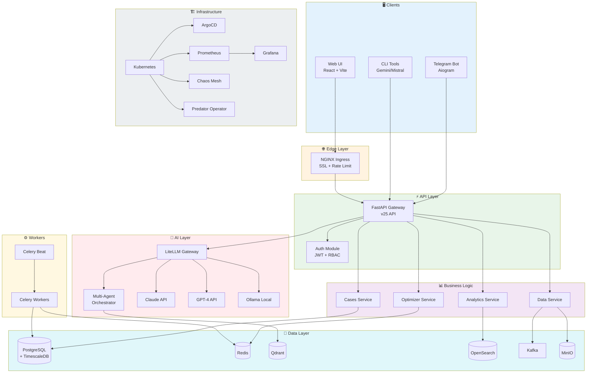

# 🏗️ Архітектурний Огляд — Predator Analytics v25.0

> Високорівнева діаграма системи

---

## Повна Архітектура

```
┌─────────────────────────────────────────────────────────────────────────────────────────────────┐
│                                 PREDATOR ANALYTICS v25.0                                         │
│                                   "Незламна" Система                                            │
└─────────────────────────────────────────────────────────────────────────────────────────────────┘

┌─────────────────────────────────────────────────────────────────────────────────────────────────┐
│                                    CLIENT LAYER                                                  │
├─────────────────────────────────────────────────────────────────────────────────────────────────┤
│                                                                                                  │
│   ┌──────────────┐    ┌──────────────┐    ┌──────────────┐    ┌──────────────┐                  │
│   │   Web UI     │    │  Telegram    │    │   Mobile     │    │  CLI Tools   │                  │
│   │   (React)    │    │     Bot      │    │    App       │    │  (Gemini/    │                  │
│   │              │    │  (Aiogram)   │    │  (Future)    │    │   Mistral)   │                  │
│   └──────┬───────┘    └──────┬───────┘    └──────┬───────┘    └──────┬───────┘                  │
│          │                   │                   │                   │                          │
└──────────┼───────────────────┼───────────────────┼───────────────────┼──────────────────────────┘
           │                   │                   │                   │
           └───────────────────┴───────────────────┴───────────────────┘
                                         │
                                         ▼
┌─────────────────────────────────────────────────────────────────────────────────────────────────┐
│                                    EDGE LAYER                                                    │
├─────────────────────────────────────────────────────────────────────────────────────────────────┤
│                                                                                                  │
│   ┌──────────────────────────────────────────────────────────────────────────────────┐          │
│   │                              NGINX / Traefik Ingress                              │          │
│   │                     (Load Balancer, SSL Termination, Rate Limit)                  │          │
│   └──────────────────────────────────────────┬───────────────────────────────────────┘          │
│                                              │                                                  │
└──────────────────────────────────────────────┼──────────────────────────────────────────────────┘
                                               │
                                               ▼
┌─────────────────────────────────────────────────────────────────────────────────────────────────┐
│                                    API LAYER                                                     │
├─────────────────────────────────────────────────────────────────────────────────────────────────┤
│                                                                                                  │
│   ┌──────────────────────────────────────────────────────────────────────────────────┐          │
│   │                              API Gateway (FastAPI)                                │          │
│   │               /api/v25/* │ /health │ /metrics │ /ws                               │          │
│   └───────┬───────────────────────┬───────────────────────┬──────────────────────────┘          │
│           │                       │                       │                                      │
│           ▼                       ▼                       ▼                                      │
│   ┌───────────────┐       ┌───────────────┐       ┌───────────────┐                             │
│   │  Auth Module  │       │  Rate Limiter │       │    CORS       │                             │
│   │   (JWT/RBAC)  │       │   (Redis)     │       │   Handler     │                             │
│   └───────────────┘       └───────────────┘       └───────────────┘                             │
│                                                                                                  │
└─────────────────────────────────────────────────────────────────────────────────────────────────┘

┌─────────────────────────────────────────────────────────────────────────────────────────────────┐
│                                 BUSINESS LOGIC LAYER                                             │
├─────────────────────────────────────────────────────────────────────────────────────────────────┤
│                                                                                                  │
│   ┌─────────────────┐   ┌─────────────────┐   ┌─────────────────┐   ┌─────────────────┐         │
│   │  Cases Service  │   │  Data Service   │   │ Analytics Svc   │   │ Optimizer Svc   │         │
│   │  (CRUD, Search) │   │ (Upload, ETL)   │   │  (Reports)      │   │ (Auto-healing)  │         │
│   └────────┬────────┘   └────────┬────────┘   └────────┬────────┘   └────────┬────────┘         │
│            │                     │                     │                     │                   │
│            └─────────────────────┴─────────────────────┴─────────────────────┘                   │
│                                             │                                                    │
└─────────────────────────────────────────────┼────────────────────────────────────────────────────┘
                                              │
           ┌──────────────────────────────────┴──────────────────────────────────┐
           │                                                                      │
           ▼                                                                      ▼
┌─────────────────────────────────────────┐    ┌─────────────────────────────────────────┐
│            AI LAYER                      │    │         WORKER LAYER                     │
├─────────────────────────────────────────┤    ├─────────────────────────────────────────┤
│                                         │    │                                         │
│  ┌───────────────────────────────────┐  │    │  ┌───────────────────────────────────┐  │
│  │        LiteLLM Gateway            │  │    │  │        Celery Workers             │  │
│  │  (Multi-LLM Router + Fallback)    │  │    │  │   (ETL, ML, Maintenance)          │  │
│  └───────────────┬───────────────────┘  │    │  └───────────────┬───────────────────┘  │
│                  │                      │    │                  │                      │
│  ┌───────┬───────┴───────┬───────┐      │    │  ┌───────┬───────┴───────┬───────┐      │
│  │       │               │       │      │    │  │       │               │       │      │
│  ▼       ▼               ▼       ▼      │    │  ▼       ▼               ▼       ▼      │
│ Claude  GPT-4        Gemini   Ollama    │    │  ETL   Ingestion     ML      Monitor   │
│  API    API           API     Local     │    │ Queue   Queue      Queue    Queue      │
│                                         │    │                                         │
│  ┌───────────────────────────────────┐  │    │  ┌───────────────────────────────────┐  │
│  │     Multi-Agent Orchestrator      │  │    │  │        Celery Beat                │  │
│  │  (Supervisor, Analyst, Executor)  │  │    │  │   (Scheduled Tasks)               │  │
│  └───────────────────────────────────┘  │    │  └───────────────────────────────────┘  │
│                                         │    │                                         │
└─────────────────────────────────────────┘    └─────────────────────────────────────────┘

┌─────────────────────────────────────────────────────────────────────────────────────────────────┐
│                                     DATA LAYER                                                   │
├─────────────────────────────────────────────────────────────────────────────────────────────────┤
│                                                                                                  │
│   ┌───────────────┐   ┌───────────────┐   ┌───────────────┐   ┌───────────────┐                 │
│   │  PostgreSQL   │   │    Redis      │   │    Qdrant     │   │  OpenSearch   │                 │
│   │  + Timescale  │   │  (Cache/Pub)  │   │ (Vector DB)   │   │ (Full-text)   │                 │
│   │               │   │               │   │               │   │               │                 │
│   │  • Cases      │   │  • Sessions   │   │  • Embeddings │   │  • Logs       │                 │
│   │  • Users      │   │  • Cache      │   │  • Documents  │   │  • Search     │                 │
│   │  • Metrics    │   │  • Queues     │   │  • Vectors    │   │  • Analytics  │                 │
│   └───────────────┘   └───────────────┘   └───────────────┘   └───────────────┘                 │
│                                                                                                  │
│   ┌───────────────┐   ┌───────────────┐   ┌───────────────┐                                     │
│   │    Kafka      │   │    MinIO      │   │   RabbitMQ    │                                     │
│   │ (Streaming)   │   │ (Object Store)│   │ (Messaging)   │                                     │
│   │               │   │               │   │               │                                     │
│   │  • Events     │   │  • Files      │   │  • Tasks      │                                     │
│   │  • CDC        │   │  • Backups    │   │  • Events     │                                     │
│   └───────────────┘   └───────────────┘   └───────────────┘                                     │
│                                                                                                  │
└─────────────────────────────────────────────────────────────────────────────────────────────────┘

┌─────────────────────────────────────────────────────────────────────────────────────────────────┐
│                                  INFRASTRUCTURE LAYER                                            │
├─────────────────────────────────────────────────────────────────────────────────────────────────┤
│                                                                                                  │
│   ┌───────────────────────────────────────────────────────────────────────────────────┐         │
│   │                              Kubernetes Cluster                                    │         │
│   │  ┌─────────────────┐  ┌─────────────────┐  ┌─────────────────┐                    │         │
│   │  │   ArgoCD        │  │   Prometheus    │  │    Grafana      │                    │         │
│   │  │   (GitOps)      │  │   (Metrics)     │  │   (Dashboards)  │                    │         │
│   │  └─────────────────┘  └─────────────────┘  └─────────────────┘                    │         │
│   │                                                                                    │         │
│   │  ┌─────────────────┐  ┌─────────────────┐  ┌─────────────────┐                    │         │
│   │  │  Chaos Mesh     │  │   Cert-Manager  │  │  External-DNS   │                    │         │
│   │  │ (Chaos Tests)   │  │   (TLS Certs)   │  │  (DNS Mgmt)     │                    │         │
│   │  └─────────────────┘  └─────────────────┘  └─────────────────┘                    │         │
│   └───────────────────────────────────────────────────────────────────────────────────┘         │
│                                                                                                  │
│   ┌───────────────────────────────────────────────────────────────────────────────────┐         │
│   │                              Predator Operator                                     │         │
│   │              (Auto-Remediation, Memory Scaling, Rollback)                          │         │
│   └───────────────────────────────────────────────────────────────────────────────────┘         │
│                                                                                                  │
└─────────────────────────────────────────────────────────────────────────────────────────────────┘

┌─────────────────────────────────────────────────────────────────────────────────────────────────┐
│                                    CI/CD LAYER                                                   │
├─────────────────────────────────────────────────────────────────────────────────────────────────┤
│                                                                                                  │
│   ┌──────────────┐    ┌──────────────┐    ┌──────────────┐    ┌──────────────┐                  │
│   │   GitHub     │───▶│   GitHub     │───▶│   Container  │───▶│   ArgoCD     │                  │
│   │ Repository   │    │   Actions    │    │   Registry   │    │   Sync       │                  │
│   │              │    │  (CI/Build)  │    │   (GHCR)     │    │  (Deploy)    │                  │
│   └──────────────┘    └──────────────┘    └──────────────┘    └──────────────┘                  │
│                                                                                                  │
│   Features:                                                                                      │
│   • Auto-trigger on push/PR                                                                     │
│   • Parallel lint/test/build                                                                    │
│   • Security scanning (Trivy)                                                                   │
│   • Automatic rollback on failure                                                               │
│   • Multi-environment support                                                                   │
│                                                                                                  │
└─────────────────────────────────────────────────────────────────────────────────────────────────┘
```

---

## Mermaid Діаграма



---

## Потік Запиту

```
┌─────────────────────────────────────────────────────────────────────────────┐
│                          REQUEST FLOW                                        │
└─────────────────────────────────────────────────────────────────────────────┘

     USER                                                              SYSTEM
       │                                                                  │
       │  1. HTTP Request                                                 │
       │ ─────────────────────────────────▶                              │
       │                                                                  │
       │                        ┌──────────────┐                          │
       │                        │    NGINX     │                          │
       │                        │   Ingress    │                          │
       │                        └──────┬───────┘                          │
       │                               │ 2. Route + SSL                   │
       │                               ▼                                  │
       │                        ┌──────────────┐                          │
       │                        │   FastAPI    │                          │
       │                        │   Gateway    │                          │
       │                        └──────┬───────┘                          │
       │                               │ 3. Validate JWT                  │
       │                               ▼                                  │
       │                        ┌──────────────┐                          │
       │                        │    Auth      │                          │
       │                        │   Module     │ ◀──── Redis (Session)    │
       │                        └──────┬───────┘                          │
       │                               │ 4. Route to Service              │
       │                               ▼                                  │
       │                        ┌──────────────┐                          │
       │                        │   Service    │                          │
       │                        │    Logic     │ ◀──── PostgreSQL         │
       │                        └──────┬───────┘                          │
       │                               │ 5. Need AI?                      │
       │                               ▼                                  │
       │                     ┌─────────┴─────────┐                        │
       │                     │                   │                        │
       │              ┌──────▼──────┐     ┌──────▼──────┐                 │
       │              │   LiteLLM   │     │   Celery    │                 │
       │              │   (Sync)    │     │   (Async)   │                 │
       │              └──────┬──────┘     └──────┬──────┘                 │
       │                     │                   │                        │
       │              ┌──────▼──────┐     ┌──────▼──────┐                 │
       │              │   Claude/   │     │   Worker    │                 │
       │              │   GPT-4     │     │   Process   │                 │
       │              └──────┬──────┘     └──────┬──────┘                 │
       │                     │                   │                        │
       │                     └─────────┬─────────┘                        │
       │                               │                                  │
       │                               │ 6. Response                      │
       │ ◀─────────────────────────────┘                                  │
       │                                                                  │
```

---

## Self-Healing Flow

```
┌─────────────────────────────────────────────────────────────────────────────┐
│                          SELF-HEALING MECHANISM                              │
└─────────────────────────────────────────────────────────────────────────────┘

    ┌─────────────────┐
    │    FAILURE      │
    │    DETECTED     │
    └────────┬────────┘
             │
             ▼
    ┌─────────────────┐
    │    ANALYZE      │      ┌─────────────────────────────────┐
    │    CAUSE        │─────▶│ • OOMKill → Increase Memory     │
    └────────┬────────┘      │ • CrashLoop → Rollback          │
             │               │ • Network → Retry + Fallback    │
             │               │ • Config Drift → ArgoCD Sync    │
             ▼               └─────────────────────────────────┘
    ┌─────────────────┐
    │   REMEDIATE     │
    │                 │
    │  ┌───────────┐  │
    │  │ Restart   │  │  ◀── Kubernetes Liveness Probe
    │  └───────────┘  │
    │  ┌───────────┐  │
    │  │ Scale Up  │  │  ◀── HPA (Horizontal Pod Autoscaler)
    │  └───────────┘  │
    │  ┌───────────┐  │
    │  │ Rollback  │  │  ◀── ArgoCD + Predator Operator
    │  └───────────┘  │
    │  ┌───────────┐  │
    │  │ Failover  │  │  ◀── Multi-Region DR
    │  └───────────┘  │
    │                 │
    └────────┬────────┘
             │
             ▼
    ┌─────────────────┐
    │    VERIFY       │
    │    RECOVERY     │
    └────────┬────────┘
             │
             ▼
    ┌─────────────────┐      ┌─────────────────────────────────┐
    │    NOTIFY       │─────▶│ • Slack/Telegram Alert          │
    │    & LOG        │      │ • Prometheus Event              │
    └─────────────────┘      │ • Audit Log Entry               │
                             └─────────────────────────────────┘

    Recovery Time Objective (RTO): < 30 seconds
    Recovery Point Objective (RPO): < 1 minute
```

---

## Deployment Environments

```
┌─────────────────────────────────────────────────────────────────────────────┐
│                          MULTI-ENVIRONMENT DEPLOYMENT                        │
└─────────────────────────────────────────────────────────────────────────────┘

    ┌─────────────────────────────────────────────────────────────────────────┐
    │                              GitHub Repository                           │
    │                                   main                                   │
    └────────────────────────────────────┬────────────────────────────────────┘
                                         │
                      ┌──────────────────┼──────────────────┐
                      │                  │                  │
                      ▼                  ▼                  ▼
            ┌─────────────────┐ ┌─────────────────┐ ┌─────────────────┐
            │    STAGING      │ │   PRODUCTION    │ │    NVIDIA       │
            │                 │ │                 │ │    SERVER       │
            │  values.yaml    │ │ values-prod.yaml│ │ values-nvidia.  │
            │                 │ │                 │ │    yaml         │
            ├─────────────────┤ ├─────────────────┤ ├─────────────────┤
            │ • 1 replica     │ │ • 3+ replicas   │ │ • GPU enabled   │
            │ • Shared DB     │ │ • Dedicated DB  │ │ • H2O LLM Studio│
            │ • Debug logs    │ │ • Info logs     │ │ • MLflow        │
            │ • No TLS        │ │ • TLS enabled   │ │ • Custom models │
            └─────────────────┘ └─────────────────┘ └─────────────────┘
                      │                  │                  │
                      ▼                  ▼                  ▼
            ┌─────────────────┐ ┌─────────────────┐ ┌─────────────────┐
            │    ArgoCD       │ │    ArgoCD       │ │    Direct       │
            │    Sync         │ │    Sync         │ │    Deploy       │
            └─────────────────┘ └─────────────────┘ └─────────────────┘
```

---

## Мережева Топологія

```
┌─────────────────────────────────────────────────────────────────────────────┐
│                          NETWORK TOPOLOGY                                    │
└─────────────────────────────────────────────────────────────────────────────┘

                              Internet
                                  │
                                  │ 443/80
                                  ▼
                    ┌─────────────────────────┐
                    │       CloudFlare        │
                    │        (WAF, CDN)       │
                    └────────────┬────────────┘
                                 │
                                 │
                    ┌────────────▼────────────┐
                    │      Load Balancer      │
                    │    (Cloud Provider)     │
                    └────────────┬────────────┘
                                 │
            ┌────────────────────┼────────────────────┐
            │                    │                    │
            ▼                    ▼                    ▼
      ┌──────────┐        ┌──────────┐        ┌──────────┐
      │  Node 1  │        │  Node 2  │        │  Node 3  │
      │          │        │          │        │          │
      │ Backend  │◀──────▶│ Backend  │◀──────▶│ Backend  │
      │ Frontend │        │ Frontend │        │ Frontend │
      │ Worker   │        │ Worker   │        │ Worker   │
      └────┬─────┘        └────┬─────┘        └────┬─────┘
           │                   │                   │
           └───────────────────┼───────────────────┘
                               │
                               │ predator-net (Docker Bridge)
                               │
            ┌──────────────────┼──────────────────┐
            │                  │                  │
            ▼                  ▼                  ▼
      ┌──────────┐      ┌──────────┐      ┌──────────┐
      │ Postgres │      │  Redis   │      │  Qdrant  │
      │ :5432    │      │  :6379   │      │  :6333   │
      └──────────┘      └──────────┘      └──────────┘

    Network Policies:
    • Backend → Postgres: ALLOW
    • Backend → Redis: ALLOW
    • Backend → External AI APIs: ALLOW (egress)
    • Worker → All datastores: ALLOW
    • Frontend → Backend only: ALLOW
    • All ingress: DENY (except Ingress Controller)
```

---

*© 2026 Predator Analytics*
