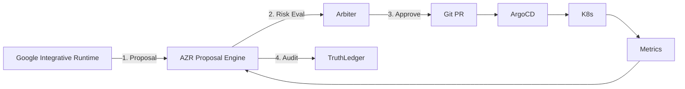

# ТЕХНІЧНЕ ЗАВДАННЯ: Predator x AZR x Google Integrative Platform (v45)

## Мета
Створити інтегративну автоматизаційну платформу, де:
*   **Predator Analytics** = Система Істини (Truth System).
*   **AZR** = Єдиний механізм самозмін (Amendment Engine).
*   **Google-екосистема** = Підсилювач розробки, аналітики та агентів, але **НЕ** джерело істини.

---

## I. КОНСТИТУЦІЙНІ ОБМЕЖЕННЯ ІНТЕГРАЦІЇ

### I.1 Непорушні принципи
```yaml
integration_constitution:
  truth_authority: "Predator Truth Ledger ONLY"
  state_authority: "Arbiter / AZR ONLY"
  google_role: "assistant / generator / accelerator"
  forbidden:
    - "Google controls state"
    - "Google writes Truth Ledger directly"
    - "Google bypasses Arbiter"
  allowed:
    - "Google generates code"
    - "Google suggests amendments"
    - "Google runs simulations"
    - "Google assists agents"
```

---

## II. АРХІТЕКТУРА ІНТЕГРАЦІЇ (Predator Core)

### II.1 Control Plane
*   **Orchestration**: Kubernetes (K3s/RKE2)
*   **Enforcement**: OPA Gatekeeper
*   **GitOps**: ArgoCD

### II.2 Truth & Audit
*   **Storage**: PostgreSQL (Truth Ledger Schema)
*   **Security**: Merkle Chaining + ED25519 Signatures
*   **Access**: Write (Arbiter Only), Read (Agents/Google RO)

---

## III. AZR (AUTONOMOUS ZERO-RISK RUNTIME)

### III.1 Компоненти
*   **AZR Proposal Engine**: Приймає пропозиції від зовнішніх систем (Google).
*   **Risk Model**: Оцінює ризик змін.
*   **Chaos Orchestrator**: Перевіряє зміни на міцність.
*   **Arbiter Court**: Приймає фінальне рішення.

```yaml
azr_integration_mode:
  autonomy: "bounded"
  approval: "arbiter court"
  rollback: "mandatory"
```

---

## IV. GOOGLE INTEGRATIVE STACK (FREE / OSS-FRIENDLY)
*Роль: Генератор та Аналітик.*

### IV.1 Development & Vibe-Coding
*   **Tools**: Google AI Studio (Free), VS Code + OSS Extensions, Jupyter.
*   **Usage**: Генерація ETL DAGs, Helm Charts, Rego Policies.

### IV.2 Data & Analytics (No Paid Google Cloud)
*   **Stack**: Apache Beam, dbt (Core), Superset.
*   **Exclusions**: No BigQuery, No Looker.

### IV.3 AI & Agents
*   **Tools**: Ollama, LangGraph, AutoGen.
*   **Policy**:
    ```yaml
    google_llm_policy:
      usage: "advisory_only"
      cannot: ["approve changes", "deploy", "write ledger"]
    ```

---

## V. INTEGRATION FLOW (Formal Contract)

### V.1 Потік змін (Pipeline)


### V.2 Контракт
*   **Input**: `code_suggestions`, `architecture_proposals`.
*   **Processing**: `azr_validation`, `chaos_testing`.
*   **Output**: `approved_amendments` OR `rejected_proposals`.

---

## VI. CLI-FIRST DOCTRINE
*Google НЕ має прямого доступу до K8s API. Тільки через `predatorctl`.*

```bash
# 1. Google генерує пропозицію
predatorctl azr proposal create --source google --file proposal.yaml

# 2. Валідація та Симуляція
predatorctl azr validate --id <id>
predatorctl azr simulate --id <id>

# 3. Chaos Test
predatorctl chaos run <id>

# 4. Рішення Арбітра
predatorctl arbiter decide --id <id>
```

---

## VII. CLI STACK & AGENTS (Detailed Specification)

### VII.1 Базовий принцип
```yaml
cli_first_doctrine:
  audit: "every_cli_call_logged"
  forbidden: ["ui_only_control", "hidden_changes"]
```

### VII.2 Основні Інструменти (CLI)
1.  **Core**: `predatorctl` (Центральний контролер).
2.  **K8s**: `kubectl`, `k9s` (Read-Only for Agents).
3.  **GitOps**: `argocd`, `helm`.
4.  **Policy**: `opa`, `conftest`.
5.  **Chaos**: `litmusctl`.
6.  **Google**: `gcloud` (Restricted: AI/Notebooks only).

### VII.3 CLI Агенти (Bots)
*   **PolicyAgent**: Виконує `opa eval`.
*   **ChaosAgent**: Виконує `litmusctl`.
*   **ETLInspector**: Виконує `dbt test`.
*   **LLMAdvisor**: Використовує `ollama` для аналізу логів.

---

## VIII. РЕЗУЛЬТАТ: ФІНАЛЬНА ФОРМУЛА
**Predator Analytics v45**
× **AZR** (Constitutional Runtime)
× **Google Integrative** (Assistant Layer / Generator)
× **GitOps**
× **Chaos**
× **Truth Ledger**
= **AUTONOMOUS, BUT UNBREAKABLE SYSTEM**
