<!-- TECH_SPEC v22.0 Implementation-Ready -->
<!-- Inserted using assistant; verify for your formatting/requirements -->

# Технічне Завдання

**Семантична Пошукова Платформа та Аналітика Даних**  
**Implementation-Ready v22.0** — Dev/Arch Standard + Automation-First

> Документ призначений для:  
> **(1)** команди розробників як implementation plan,  
> **(2)** архітекторів як внутрішній стандарт.  
> Не є комерційною пропозицією.

---

## 0. Executive Summary

Платформа забезпечує глибокий семантичний пошук, аналітику та повний ML/LLMOps цикл з **вбудованими механізмами автономного вдосконалення**:

- **Гібридний пошук**: OpenSearch (BM25) + Qdrant (dense/sparse/multimodal)
- **Reranking**: Cross-Encoder
- **XAI**: SHAP/LIME для пояснення топ-результатів
- **Автогенерація датасетів**: для закриття coverage-дір та cold-start
- **No-code / low-code fine-tuning**: H2O LLM Studio
- **AutoML для табличних та правил**: H2O AutoML
- **Federated Learning**: Flower (enterprise сценарії)
- **MLOps артефакти**: DVC + MLflow
- **FinOps**: Kubecost + GPU telemetry
- **GitOps**: ArgoCD + Helm umbrella
- **Контури**: Mac (Dev) → Oracle (Edge/Staging) → NVIDIA (Compute)

Ключова ідея v22.0:  
**“♾️-Self-Improvement Loop”** з чіткими межами між **observability → data → training → evaluation → GitOps**.

---

## 1. Головні цілі та вимірювані KPI/SLA

### 1.1 Search Quality

| Метрика     |            Ціль | Де вимірюємо          | Примітка                |
| ----------- | --------------: | --------------------- | ----------------------- |
| precision@5 |          ≥ 0.85 | offline + A/B         | основний продукт-метрик |
| recall@20   |          ≥ 0.90 | offline + A/B         | критично для enterprise |
| NDCG@10     | ≥ baseline + 3% | offline + staging A/B | гейт на промоут         |

### 1.2 Performance

| Метрика                                          |     Ціль | Примітка              |
| ------------------------------------------------ | -------: | --------------------- |
| P95 latency (full pipeline: BM25+ANN+rerank+XAI) | ≤ 800 ms | default профіль       |
| P95 latency (без XAI)                            | ≤ 500 ms | fallback режим        |
| ETL backlog                                      |   ≤ 60 s | середній лаг по черзі |

### 1.3 Reliability

| Метрика                              |                   Ціль |
| ------------------------------------ | ---------------------: |
| Uptime (Search API)                  |                  99.9% |
| Автоматичний rollback при деградації | 100% для model-promote |

### 1.4 FinOps

| Метрика                |                              Ціль |
| ---------------------- | --------------------------------: |
| cost per 1k queries    |                           < $0.05 |
| GPU idle > 60 хв       | auto-scale/down або auto-shutdown |
| Kubecost budget breach |             алерт + policy action |

---

## 2. Архітектура системи

Diagram (see system-specific `mermaid` or infra diagrams for full view - saved in repo):

```mermaid
flowchart TB
    subgraph UI["Frontend (React 18 + TS)"]
        UIClient["SPA: Search + XAI + Dataset Studio + Admin Console"]
    end

    subgraph BE["Backend (FastAPI)"]
        API["REST API v1"]
        Auth["Auth + RBAC + Tenant Guard"]
        Search["Hybrid Search Orchestrator"]
        Datasets["Dataset Control API"]
        MLAPI["ML Jobs API"]
        Integrations["OAuth2 Integrations"]
        Flags["Feature Flags"]
    end

    subgraph Inference["ML Inference Services"]
        EmbedText["Text Embeddings Service"]
        EmbedMM["CLIP/MM Embeddings"]
        Reranker["Cross-Encoder Reranker"]
        Summarizer["Summarizer"]
        XAI["SHAP/LIME XAI Service"]
    end

    subgraph MLOps["Training & Self-Improve"]
        Augmentor["Synthetic Data Augmentor"]
        AutoML["H2O AutoML"]
        H2O["H2O LLM Studio"]
        FedLearn["Flower FL"]
        DVC["DVC Remote + Pipelines"]
        MLflow["MLflow Tracking + Registry"]
        SIO["Self-Improve Orchestrator"]
        Policy["Policy Decision Point"]
    end

    subgraph Data["Storage & Search"]
        PG["PostgreSQL + pgvector"]
        OS["OpenSearch"]
        QD["Qdrant"]
        Redis["Redis Cache"]
        Obj["S3/MinIO (artifacts, DVC, snapshots)"]
    end

    subgraph Workers["Workers (Celery)"]
        Parser["ETL Parser"]
        Processor["Processor + NER + Classify"]
        Indexer["Indexer + Embeddings Builder"]
    end

    subgraph Queue["Queue"]
        MQ["RabbitMQ (to_process/to_index/to_augment/to_train)"]
    end

    subgraph Obs["Observability + FinOps"]
        Prom["Prometheus"]
        Graf["Grafana"]
        KCost["Kubecost"]
        OSD["OpenSearch Dashboards"]
        Alert["Alertmanager"]
    end

    subgraph External["External"]
        Drive["Google Drive"]
        Notion["Notion"]
        Slack["Slack"]
        Sources["RSS/Web/Files"]
    end

    UIClient -->|"REST + JWT"| API

    API --> Auth
    API --> Search
    API --> Datasets
    API --> MLAPI
    API --> Integrations
    API --> Flags

    Search --> OS
    Search --> QD
    Search --> Reranker
    Search --> Summarizer
    Search --> XAI
    Search --> PG
    Search --> Redis

    Sources --> Parser --> PG
    Parser --> MQ

    MQ --> Processor --> PG
    Processor --> MQ

    MQ --> Indexer
    Indexer --> PG
    Indexer --> OS
    Indexer --> QD
    Indexer --> EmbedText
    Indexer --> EmbedMM

    MQ --> Augmentor
    Augmentor --> PG
    Augmentor --> DVC
    Augmentor --> MLf
    Augmentor --> MQ

    MQ --> H2O
    H2O --> MLflow
    H2O --> DVC

    AutoML --> MLflow
    FedLearn --> MLflow

    SIO --> Prom
    SIO --> KCost
    SIO --> OSD
    SIO --> Policy
    Policy --> SIO

    Obs --> API
    Obs --> Workers
    Obs --> Data
    Alert --> Slack

    Integrations --> Drive
    Integrations --> Notion
    Integrations --> Slack

    DVC --> Obj
    MLflow --> Obj
    OS --> Obj
    QD --> Obj

```



---

## 3. Data flows

3.1 ETL → Augment → Train → Index

sequenceDiagram
participant Src as Джерела
participant P as Parser
participant DB as PostgreSQL
participant Q as RabbitMQ
participant PR as Processor
participant Aug as Augmentor
participant DVC as DVC
participant MLf as MLflow
participant H2O as H2O Studio
participant I as Indexer
participant OS as OpenSearch
participant QD as Qdrant

    Src --> P: raw файли/стріми
    P ->> DB: raw_data
    P ->> Q: to_process

    Q ->> PR: consume
    PR ->> DB: documents(gold)
    PR ->> Q: to_index
    PR ->> Q: to_augment

    Q ->> Aug: consume
    Aug ->> DB: augmented_datasets
    Aug ->> DVC: version + push
    Aug ->> MLf: log(dataset)
    Aug ->> Q: to_train

    Q ->> H2O: consume
    H2O ->> MLf: experiment + register model
    H2O ->> DVC: link dataset version
    H2O -->> I: model_ready

    Q ->> I: consume
    I ->> DB: read gold+aug
    I ->> OS: index text
    I ->> QD: upsert vectors

3.2 Search → Rerank → XAI

sequenceDiagram
participant U as UI
participant API as Backend
participant OS as OpenSearch
participant QD as Qdrant
participant RR as Reranker
participant X as XAI

    U->>API: /search?modal=auto
    API->>OS: BM25 top-100
    API->>QD: ANN top-100
    API->>RR: rerank top-50
    API->>X: explain top-10
    X-->>API: SHAP/LIME payload
    API-->>U: results + explain

---

    ### 3.3 GitOps: App-of-Apps and root Application

    Architecture enforces App-of-Apps: a single root ArgoCD Application (e.g. `bootstrap/root-app.yaml`) controls per-environment apps (dev / staging / prod). Use `infra/apps/overlays/*` for environment overlays, and charts under `infra/charts/*`.

    Key principles:
    - Keep environment overlays minimal: only values differ between dev/staging/prod.
    - Use `CreateNamespace=true` to ensure namespace creation is declarative.
    - Use `selfHeal` and `prune` to guarantee compliance with Git state.

    ### 3.4 FinOps-driven autoscaling (KEDA + Kubecost)

    FinOps integration: Kubecost (or OpenCost) provides cost-related metrics into Prometheus, while KEDA reads Prometheus metrics and scales workers accordingly. This enables the system to "rush to complete" or throttle workloads depending on cost and budget.

    Example ScaledObject (concept):
    ```yaml
    apiVersion: keda.k8s.io/v1alpha1
    kind: ScaledObject
    metadata:
        name: augmentation-worker-scaler
        namespace: predator-ops
    spec:
        scaleTargetRef:
            name: augmentation-worker-deployment
        minReplicaCount: 1
        maxReplicaCount: 50
        pollingInterval: 30
        cooldownPeriod: 300
        triggers:
         - type: prometheus
             metadata:
                 serverAddress: http://prometheus-server.monitoring.svc.cluster.local:9090
                 metricName: cost_efficiency_metric
                 query: |
                     scalar(avg(node_total_hourly_cost{cluster="predator-prod"}) < 1.5) * sum(rabbitmq_queue_messages_ready)
                 threshold: '10'
    ```

    This ensures that scale-out happens only when cost is low (i.e. cheaper spot instances) and when the queue length demands it.

    ### 3.5 Policy Engine pattern

    We recommend a small Policy Engine service that centralizes allow/deny decisions for auto-promote, auto-reindex, and other automation. It should accept `signal + context` and return `allow/deny + plan` with a short TTL. The Policy Engine includes:
    - Signal evaluation rules (NDCG/latency/cost/backlog triggers)
    - Access control to allow human override
    - Audit logs (write to Postgres and/or OpenSearch)

### 3.6 Edge-first: PWA, Offline Vector Search & Privacy

v22.0 implements offline-first behaviour with a PWA client, local quantized embedding models, and background-sync strategies:

- Use Workbox service worker to manage caching strategies and background sync.
- Bundle quantized transformer models (`q8` / `q4`) via `transformers.js` or `onnxruntime-web` and store in the client cache.
- Store locally computed vectors in IndexedDB (via RxDB), and implement a sync queue for user interactions.
- Local vector search uses a small ANN (HNSW or library-based) in browser; fallback to server (Qdrant) for large corpora or heavy queries.

Privacy & Edge-generation:

- PWA works as an edge generation node: on-device annotations, click behaviour and corrections form a local dataset, then are batched and synchronized to the central Data Lake on reconnection.
- Include client-side validation and simple toxicity/poisoning heuristics before pushing to server (e.g. profanity detection, spam filters).

## 4. System DB Catalog & roles

See `sql/schema.sql` (in this folder) for minimal schema including `documents`, `augmented_datasets`, `ml_datasets`, `ml_jobs`, `multimodal_assets`, `si_cycles` and related fields. Use `tenant_id` mandatory.

---

## 5. DB schema (minimal/required SQL)

See `sql/schema.sql` for the SQL to create required tables and constraints.

---

## 6. Environment contours (Mac → Oracle → NVIDIA)

Dev (Mac) — Docker Compose, smoke tests
Edge (Oracle) — K3s, staging A/B
Compute (NVIDIA) — Kubernetes GPU pool, real training + batch

Policy: no model may go to production directly from Dev.

---

## 7. DevOps / GitOps standards

Trunk: monorepo code + infra repo practice
ArgoCD App-of-Apps + Helm umbrella
DVC + MLflow storage and versioning

Notes: `helm/values-*.yaml` are added below as minimal working examples.

---

## 8. Quality & Safety gates

Autogen: ≥1k docs & coverage <70% -> require manual approval (or premium)
Fine-tune: dataset≥5k + baseline NDCG@10 measured
Promote: A/B ≥7 days + NDCG@10 ↑ ≥3% + latency increase ≤15%

---

## 9. Self-Improvement Loop ♾️

Monitor → Diagnose → Augment → Train → Evaluate → A/B → GitOps Promote → Post-Monitor → Repeat

See `self-improve` orchestration code in `implementation_v22/scripts` for example job templates.

---

## 10. Minimal working configs (examples)

Included in this folder:

- `qdrant/collection.yaml` — Qdrant collection minimal
- `opensearch/mapping.json` — baseline mapping
- `dvc/config` — example DVC remote settings
- `helm/values-dev.yaml`, `helm/values-staging.yaml`, `helm/values-prod.yaml`

---

## 11. RACI

See original document: Backend/API | ML/Data Science | DevOps/MLOps responsibilities

---

## 12. Security & tenant isolation

Enforce `tenant_id` filter in all query layers (OpenSearch, Qdrant, Postgres + RLS).
RBAC: admin / ml-admin / analyst / user
Audit trail: track model promote events & DVC/MLflow manifests.

---

## 13. Roadmap & DoD

Outlined in `TECH_SPEC.md` in root and this file's `Roadmap` section.

---

## 14. References & Next Steps

1. I created a consolidated folder with minimal configs and scripts to bootstrap v22.0 deployment.
2. Next steps:

- Review `TECH_SPEC.md` and the created configs.
- Confirm list of files that can be removed from the existing repo workflow.
- I prepared a `cleanup_proposal.sh` (not-run) listing candidate files — confirm before destructive changes.

-- End of `TECH_SPEC.md`
