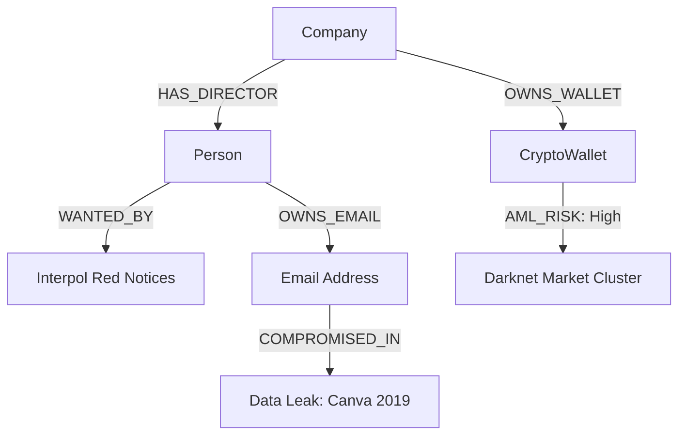

# Інтеграції: Cyber, Interpol, Leaks та Blockchain

Цей документ описує архітектуру інтеграції високоспеціалізованих OSINT джерел до системи `Registry Manager`. Ці джерела поєднують інкрементальний (Incremental) та запитовий (On-Demand) підходи.

## Архітектура Графа (Neo4j)

Інтеграція нових сутностей дозволяє виявляти багатошарові зв'язки.

## Interpol (Red Notices)
- **Підхід:** Incremental
- **Особливості:** Щоденно викачує нові та оновлені картки червоного розшуку. Вузол `Person` зв'язується з `InterpolNode`.
- **Дані:** Повне ім'я, національність, дата народження, фото (в MinIO).

## Blockchain (AML)
- **Підхід:** On-Demand
- **Особливості:** Запускається, коли аналітик або система виявляє новий крипто-гаманець. Запитує API (наприклад, Chainalysis) для отримання Risk Score.
- **Сутність:** `CryptoWallet` (Address, Risk Score, Cluster, Balance).

## Cyber / Leaks (Витоки Даних)
- **Підхід:** On-Demand (через API DeHashed) або Bulk (локальні дампи).
- **Особливості:** Дозволяє виявити, чи був скомпрометований Email директора компанії.
- **Сутність:** `Email` та `DataLeak`. Зв'язок `[:COMPROMISED_IN]`.
