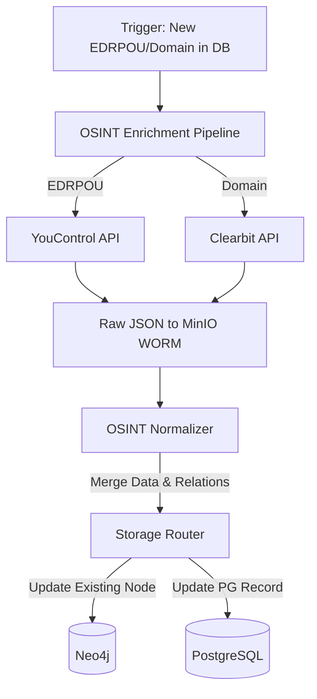

# OSINT Збагачення (YouControl, Clearbit)

Цей документ описує механізм автоматичного збагачення існуючих даних профілів компаній з комерційних OSINT джерел.

## Enrichment Pipeline (On-Demand)
Комерційні OSINT провайдери не дозволяють викачувати бази повністю, тому ми використовуємо підхід **Збагачення за запитом** (On-Demand Enrichment).

## YouControl (UA)
- **Ендпоінт:** `https://api.youcontrol.com.ua/api/v2/company/{edrpou}/dossier`
- **Тип виклику:** On-Demand (за ЄДРПОУ)
- **Збагачення:** Статус платника ПДВ, Ризик-скоринг, Суди, Борги.
- **Нові зв'язки (Neo4j):** `[:DIRECTOR_OF]`, `[:FOUNDER_OF]`.

## Clearbit (Global)
- **Ендпоінт:** `https://company.clearbit.com/v2/companies/find`
- **Тип виклику:** On-Demand (за доменом сайту)
- **Збагачення:** Індустрія, кількість співробітників, логотип.
