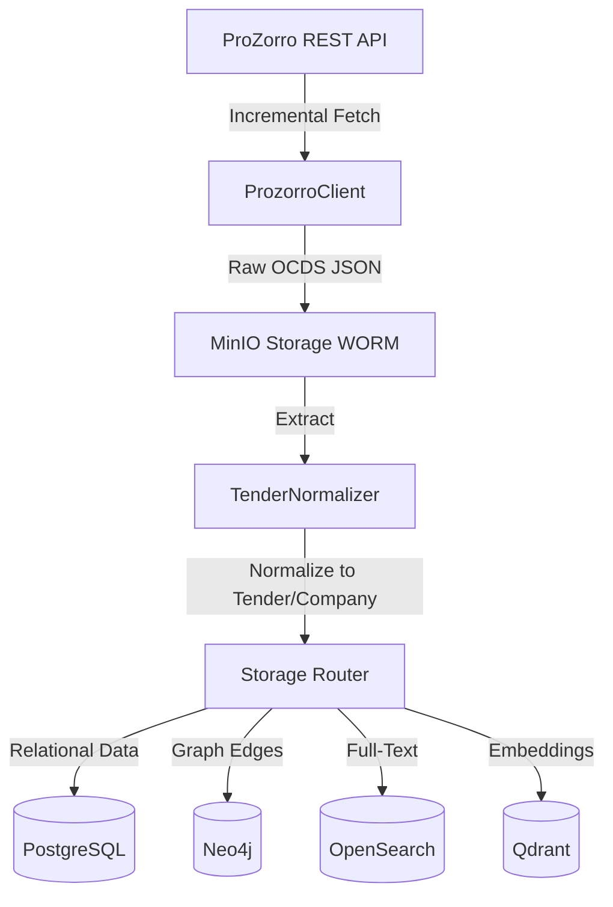

# ProZorro API Integration

Цей документ описує автоматичну інтеграцію з державним реєстром ProZorro (Open Contracting Data Standard - OCDS) у системі PREDATOR Analytics.

## Архітектура (ETL Flow)

## Деталі інтеграції
- **Ендпоінт:** `https://public.api.openprocurement.org/api/2.5/tenders`
- **Тип завантаження:** Incremental REST
- **Метод пагінації:** Cursor-based (`offset`)
- **Частота оновлення:** Кожні 15 хвилин (задано через RegistryScheduler)

## Моделі Нормалізації
| Поле ProZorro | Універсальна Модель PREDATOR | Тип Сутності |
|---------------|------------------------------|--------------|
| `id` | `id` | Tender |
| `title` | `title` | Tender |
| `value.amount` | `value` | Tender |
| `procuringEntity.identifier.id` | `Company (organizer)` | Company |
| `bids.tenderers.identifier.id` | `Company (participant)` | Company |

## Відновлення при помилках
У разі виникнення помилок `HTTPStatusError` при перевищенні лімітів (Rate Limiting), конвеєр зупиняється і чекає наступного такту планувальника, зберігаючи останній відомий `offset`.
