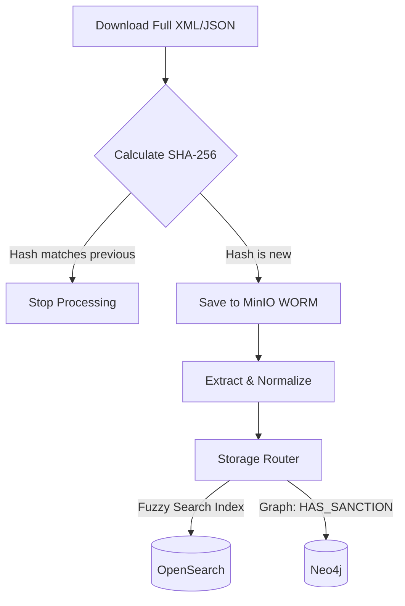

# Санкційні Списки (OFAC, РНБО)

Цей документ описує автоматичну інтеграцію з міжнародними та локальними санкційними списками.

## Bulk Dump Pipeline
Санкційні бази відрізняються від звичайних реєстрів тим, що їх оновлення публікуються у вигляді повних дампів. Ми використовуємо механізм порівняння SHA-256 хешів.

## OFAC (США)
- **Ендпоінт:** `https://www.treasury.gov/ofac/downloads/sanctions/1.0/sdn_advanced.json`
- **Тип завантаження:** Bulk
- **Частота:** Щоденно
- **Особливості нормалізації:** Збирає всі псевдоніми (Aliases) та передає їх у `searchable_text` для Fuzzy-пошуку.

## РНБО (Україна)
- **Ендпоінт:** `https://sanctions.nazk.gov.ua/api/bulk/rnbo.json` (Умовний)
- **Тип завантаження:** Bulk
- **Частота:** Щоденно
- **Сутність:** `SanctionedEntity` (РНБО)
