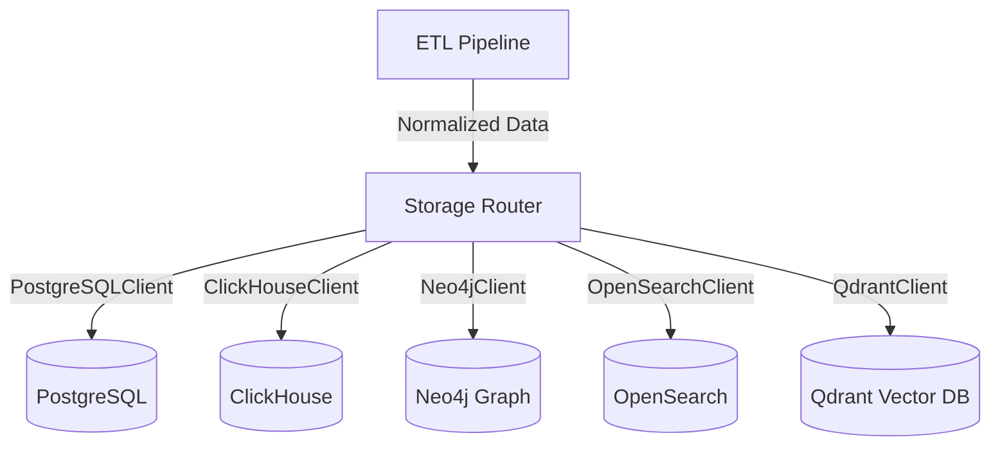

# Storage Engines (Сховища)

Цей документ описує імплементацію фізичних конекторів до баз даних у `Registry Manager`.

## Архітектура `Storage Router`
Замість того, щоб кожен ETL пайплайн знав про всі бази даних, він просто генерує нормалізований JSON і передає його у `Storage Router`.

## Neo4j
- **Призначення:** Зберігання графів та зв'язків.
- **Підхід:** Використовує Cypher `MERGE`, щоб уникнути дублювання вузлів (ідентифікація за `ueid`). Динамічно формує зв'язки з масиву `relations`.

## OpenSearch
- **Призначення:** Повнотекстовий (Fuzzy) пошук з урахуванням помилок.
- **Підхід:** Індексує документи, які мають поле `searchable_text` (імена, псевдоніми). Ідентифікатором документа (`_id`) виступає `ueid`.

## Qdrant
- **Призначення:** Семантичний векторний пошук для AI-агентів.
- **Підхід:** Створює колекції під кожен тип сутності (`predator_companys`, `predator_persons`). Ідентифікатор генерується як UUIDv5 на базі `ueid`.
